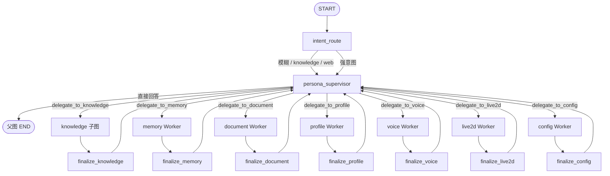
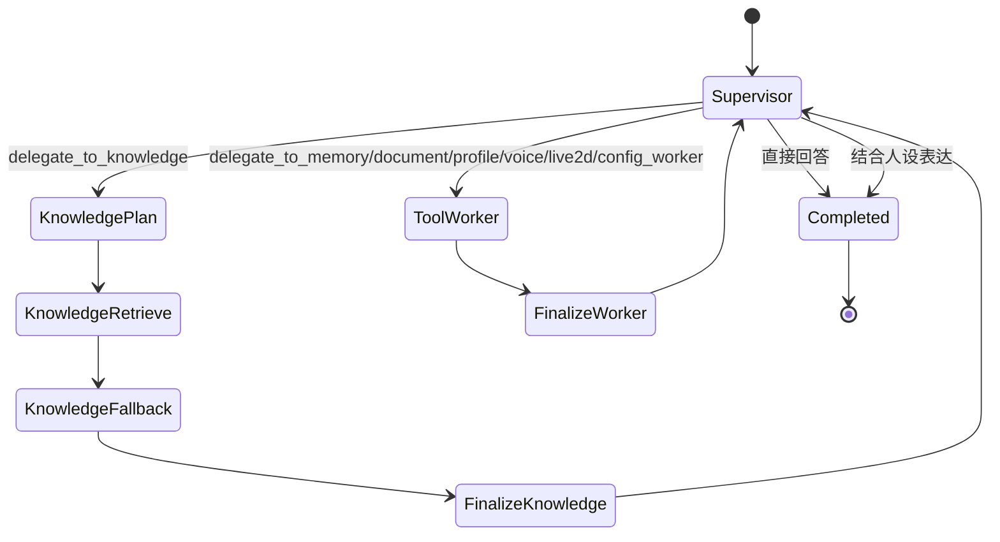
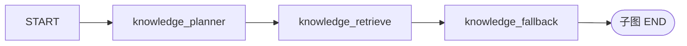

# YUMENO Multi-Agent 架构

本文描述**当前正在运行的图**，不是历史方案。设计论证、选型比较和四维改进见 [ARCHITECTURE_DESIGN.md](ARCHITECTURE_DESIGN.md)。请求主链路与 RAG/SQL 细节见 [docs/architecture/agent-rag-platform.md](docs/architecture/agent-rag-platform.md)。

图直接画在 Markdown mermaid 里，不要再看 PNG：

- 总览：[README.md](README.md) 的「架构图」一节
- 图册：[diagrams/README.md](diagrams/README.md)
- 源文件：`diagrams/*.mmd`（与 README 内嵌内容一致）
- 父图生成：`agents.graph.diagram.parent_graph_mermaid()`

## 1. 目标与边界

YUMENO 是本地优先的角色对话系统。Agent 图要同时满足三件事：

- 只有外层 Supervisor 对用户说话，并保持人设。
- 领域执行可审计：检索、SQL、写操作都不能靠自由总结蒙混过关。
- 失败时能停、能确认、能从检查点恢复，而不是 Worker 直接把半成品交给用户。

非目标：Worker 互相通话、群聊式辩论、知识子图直达父图 END。

## 2. 宏观总图

父图闭环始终是：

`START → persona_supervisor → Worker → finalize_* → persona_supervisor → 父图 END`

子图 END 只结束子图，不等于父图 END。图中不存在 Worker 直达父图 END 的边。

四个层面的选型（详见设计文档）：State Graph + Supervisor 中心辐射通信、层级验证、分层记忆、无需 CTDE/MARL。

## 3. 同构规则

宏观 Supervisor 和微观 knowledge 子图遵守同一套分层，而不是两套风格：

| 层级 | 做什么 | 不做什么 |
|------|--------|----------|
| Supervisor / planner | 选择路径或工具 schema | 不跑 RAG/SQL/联网，不对用户自由发挥领域事实 |
| retrieve / ToolNode | 执行受限工具或确定性管线 | 不对用户说话，不改写合同 |
| fallback / HITL | 只在证据不足且策略允许时升级 | 不把未授权草稿交给 Supervisor |
| finalize | 校验并回填合同 | 不二次总结、不发明答案 |
| 最外层 Supervisor | 结合人设生成可见回复 | 不假装自己执行了检索或写操作 |

## 4. 节点职责

### persona_supervisor

真正的对外 Agent：LLM + 工具循环。它只拥有：

- `delegate_to_*` handoff
- 技能安装/加载
- MCP 管理工具

普通闲聊可以由它直接回答。涉及上传资料、结构化表、公开时事、记忆、文档、人设、音色或配置时，必须委派。

### knowledge_worker

不是 `create_agent` 工具循环，而是 Planner + 确定性执行子图：

- `knowledge_planner`：单次 `bind_tools`，只产出 RAG/SQL 的 schema-only tool_call。schema-only 工具被误执行会直接失败。若 Supervisor 已给出 `kind=structured` 的 SQL 合同，planner 不再二次调用 LLM，也不发明 SQL。
- `knowledge_retrieve`：校验能力、执行 RAG 或只读 SQL，写入 JSON 合同 `ToolMessage`。不写对用户可见的 AIMessage。
- `knowledge_fallback`：仅当本地证据不足时，按策略拒绝、HITL 确认或执行联网搜索。interrupt 放在这里，resume 不重跑 RAG。

RAG / SQL / web 都是确定性管线，不是 Worker 自由总结。

### 受限工具 Worker

`memory` / `document` / `profile` / `voice` / `live2d` / `config_worker` 是 `create_agent` 子图：各自 LLM、各自受限工具、各自 prompt，经 `finalize_*` 回 Supervisor。Worker 之间不互相调用，继续由 Supervisor 编排。

URL 导入文档属于 `document`，不属于 knowledge 检索子图。

### finalize_*

- knowledge：只拷贝白名单合同字段；`status=accepted` 才把答案和证据交给 Supervisor，`insufficient` 只保留不确定性。
- 其他 Worker：把内部结果收成交接摘要，回填原始 handoff `tool_call_id`。

## 5. 权限、确认与状态

- 工具注册表是单一事实来源。`mutates_data` 与 `requires_confirmation` 正交：不写数据不等于永远免确认。
- `web_search` 本身不写数据；是否联网由 `knowledge_fallback` 按意图策略决定，而不是把“有时需要确认”写死在 ToolSpec 上。
- 写记忆、改文档、改人设、改配置、训练音色走 HITL / checkpoint。
- checkpointer 按 `persona_id:conversation_id` 持久化父图状态，中断恢复、多轮对话和服务重启都回到同一条线程。

RAG 还使用统一的失败合同，避免把底层依赖异常直接暴露给 API、Agent 或前端：

| 错误码 | 语义 | 对上层的处理 |
|---|---|---|
| `insufficient` | 流程正常，但证据不足 | 正常完成，保守说明资料不足 |
| `failed_retrieval` | 本地或联网检索失败 | 失败关闭，不进入改写或生成 |
| `failed_generation` | 基于证据的答案生成失败 | 失败关闭，不返回生成草稿 |
| `failed_quality_gate` | 质量门执行失败 | 失败关闭，不返回未通过校验的草稿
| `dependency_unavailable` | 模型、Milvus、Reranker 等依赖不可用 | 统一降级并记录公开错误合同 |

错误码和脱敏消息同时写入 `RagQueryRecord`，用于历史查询回溯；不保存底层异常文本、完整 Prompt 或思维链。

## 6. 不要再这样描述现状

以下说法已经过时，不要写进文档或简历：

- 把 knowledge、web、conversation 误写成与领域 Worker 平级的独立 Worker
- 「所有 Worker 都是对等 LLM Agent」或「全部并行」
- 「knowledge 绕过 finalize 直接出答案」——当前 knowledge 必须经 finalize 回到 Supervisor
- 「LLM 只做策略决策，所有执行都是确定性代码」——这只描述 knowledge 主链路，不能概括全部 Worker

更准确的口径：

- Supervisor 负责策略和最终表达
- knowledge 走 Planner + 确定性 retrieve/fallback
- 其余 Worker 是受限工具的 LLM 子 Agent
- 全部经 finalize 合同回 Supervisor
- 写操作走 HITL / checkpoint

## 7. 意图如何被保证

意图不是单一路由器，而是分层信号 + 硬门禁：

1. **能力自检短路**：`is_capability_question()` 命中后不进图，直接返回能力清单。这与漏斗里的 capability 信号分工不同，漏斗不负责拦截。
2. **确定性漏斗**：`agents/intent_funnel.py` 扫描关键词、否定、显式联网、时效外部事实，产出 `intent_decision`（含 `web_authorized`）。
3. **省略句继承**：服务入口从 checkpoint 读取上一轮 `intent_decision`。像「那上海呢」会继承 `web_authorized`；完整新问题不会继承。
4. **顾问，不是路由**：Supervisor prompt 看得到漏斗结果，但明确写明不得覆盖工具、策略和证据边界。真正的 Worker 选择仍是 `delegate_to_*`。
5. **硬门禁**：搜索工具可见性只认 `intent_decision.web_authorized`，不再认旧字段 `web_search_authorized`。`knowledge_fallback` 用同一份决策决定拒绝 / HITL 确认 / 直接联网。

漏斗不保证 Supervisor 一定委派某个 Worker。UI 命令（打开设置/角色管理）目前只被识别为结构化信号，产品层尚未消费。

## 8. 核心代码

- 父图编译：`agents/graph/build.py`
- Supervisor 与受限 LLM Worker：`agents/graph/supervisor.py`
- knowledge Planner + retrieve/fallback：`agents/graph/knowledge.py`
- 兼容门面：`agents/workflow.py`（对外仍可 `from agents.workflow import build_persona_workflow`）
- 意图漏斗：`agents/intent_funnel.py`
- 应用入口与 API 映射：`agents/service.py`
- 工具注册：`agents/registry.py`
- 证据合同：`agents/contracts.py`
- RAG 管线：`rag/`
- 结构化查询：`agents/tools/structured_query.py`
