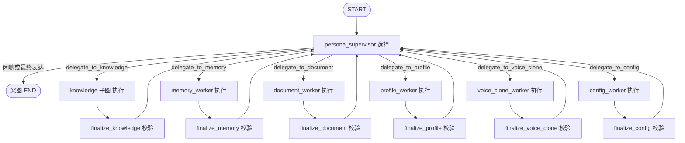
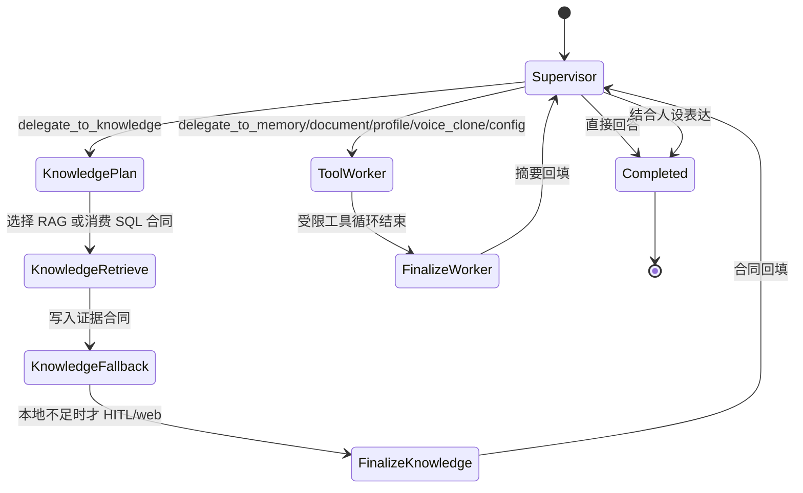
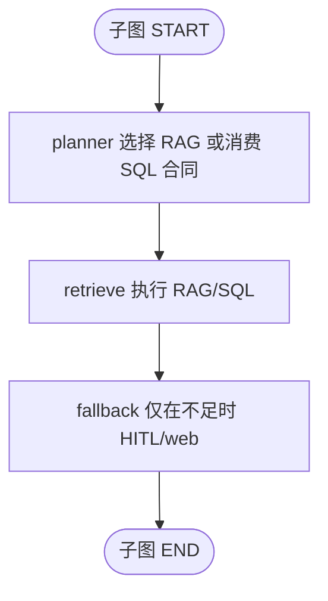

# YUMENO LangGraph 多 Agent 设计说明

本文回答四件事：四个抽象层面各选了什么、为什么是现在这张图、宏观到微观如何同构，以及它怎样同时改进任务效能、协作效率、系统属性和资源成本。现行运行图见 [ARCHITECTURE.md](ARCHITECTURE.md)。

## 1. 要解决的问题

早期实现里，文档、代码和对外口径经常各说各话：

- 有的地方写独立 web / management / conversation Worker，有的地方写 knowledge 快路径直达 END。
- knowledge 一度被降成纯函数节点：没有自己的规划层，却又承担 RAG、SQL、联网和导入。
- 简历容易写成“LLM 只做策略、代码包办执行”，这只覆盖了 knowledge 快路径，不能描述受限工具 Worker。

这会造成两类故障：

1. **架构混乱**：同一张系统被同时理解成群聊、快路径和工作流引擎，改一处就会在另一处说错。
2. **运行脆弱**：Worker 若直达 END，人设丢失、合同被自由总结覆盖、HITL 恢复后重复检索；若所有 Worker 都做成自由 LLM 循环，SQL/RAG 又会失去确定性。

因此图设计的第一原则不是“堆更多 Agent”，而是**分层同构**：谁选择、谁执行、谁校验、谁对用户说话，在每一层都相同。

## 2. 四个层面的选型结论

面向角色对话 + 知识执行，四个层面各选其一，组合成现行生产架构。

| 层面 | 选择 | 一句话 |
|------|------|--------|
| 拓扑结构 | **State Graph**，图上通信约束为 Supervisor 中心辐射 | 节点和有向边决定谁能走到谁；Worker 不互聊 |
| 协作机制 | **层级验证**（handoff 合同 + finalize 校验） | 产出必须过合同，而不是靠辩论达成措辞 |
| 记忆与状态 | **分层记忆**；工作记忆落在持久化状态图 | checkpoint / 摘要 / 角色记忆 / 外部知识库各管一层 |
| 训练范式 | **无需 CTDE / MARL** | 这是图约束的 LLM-MAS，不是多智能体强化学习 |

### 2.1 拓扑：为什么选 State Graph，而通信仍是中心辐射

YUMENO 需要分支、回环、HITL 中断和按会话恢复。State Graph 把这些变成图上的边和检查点，而不是 prompt 约定。

通信约束必须额外收紧：任意 Worker 之间没有边。handoff 只从 `persona_supervisor` 发出，`finalize_*` 只回到 `persona_supervisor`。也就是说：

- **图引擎是 State Graph**（能循环、能分支、能持久化）；
- **对话拓扑是 Supervisor 中心辐射**（唯一对外入口，唯一合同所有者）。

不选其他拓扑：

| 候选 | 不选的原因 |
|------|------------|
| 纯 Supervisor 无图 | 缺 checkpoint、缺子图边界，HITL 只能靠临时变量 |
| Sequential Pipeline | 闲聊、检索、写操作不是固定 SOP；强行链式会让无关阶段空转 |
| Group Chat / Broadcast Mesh | Worker 共享发言权，权限边界溶解，审计变成“谁说服了谁” |
| Role-based Crew | 角色产品需要的是证据门禁，不是研究团队式互评 |
| Network / Flat | 通信边随领域增加而膨胀，失败关闭困难 |
| Publish-Subscribe / Blackboard | 适合松耦合插件总线，不适合“只有一人设对用户说话” |
| Dual-Plane | 控制面/工作面分离适合大规模异构集群；本系统一个父图已能表达控制与执行 |

Intent funnel 只是顾问信号，不是路由器。真正的路由权在 Supervisor 的 `delegate_to_*`，以及 knowledge 子图对结构化合同的消费。

### 2.2 协作：为什么选层级验证

知识问答的错误形态是“没有证据却有流畅答案”。层级验证把协作压成三步：

1. Supervisor 选择 Worker 并写出 handoff 合同；
2. Worker / 子图执行，不直接对用户说话；
3. `finalize_*` 校验合同后才允许 Supervisor 表达。

不选其他协作：

| 候选 | 不选的原因 |
|------|------------|
| 动态图 / 重要性路由 | 每步评估贡献度会引入额外模型回合，且本系统领域集合是稳定的 |
| 多智能体辩论 / 交叉检验 | 换来的是措辞，不是证据；检索门禁比互相反驳便宜且可审计 |
| 元智能体自动生成团队 | 运行时生成 FSM 会破坏固定权限边界和评测可重复性 |
| 拍卖 / 竞价 | 没有去中心化资源市场，任务归属由领域工具决定 |
| 蜂群涌现 | 角色产品要求涌现行为可控，不能靠局部规则长出新发言者 |

API 仍暴露旧的四值 specialist（conversation / web / memory / management），那是 resume 兼容层，不是图内 Worker 清单。不存在运行时 Worker 注册表；父图编译以 `agents/graph/state.py` 的固定 `WORKERS` 集合为准，由 `agents/graph/build.py` 编译；`agents.workflow` 只是兼容门面。

### 2.3 记忆：为什么选分层记忆

四层各有作用域，禁止把所有事实塞进同一段 prompt：

| 层 | 载体 | 职责 |
|----|------|------|
| 工作记忆 | LangGraph checkpoint（持久化状态图） | 当前回合的 messages、handoff、HITL 中断点 |
| 会话记忆 | 对话摘要 | 压缩更早回合，不删除检查点 |
| 长期记忆 | 角色记忆 + 工作区记忆 | 用户偏好与共享事实，经 memory Worker 读写 |
| 外部知识 | Milvus RAG + 工作区 SQLite | 上传资料与结构化表，经 knowledge 确定性管线读取 |

不选“全体共享一块黑板式记忆”：Worker 若能实时互写，作用域隔离和最小权限都会失效。不选单一 A-Mem 笔记网络：角色产品先要保证隔离和恢复，而不是先做卡片式联想。

### 2.4 训练：为什么声明无需训练范式

本系统用图边界、工具权限、质量门和 HITL 约束 LLM，而不是用 CTDE 学一套分散策略。observation / action / reward / rollout 在这里没有对应的生产闭环：没有可重复的环境步进，也没有要用多智能体价值函数去优化的协作策略。若未来做提示词或路由策略的离线评估，那是评测，不是 MARL。

## 3. 痛点针对性解释

### 3.1 架构混乱如何被解耦

- **单一生产入口**：`build_persona_workflow` 是唯一编译父图的函数；旧四 specialist 图不再存在。
- **合同代替自然语言交接**：knowledge 交 JSON 证据，其他 Worker 交固定摘要；Supervisor 不解析“我已经查过了”。
- **选择 / 执行 / 校验 / 表达分离**：宏观和微观用同一套职责表，文档不能再把 knowledge 说成快路径、把其余 Worker 说成群聊。
- **注册表与父图解耦**：工具注册表决定权限，父图节点集合由 `WORKERS` 显式列出。新增领域必须改图，而不是热加载一个能直达 END 的 Agent。

### 3.2 运行脆弱如何被隔离和恢复

- **异常隔离**：Worker 失败写入合同状态（insufficient / failed / confirmation_required），不把半成品 AIMessage 交给用户。
- **自动恢复**：checkpointer 按 `persona_id:conversation_id` 持久化父图；HITL resume 从中断节点继续，knowledge retrieve 发现已有合同就不重跑 RAG。
- **涌现行为受图约束**：没有 Worker→Worker 边，没有 Worker→父图 END 边；子图 END 只结束子图。模型不能通过互相交接发明新拓扑。
- **权限二次闭合**：工具按 specialist 挂载；schema-only 规划工具被执行会失败；写操作和策略化联网走 HITL。

## 4. 宏观到微观的同构

### 4.1 父图（控制流）

### 4.2 状态流转

### 4.3 knowledge 子图

子图 END 之后必须进入 `finalize_knowledge`，再回到 Supervisor。这与 memory 等 Worker 的 `worker → finalize → supervisor` 同构。

### 4.4 同一套职责切分

1. **选择层只选择，不跑领域管线。** Supervisor 不执行 RAG；planner 不调用真实检索函数。结构化 SQL 已由 Supervisor 合同给出时，planner 连 LLM 都不调用。
2. **执行层只执行，不对用户说话。** retrieve / ToolNode / web fallback 只写合同或工具结果。
3. **finalize 只做合同校验，不自由总结。** knowledge 丢弃白名单以外的字段，未通过门禁的答案草稿不得交给 Supervisor。
4. **只有最外层 Supervisor 对用户说话。** 人设、引用和不确定性都在这一层结合完整上下文表达。
5. **子图 END ≠ 父图 END。** 这是防止“快路径直出”回潮的硬约束。

## 5. 四维改进

### 5.1 任务效能

- 知识问题先走本地 RAG 或受控 SQL，公开时事才允许联网兜底，避免用网页结果冒充角色资料。
- 质量门和失败关闭让“没有证据”成为合法结果，而不是让模型补全。
- 结构化查询禁止 planner 发明 SQL：合同里没有 sql 就失败，而不是现场编一条。
- finalize 丢弃白名单外字段，阻止 Worker 自由文本覆盖证据合同。

### 5.2 协作效率

- Worker 不互相调用，减少隐式对话和重复交接。
- 交接用 JSON 合同或固定摘要，而不是解析一段自然语言。
- 只读知识路径保持 planner → retrieve → fallback 的直线，不在子图里再开一轮自由 Agent 循环。
- Intent funnel 只提供顾问信号，避免关键词硬路由与 Supervisor 抢权。

### 5.3 系统属性

- 最小权限：工具按 specialist 分配，MCP 默认不进入任何 Worker。
- HITL 与 checkpoint 绑定：确认发生在执行点，resume 从中断节点继续。
- 作用域由服务端 `PersonaAgentContext` 注入，客户端不能提交知识空间范围。
- 对外 API specialist 做兼容映射，避免图内 Worker 名称直接打穿旧 resume 契约。
- 图编译集固定，动态注册不能悄悄改变生产拓扑。

### 5.4 资源成本

- knowledge 不为“像一个 Agent”而使用 `create_agent` 工具循环。
- 已有结构化合同时跳过 planner LLM，少一次无决策价值的模型调用。
- 闲聊不 handoff。
- 联网只在本地不足且策略允许时发生；用户明确拒绝或未确认则停止。
- 上下文预算裁剪模型视图，不删除 checkpoint。

四维不是互相独立的广告语：少一层自由 LLM，同时提高效能、降低成本、让协作路径变短、让权限和恢复语义更硬。

## 6. knowledge 为什么是 Planner + Deterministic Executor

把 knowledge 做成普通 `create_agent`，看起来“每个 Worker 都是子 Agent”，但会破坏同构：

- RAG/SQL 变成模型可跳过、可改写、可连调用两次的工具。
- 联网确认混进自由工具选择，interrupt 点不稳定。
- finalize 只能看到一段总结，无法区分证据和措辞。

把 knowledge 做成纯函数快路径，直达父图 END，则破坏另一半同构：

- 检索结果不再经过 Supervisor 的人设表达。
- 子图 END 被误当成产品 END。
- 与 memory 等 Worker 的闭环不一致，文档只能写“有的回 Supervisor，有的不回”。

因此现行形态是折中后的稳定点：**knowledge 在 LangGraph 意义上仍是子图/子 Agent，但它的执行核是确定性管线；规划权在 planner，表达权在外层 Supervisor。**

## 7. 其余 Worker 为什么仍是受限 LLM 子 Agent

记忆修订、文档管理、人设更新、音色训练和配置变更是多步、带确认、带会话状态的交互。它们需要：

- 在受限工具集里选择下一步；
- 把 `request_*_confirmation` 和 `apply_*` 分成两段；
- 把中间态写进 checkpoint。

这类任务不适合一次性确定性 DAG。它们仍然遵守同一闭环：`worker → finalize → supervisor`，并且不得直达 END。URL 导入属于 document，不属于 knowledge 检索子图。

## 8. 演进约束

以后若继续增强，优先保持同构，而不是增加新的对话拓扑：

- 只读任务可以做并行 fan-out / join，但 join 点必须在 Supervisor 之前，且各分支仍走自己的 finalize/合同。
- 不要让 Worker 互相 `delegate_to_*`。
- 不要把 web 再拆成独立对外 Worker；联网是 knowledge 的策略化兜底。
- 不要把 URL 导入塞回 knowledge 检索子图。
- 不要让动态 Worker 注册表自动编译进父图。
- 文档和简历禁止再用“快路径直出 / 全部确定性执行 / 旧四 specialist 即图内 Worker”来概括整张图。
