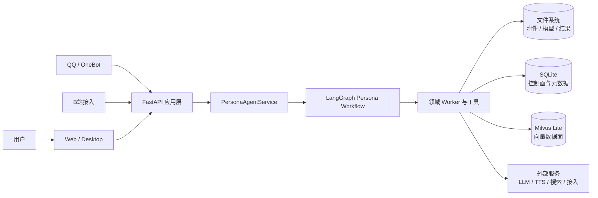
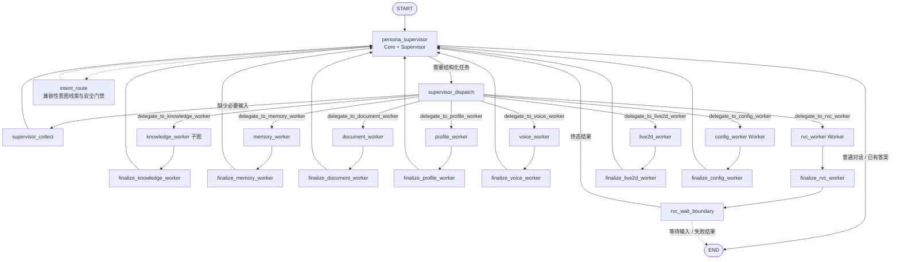
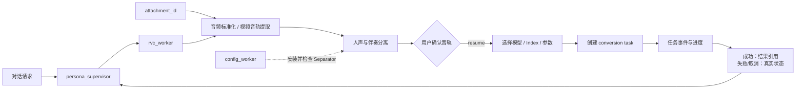

<div align="center">

# YUMENO

**本地优先的角色化 Agent 运行平台：让角色能够理解意图、编排工具、调用领域 Worker，并在对话中完成可恢复的真实任务。**

[](https://www.python.org/)
[](https://fastapi.tiangolo.com/)
[](https://langchain-ai.github.io/langgraph/)
[](https://milvus.io/)
[](LICENSE)
[](https://github.com/TKGEKKOU/yumeno)

[快速开始](#快速开始) · [核心能力](#核心能力) · [系统架构](#系统架构) · [项目结构](#项目结构) · [测试](#测试与验证)

</div>

YUMENO 是一个**本地优先的角色 Agent 工作台**。它把角色对话、工具调用、知识检索、语音能力和长任务执行组织在同一条可恢复的 Agent 链路中。

与“聊天页 + 一组互相独立的设置页”不同，YUMENO 的对话不仅用于回答问题，也可以作为实际操作入口：用户可以直接提出“检查资源”“安装模型”“启动 GPT-SoVITS”“把资料加入知识库”或“用这段音频做 RVC 变声”，系统会根据真实状态完成检查、配置、执行和结果回收，并在对话中展示可继续操作的任务卡片。

核心使用主线：

```text
创建角色
  → 配置角色的知识、声音与能力
  → 与角色对话
  → Agent 按需调用 Worker
  → 在对话中完成资源准备、服务启动与长任务
  → 返回结果、状态和下一步操作
```

## 项目简介

### 对话即控制台

对话是 YUMENO 的主要工作区，设置页用于查看状态和精细配置，但不是完成任务的唯一入口。资源、服务和文件任务都可以由角色 Agent 统一调度：

| 对话请求 | 负责执行的 Worker | 用户得到的结果 |
| --- | --- | --- |
| 检查或安装 RVC、Separator 等资源 | `config_worker` | 资源状态、容量、阶段、进度和下一步操作 |
| 启动 GPT-SoVITS 服务 | `voice_worker` | 按需启动状态、就绪结果和快捷入口 |
| 用音频或视频进行 RVC 变声 | `rvc_worker` | 上传、分离、确认、转换和结果音频 |
| 将资料加入当前角色知识库 | `document_worker` / `knowledge_worker` | 文档处理状态、索引状态和检索结果 |
| 配置联网搜索或其它服务 | 对应 Worker 与服务配置 | 语义化配置结果和启用状态 |

任务不会被伪装成“已完成”。系统明确区分未配置、未安装、未启动、检查中、运行中、等待输入、失败、取消和已完成；长任务可以在卡片中确认、补充输入、停止、恢复或重试。

### 核心分工

```text
Core Agent       理解自然语言、识别意图和所需输入
Supervisor       选择 Worker、维护工作流、收口状态与用户回复
领域 Worker      执行知识、文档、声音、RVC、资源等具体业务
Native Runtime   管理 Session、Run/Job、事件、Resume、Cancel 和 Finish
```

GPT-SoVITS、RVC、RAG、文档、记忆、Live2D、Skill、MCP、QQ 和 B站不是彼此割裂的产品入口，而是角色 Agent 可以按需使用的能力。

### 设计目标

- **对话优先**：尽量在当前会话完成配置和长任务，避免用户手动拼接接口或切换多个页面。
- **状态真实**：界面展示后端真实状态，并为每种非就绪状态提供明确的下一步。
- **职责清晰**：Core Agent 负责理解，Supervisor 负责编排，Worker 负责领域执行，Runtime 负责生命周期。
- **本地优先**：默认使用本地文件、SQLite 和 Milvus Lite，不要求 Docker 或独立服务作为普通用户的启动前置条件。
- **边界安全**：任务合同只传递稳定引用和结构化选项，不把本地路径、Shell 或可执行命令交给前端或模型。

## 核心能力

| 能力 | 说明 |
| --- | --- |
| 角色 Agent 对话 | 角色资料、记忆、知识和能力策略共同参与对话，支持流式输出、中断和停止。 |
| Supervisor 编排 | 处理 Worker 委派、缺失输入、人工确认、恢复、取消和结果收口。 |
| 对话式资源管理 | 通过自然语言检查、下载、启动、停止和配置受管资源；任务卡片提供进度、操作和真实错误。 |
| RVC 文件型任务 | 以 `attachment_id`、RVC session 和 conversion task 串联准备、分离、确认、转换和结果回收。 |
| GPT-SoVITS | 支持服务按需启动、TTS/ASR、Voice Asset、素材分析、训练和角色绑定。 |
| RAG 知识链路 | 支持文档导入、分块、Embedding、Milvus Lite 检索、重排、质量门和评测。 |
| 扩展能力 | 通过 Skill、MCP、QQ/OneBot、B站等扩展角色的工具和接入范围。 |
| Native Runtime | 在进程内管理运行记录、Job、事件流、Resume、Cancel 和 Finish。 |

## 快速开始

### 推荐方式：Windows PowerShell

```powershell
git clone git@github.com:TKGEKKOU/yumeno.git
cd yumeno
.\scripts\start.ps1
```

如果当前 PowerShell 阻止脚本执行：

```powershell
Set-ExecutionPolicy -Scope Process Bypass
.\scripts\start.ps1
```

启动后访问：

```text
http://127.0.0.1:17000/static/index.html
```

### 手动启动

```powershell
py -3.11 -m venv .venv
.\.venv\Scripts\python.exe -m pip install -e . -r requirements.txt
Copy-Item .env.example .env
.\.venv\Scripts\python.exe -B main.py
```

### 第一次使用

只需先配置一个可用的 LLM Provider。创建或选择角色后，直接在对话中提出需求即可：

```text
检查所有运行资源
安装人声分离模型
启动 GPT-SoVITS 服务
把这份 PDF 加入当前角色知识库
用刚上传的音频开始 RVC 变声
```

Embedding、Reranker、GPT-SoVITS、RVC、FFmpeg 等能力按需准备；未安装或未启动不等于系统错误，系统会在任务卡片中提示可执行的下一步。
## 系统架构

YUMENO 的核心不是把多个功能页堆在一起，而是让**角色 Agent 成为统一入口**：用户从对话提出目标，Core Agent 负责理解，Supervisor 负责调度，领域 Worker 负责执行，Runtime 负责把长任务变成可观察、可恢复、可停止的运行过程。

从产品主线看，系统围绕这一条闭环展开：

```text
创建角色
  → 为角色绑定知识、声音和能力
  → 与角色对话
  → Agent 按需调用 Worker
  → 在对话中完成资源准备、服务启动和长任务
  → 返回可继续操作的结果
```

### 系统边界



### Agent 主流程



`START → persona_supervisor` 是当前真实入口。普通对话由 Supervisor 直接收口；需要执行动作时，Supervisor 生成结构化委派请求，Worker 返回状态、事实或结果引用，再由 Supervisor 组织用户可见回复。`intent_route` 仅作为兼容性意图线索和安全门禁，不是另一条主入口。

### 以 RVC 为例：对话如何完成一个真实文件任务

RVC 是当前最完整的文件型 Worker 样板，也最能体现 YUMENO 与普通“聊天 + 独立工具页”的区别：文件、资源、确认、长任务和结果都在同一个对话任务里闭环完成。



GPT-SoVITS 遵循同一套 Agent 控制链路，但业务重点不同：`voice_worker` 先检查运行环境和服务状态；服务未启动时按需启动，已安装但未启动不视为错误。语音合成会读取角色绑定的 Voice Asset，完成文本分段和语言校验后生成音频；音色创建和训练则经过参考音频上传、素材分析、用户确认、训练进度和角色绑定。运行资源由 `config_worker` 管理，语音业务由 `voice_worker` 管理，二者不混淆。

这三张图分别回答三个问题：系统接收什么、Agent 如何调度、一个真实长任务如何落地。其它 Worker 沿用相同的委派和任务协议，不在 README 中为每个能力重复绘图。

## Worker 注册表

当前 canonical name 统一使用 `_worker` 后缀：

| Worker | 领域职责 |
| --- | --- |
| `knowledge_worker` | 知识检索、结构化查询和策略化联网补充 |
| `memory_worker` | 角色记忆、用户记忆和工作区记忆 |
| `document_worker` | 文档列表、资料导入、URL 导入、删除和索引相关操作 |
| `profile_worker` | 角色档案、人设和角色相关导出 |
| `voice_worker` | GPT-SoVITS、TTS、ASR、音色和训练相关业务 |
| `rvc_worker` | 音频准备、人声分离、模型选择、转换任务和结果 |
| `live2d_worker` | Live2D 模型、目录和相关连接管理 |
| `config_worker` | 应用受管资源的检测、安装、下载、停止、卸载和状态 |

旧请求仍可兼容解析：

```text
knowledge / memory / document / profile / voice / voice_clone
rvc / live2d / config
```

这些是别名，不会创建重复 Worker。MCP 工具属于外部扩展能力，不冒充内置 Worker。

## 典型任务链路

所有可执行能力都遵循同一条主链路：

```text
用户请求
  → Core Agent 理解意图
  → Supervisor 生成结构化委派
  → Worker 检查输入与资源并执行
  → Runtime 记录事件、进度和运行状态
  → 对话卡片等待确认、补充输入或停止
  → Supervisor 收口为回复、结果或下一步操作
```

RVC 是文件型长任务示例：附件通过 `attachment_id` 进入 `rvc_worker`，经过音频准备、分离、用户确认、模型参数选择和异步转换后返回结果引用。GPT-SoVITS 是按需服务示例：`voice_worker` 检查服务状态，必要时启动 GPT-SoVITS，再执行语音合成、音色素材分析或训练流程。前端只提交结构化操作，不直接创建 session、执行处理接口或依赖浏览器临时路径。

## 数据与资源边界

### RAG 数据边界

```text
SQLite（控制面）
  角色、会话、知识空间、文档元数据、文档任务、索引状态、查询记录、评测数据和运行摘要

Milvus Lite（向量数据面）
  文档分块、Dense/Sparse Vector 和向量检索索引

文件系统
  原始文档、附件、模型、音频和任务结果
```

SQLite 存在知识空间、文档任务或 RAG 查询记录，并不代表向量存储在 SQLite。三类数据通过 `workspace_id`、`knowledge_space_id`、`document_id` 和 `source_hash` 关联。

### 资源管理边界

`config_worker` 只操作应用受管目录，例如 RVC 运行环境、Separator、ASR、GPT-SoVITS、FFmpeg、Embedding 和 Reranker。以下内容不进入普通资源卸载逻辑：

- 用户 `.pth`、`.index` 音色模型；
- 会话附件、历史音频和历史任务结果；
- 用户知识文档；
- 不属于应用受管路径的文件；
- 远程 API Provider。

## 项目结构

```text
YUMENO/
├─ agents/
│  ├─ graph/              LangGraph 父图、Supervisor、knowledge 子图
│  ├─ runtime/            Native Runtime、Run/Job、事件和生命周期适配
│  ├─ registry.py         Worker canonical name、manifest 和工具权限
│  ├─ tools/              领域工具与 Worker 执行入口
│  └─ contracts/          结构化交接、错误和运行合同
├─ app/
│  ├─ routers/            FastAPI 路由与 API
│  ├─ models/             SQLite 控制面模型
│  └─ run_store.py        运行记录、任务、步骤和事件持久化
├─ persona/               角色、草稿、版本、记忆和知识绑定
├─ rag/                   检索、重写、重排、质量门和评测
├─ ingestion/             文档解析、分块、Embedding 和 Milvus Lite 索引
├─ voice/                 GPT-SoVITS、RVC、Separator、ASR、TTS 和音频任务
├─ realtime/              会话、执行和事件协议
├─ frontend/              Vue 工作台、能力和供应商配置
├─ static/                对话页、兼容入口和共享前端资源
├─ diagrams/              与代码核对过的 Mermaid 架构图
├─ docs/                  技术说明、部署材料和设计记录
└─ tests/                 Python、API、RAG、Runtime、Vue 和 JavaScript 测试
```

## 配置原则

- **LLM**：首次使用的必要配置；负责 Core/Supervisor 的自然语言理解和表达。
- **Embedding / Reranker**：知识检索按需配置，默认配合 Milvus Lite 使用。
- **GPT-SoVITS**：运行环境可以已安装但默认不启动，语音开启时按需启动。
- **RVC / Separator / FFmpeg**：由 `config_worker` 检查和管理，RVC 业务由 `rvc_worker` 执行。
- **外部接入**：QQ、B站、联网搜索和远程 Provider 使用各自语义化配置，不共享误导性的“模型/来源/设备”字段。

## 测试与验证

仓库为后端、Agent、Runtime、RAG、API、Vue 和 JavaScript 保留了对应测试。常用命令：

```powershell
# Python 全量测试
.\.venv\Scripts\python.exe -m pytest -q

# JavaScript 测试
node --test tests/js/*.test.cjs

# Vue 测试、类型检查和前端构建
Push-Location frontend
npm test -- --run
npm run typecheck
npm run build:frontend
Pop-Location

# 编译和静态检查
.\.venv\Scripts\python.exe -m compileall -q agents app ingestion rag persona realtime voice
node --check static/js/app.js
git diff --check
```

对于依赖真实外部服务、大型模型、GPU 或网络的场景，我们以当前环境状态为准；未配置时不会把测试或界面结果伪报为成功。

## 当前边界

目前主要面向本地单用户和 Windows 桌面场景。Native Runtime 采用进程内实现，运行记录通过应用存储适配；暂不把分布式队列、高可用集群、生产级多租户隔离或远程 Milvus 作为默认部署目标。外部模型、GPT-SoVITS、RVC、FFmpeg、Live2D 和用户资产仍受各自许可证与使用条件约束。

## 安全与授权

- 仅处理你拥有或已获得明确授权的声音、视频、文档和其它资料。
- Agent 合同拒绝 `path`、`command`、`shell` 和 `python` 等执行字段。
- 角色、工作区、知识空间和附件作用域由服务端建立，客户端不能扩大权限。
- 高风险写操作、联网行为和资源操作可进入人工确认与 checkpoint 恢复。
- 请勿将 API Key、Token、私有音频、用户文档或原始工具载荷提交到 Issue。

## 联系方式

- GitHub：[@TKGEKKOU](https://github.com/TKGEKKOU)
- QQ：`3198260896`
- 邮箱：`3198260896@qq.com`
- 项目问题：请优先提交 [GitHub Issues](https://github.com/TKGEKKOU/yumeno/issues)

## 许可证与第三方声明

YUMENO 自有代码采用 [MIT License](LICENSE)。第三方依赖、模型、GPT-SoVITS、RVC、FFmpeg、Milvus Lite、Live2D Cubism Core 和用户提供的资产不自动继承 MIT License，请同时阅读 [THIRD_PARTY_NOTICES.md](THIRD_PARTY_NOTICES.md) 及对应上游许可证。

## 贡献

欢迎提交 Issue 或 Pull Request。提交 Agent、Worker、Runtime 或架构图修改时，请同时说明影响的状态、权限、数据边界和测试命令；涉及模型和第三方代码时，请确认许可证与分发边界。
