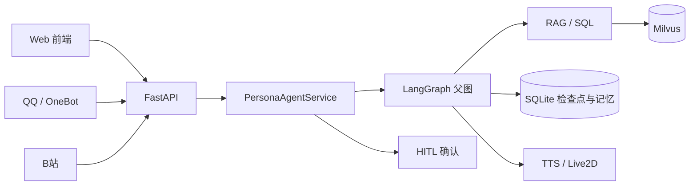
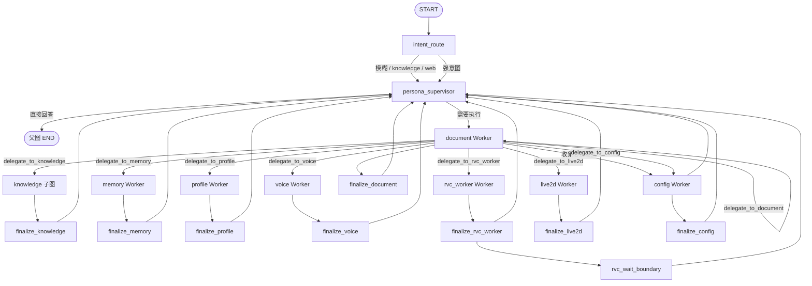
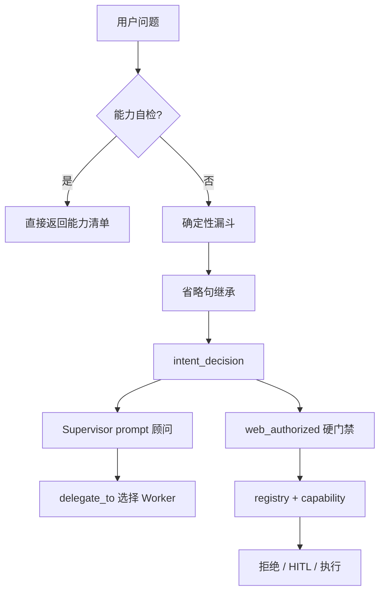
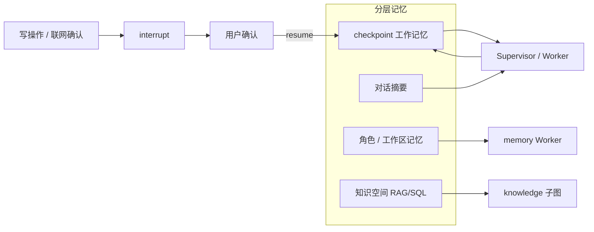
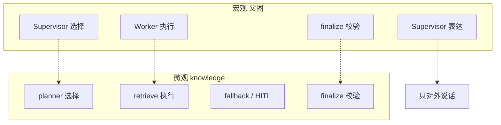
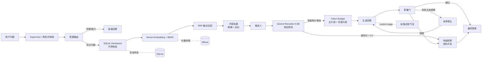

# YUMENO

[](https://github.com/TKGEKKOU/yumeno/releases)
[](https://github.com/TKGEKKOU/yumeno/releases)
[](https://github.com/TKGEKKOU/yumeno)

> 曾用名 PersonaLive；代码、容器名、API 校验头等内部标识仍沿用 `personalive` 前缀，作为工程别名保留。
## 当前版本说明（2026-09-02）

当前工作重点是先把 **Web 对话页、会话文件和 Agent 运行时**整理成稳定基础，再逐步接入更多 Worker。RVC 已作为首个真实文件型 Worker 样板：对话页通过会话附件取得受管 `attachment_id`，由 Agent/Worker 调度共享 RVC session 与 task 服务，前端只展示状态、进度、分离结果和最终音频，不传递浏览器临时路径。

已纳入当前版本的基础能力：

- Core Agent / Supervisor-centric LangGraph 运行时，支持受限 Worker 委派、结构化运行记录、取消和 HITL 恢复；
- 统一会话附件：上传、列表、预览、重命名、删除、重试，以及音频/视频/文档等文件引用；
- 对话内 RVC 工作区：源文件上传、标准化、人声/伴奏分离、模型与 Index 选择、转换进度、取消和结果回挂；
- 思考内容与调试信息分开控制，默认保持简洁对话；
- RAG 文档处理、知识空间隔离、检索质量门、评测与运行 trace；
- GPT-SoVITS、ASR、TTS、Live2D、OneBot/B 站等能力保留独立页面和受控接口，后续按统一 Worker 合同逐步接入。

> 说明：RVC、语音引擎和本地模型能力依赖本机安装的运行时、FFmpeg、模型文件及提供商配置；没有配置时，页面应显示可解释的不可用状态，不会伪造成功结果。

### 本版本验证

在 Windows / Python 3.11 环境中，提交前至少运行以下检查：

```powershell
node --test tests/js/*.test.cjs
.\.venv\Scripts\python.exe -m pytest -q
```

当前仓库包含完整的 Agent、RVC、附件、RAG、运行时和前端结构测试；如果本机缺少可选语音模型、FFmpeg 或外部服务，相关能力会按依赖不可用处理。README 不把“依赖未配置”标记为功能成功，也不把未完成的真实浏览器验收写成已完成。

**YUMENO** 是一个**工程化的企业级 Multi-Agent RAG 编排引擎**，专为知识密集场景设计。不是又一个聊天机器人，而是将 **LangGraph 多智能体协作** 与 **自适应纠错式 RAG** 深度融合的生产级平台。

## 🎯 核心差异化能力

### 1. 自适应纠错式 RAG（行业领先）
- **查询改写 + 质量门 + 有界重试**：准确率提升 **31%**，幻觉率降低 **39%**（[评测报告](benchmarks/rag_quality_results.json)）
- **混合检索**：Dense + BM25 + RRF 融合，Recall@3 = 85%
- **结构化查询**：CSV/XLSX → Text-to-SQL，AST 验证 + 只读沙箱执行

RAG 结果使用稳定的错误合同：`insufficient` 表示流程正常但证据不足；
`failed_retrieval`、`failed_generation`、`failed_quality_gate` 和
`dependency_unavailable` 表示对应阶段失败。失败结果会丢弃答案草稿和证据，
API、Agent 以及历史查询记录只返回脱敏后的错误消息。

### 2. LangGraph 多 Agent 编排 + HITL
- **Supervisor + knowledge 子图 + 6 个领域 Worker**：知识走确定性管线，其余 Worker 使用受限工具
- **HITL 中断恢复**：变更操作需人工批准，LangGraph checkpoint 可恢复

### 3. 知识隔离架构
- **workspace/knowledge_space** 双层隔离，杜绝跨角色数据串扰
- **工具作用域过滤**：Worker 只能访问授权的知识空间

### 4. 完整的评测与可观测性
- **核心链路测试**覆盖 Agent、RAG、权限、运行时与 API 合同
- **RAG 基准测试**：Recall@3、MRR@3、检索 P95、拒答率
- **运行指标**：TTFT、Token 消耗、工具调用、RAG trace

---

## 🆚 与通用 IM 机器人的区别

| 特性 | 通用 IM 机器人 | YUMENO |
|------|---------------|--------|
| **定位** | 多平台消息集成 | 知识增强的 AI 编排引擎 |
| **Agent 架构** | 单 Agent + 工具集 | Supervisor-centric 混合图（1 个 Supervisor + 1 个 knowledge 子图 + 6 个领域 Worker） |
| **RAG 深度** | 简单检索 | 自适应纠错 + 质量门 |
| **知识隔离** | 无 | workspace/knowledge_space |
| **韧性保证** | 基础错误处理 | HITL 确认 + checkpoint 恢复 |
| **评测体系** | 无 | 完整基准测试 |

---


### 4. 端到端 Agent 能力展示
- **语音 Worker**：自动化 5 步流程（上传素材 → 质量检测 → 训练 → 试听 → 绑定）
- **配置管理 Worker**：运行时修改 LLM/Embedding/RAG/TTS/安全设置，支持 HITL 确认
- **SQL 安全加固**：10 层防护机制（递归 CTE/JOIN 深度/子查询/表白名单/危险函数/结果集限制）
## 📊 性能指标（真实评测）

| 指标 | 自适应 RAG | 传统单阶段 RAG | 改进 |
|------|-----------|---------|------|
| **准确率** | 85% | 65% | **+31%** |
| **幻觉率** | 14% | 23% | **-39%** |
| **Recall@3** | 85% | 62% | **+37%** |

*评测环境：650 文档 character 预设*

---

YUMENO 是一个**本地优先、工程化**的角色化多 Agent RAG 平台。它以 LangGraph 1.2.9 为底层运行时，将
**人设驱动的多 Agent 编排**与**自适应纠错式 RAG** 深度耦合：每个角色拥有独立的身份设定、知识空间、
会话状态与记忆，通过 Supervisor 调度 knowledge 子图与 memory / document / profile / voice / live2d / config
knowledge 子图 与六个领域 Worker，通过质量门与有界纠错机制抑制幻觉，最终以角色口吻生成接地、可信、可追溯的回复。

平台强调**本地优先与离线可用**：LLM 与 Embedding 通过任意 OpenAI-compatible 接口接入，语音识别
（Qwen3-ASR）、语音合成（GPT-SoVITS）与向量化（Qwen3-Embedding）均可本地部署、按需安装；
角色、对话、记忆与运行记录存本地 SQLite，默认使用嵌入式 `milvus-lite` 保存向量知识；
也可以通过 `.env` 接入远程 Milvus，无需注册与登录。


## 核心架构

从桌面启动、进程关系到 Agent/RAG、记忆、Skill/MCP/Tool、语音、Live2D 与消息接入的完整调用链，见 [YUMENO 项目完整技术解读](docs/architecture/YUMENO-project-deep-dive.md)。能力系统的操作参考见 [Agent 能力系统架构与操作说明](docs/agent-capability-system.md)；早期实施过程见 [能力系统长计划成果报告](docs/agent-capability-system-implementation-report.md)。

当前运行时是 **hybrid Supervisor-centric**，不是把所有能力做成对等 LLM 子 Agent：

- 1 个对外 `persona_supervisor`（LLM + 工具循环）
- 1 个 `knowledge` Planner 子图（单次策略决策 + 受控的完整 RAG/SQL/web 管线，**不是** `create_agent`）
- 6 个领域 Worker：`memory` / `document` / `profile` / `voice` / `live2d` / `config`，均通过受限工具执行

Worker 不互调，也不直达父图 END。`knowledge` 负责知识检索与结构化查询，但不负责最终用户表达；所有领域结果经 `finalize_*` 合同校验后回到 Supervisor，由它结合人设说话。

图直接画在 Markdown 里。父图拓扑由 `agents.graph.diagram.parent_graph_mermaid()` 按 `WORKERS` 生成；
LangGraph 原生 `get_graph().draw_mermaid()` 画不出 Command/handoff 边，所以不以那张残缺导出为准。
knowledge 子图没有 handoff，可以用 LangGraph 原生导出核对。

### 架构图

#### 系统上下文



#### 完整 Multi-Agent 父图



#### knowledge 子图


#### 意图与权限



#### 分层记忆与 HITL



#### 宏观到微观同构



#### RAG 检索管线（knowledge_retrieve 内部）



### 设计取舍与工程实践

### 1. Agent 系统：Supervisor-centric 混合图

对话层采用 **LangGraph Supervisor 集中式监督架构**（星形拓扑）：仅 `persona_supervisor` 对用户可见。
knowledge 走 Planner + 确定性管线，其余 5 个 Worker 才是 `create_agent` 子图；最终答复统一由 Supervisor 结合完整人设资料整合生成。

**构建方式**：基于 LangChain 1.3.14 的 `create_agent()` 标准入口，底层封装 LangGraph 执行机制
（模型调用 → 工具决策 → 执行 → 结果整合的闭环）；通过**中间件（Middleware）**的 `dynamic_prompt`
钩子在每次模型调用前动态注入角色人设、持久记忆与回复约束，无需为每个角色维护静态提示词模板；
通过 `context_schema` 将角色/会话上下文（`PersonaAgentContext`）作为不可变上下文注入工具运行时，
实现严格的**作用域过滤**。knowledge 不走这条 `create_agent` 回路。

工具调用协议建立在模型原生 **Function Calling** 能力之上：LLM 负责意图识别并生成结构化的工具
调用指令，框架负责执行、状态管理与结果反馈；本项目在此基础上叠加 Supervisor 路由、作用域过滤
与人工确认，将"单次函数调用"扩展为"可审计的多轮 Agent 协作"。能力自检在进图前短路；漏斗写入
`intent_decision`；真正的网页闸门只有 `intent_decision.web_authorized`。

**Worker 分工与最小权限**：

| 节点 | 类型 | 职责 |
|---|---|---|
| knowledge | Planner 子图，不是 `create_agent` | RAG / 只读 SQL；证据不足才按 `web_authorized` 升级联网 |
| memory | `create_agent` | 读取与维护 `persona_memories` |
| document | `create_agent` | 文档与资料管理，写操作走 HITL |
| profile | `create_agent` | 人设资料变更，写操作走 HITL |
| voice | `create_agent` | 音色素材、训练与绑定 |
| live2d | `create_agent` | Live2D 模型与 VTube Studio 配置 |
| config | `create_agent` | 运行时配置，写操作走 HITL |

**Agent 间通信（Handoff）**：为每个 Worker 动态创建 `delegate_to_*` handoff 工具，通过
`Command(PARENT, goto=worker_node, update=...)` 将控制权从 Supervisor 子图交还父图对应节点；
Worker 执行完毕后由 `finalize` 节点将结果封装为**结构化交接合同**（knowledge 走 JSON 协议，
其余走文本摘要），以 `ToolMessage` 按 `tool_call_id` 回填，保证工具调用协议闭环。

**Human-in-the-loop（人机协同）**：变更类工具（新增资料、修改人设、删除文档）在执行前调用
LangGraph `interrupt()` 触发中断，返回待审批的操作详情（工具名 + 参数）；前端弹出确认框，
用户批准或拒绝后通过 `Command(resume=...)` 从检查点恢复，未完成的 Worker 步骤不会重跑。

**上下文工程：记忆分层**（短期记忆 + 长期记忆）：

- **短期记忆（线程范围）**：`langgraph-checkpoint-sqlite` 将会话状态持久化到本地 SQLite，按
  `thread_id = persona_id:conversation_id` 隔离不同会话；无数据库时自动回退 `MemorySaver`。
- **长期记忆（跨会话）**：`persona_memories` 表按角色持久化用户偏好等事实，由 memory Worker
  写入，Supervisor 每次请求经中间件注入，实现跨会话的个性化响应。

### 2. RAG 系统：自适应纠错式检索增强生成

#### 文档处理管线

文档经 **MarkItDown** 解析为 Markdown，由**结构感知分块器**（标题感知 + 递归字符切分，
`chunk_size=1000 / overlap=150`）切成语义连贯的块，并为每个块写入元数据
（`workspace_id`、`knowledge_space_id`、`category`、来源路径、`chunk_id`），以**内容哈希**实现
增量入库，重复上传自动去重。

#### 两阶段检索：候选召回 + 精化排序

检索层采用**两阶段策略**。第一阶段**候选召回（Recall）**——双路混合检索 + 排名融合：

- **Dense 路**：本地/远程 Embedding 生成稠密向量，Milvus `HNSW` 索引（IP 内积）负责语义召回；
- **Sparse 路**：Milvus 内置 **BM25 函数**将原文转为稀疏向量（`SPARSE_INVERTED_INDEX`），
  负责关键词、专有名词的精确匹配（中文经 jieba 分词）；
- **融合**：两路候选经 **RRF（Reciprocal Rank Fusion）** 融合排序，兼顾语义与词汇信号；
- **强制作用域过滤**：`expr` 在检索阶段即按角色知识空间过滤，先过滤、再排序，杜绝跨角色数据串扰。

第二阶段**精化排序（Ranking）**由可用的本地 Reranker 对召回候选进行排序；Reranker 不可用时降级为确定性的 RRF 顺序，并把低置信结果交给后续质量门。

#### Adaptive / Corrective 执行流

默认 `RAG_PIPELINE=default` 走**自适应纠错图**（LangGraph `StateGraph` 手工编排，全部循环有硬边界）：

```text
路由 -> 检索 -> Reranker 精排 -> 生成 -> 答案质量门 -> （通过 / 改写重试 / 联网回退 / 纠错重生成 / 拒答）
```

- **路由**：意图识别区分知识问答 / 闲聊 / 能力询问 / 联网需求，支持强制走知识链路；
- **候选精排与证据筛选**：先用 Reranker 对候选块精排并截断；不可用时保留确定性候选并降低置信度，随后由质量门检查答案是否有证据支持；
- **查询改写**：置信度不足时把口语化问题改写成适合向量检索的陈述式查询，次数受
  `MAX_REWRITE_COUNT` 限制；
- **质量门**：所有生成答案都经过 LLM 校验 **grounded（事实接地）** 与
  **useful（问题解决）**，并给出纠错动作（重新生成 / 再检索 / 联网 / 拒答）；
- **有界纠错**：`missing_points` / `unsupported_claims` 反馈给下一轮生成，所有循环受计数器
  与联网开关约束，杜绝无限循环；最终兜底为保守拒答；
- **流式与可观测**：`graph.stream(stream_mode="values")` 逐节点回调，前端实时展示
  "当前环节 / 问题" 进度；`trace` 仅记录可公开摘要（节点、片段数、置信度、是否有答案）。

正式运行不提供绕过质量链的 `simple` 模式；`RAG_PIPELINE` 应保持为 `default`（兼容别名 `adaptive`）。`rag/simple_graph.py` 仅作为历史/实验实现保留，不属于正式入口。

#### 评测体系（离线、免标注、可缓存）

内置 RAG 离线评测（`rag/eval/`），一键对任意角色运行：

- **题集档位**：`fast`（5 题）/ `standard`（10 题）/ `thorough`（15 题），由 LLM 基于角色资料
  免标注生成，并内置无关问题探针；按内容指纹 + 档位缓存，资料不变不重复调用 LLM；
- **指标**：检索质量（`recall@k` / `precision@k` / `MRR` / `hit@1`）、生成质量
  （`grounded` / `useful`）、拒答率、正常作答率、通过率、置信度、检索与整链路延迟（均值 / P95）、
  跨角色隔离校验；逐条详情含问题、回答、判定与证据；
- **AI 分析**：`POST /api/eval/analyze` 对结果做异常 / 性能 / 功能归因分析（强制 ≤200 字）。

### 3. 语音与角色表现

- **本地 TTS**：GPT-SoVITS 训练式音色；每个音色保存参考语言，回复按语种分段合成并合并
  WAV（`/synthesize/stream`），同一音色可稳定朗读中文、日文、英文等；
- **口型同步**：文本 → 音素（viseme）序列与实时音频能量混合驱动 Live2D
  `ParamMouthOpenY / ParamMouthForm`，支持中文 / 日文 / 英文音素映射，也可经 WebSocket 驱动
  VTube Studio；
- **本地 ASR**：Qwen3-ASR-0.6B（CUDA 12.8）+ Silero VAD，自动识别中 / 英 / 日，离线可用；
- **Live2D 面板**：支持 Cubism 2 / 3 / 4 模型，自动眨眼、呼吸、拖拽缩放，聆听 / 思考 / 应答状态
  与语音链路联动。

### 4. 集成与扩展

- **Agent Skills 动态技能包**：技能 = 提示词包 + 可选工具集（`agents/skills/` 内置、
  `data/skills/` 自定义），由 `load_skill` 按需加载，加载后提示词注入 Supervisor
  system prompt、对应工具才对模型可见，从源头缓解工具过载；支持上传标准
  `SKILL.md` 技能包（zip，≤25MB、可含多个技能，frontmatter 用 `tool-names`
  声明工具），与既有 JSON 技能并存；
- **MCP 工具接入**：通过官方 MCP SDK 2.x 的持久 Session 连接外部
  MCP 服务器（stdio / streamable_http / SSE），工具转换为 LangChain `StructuredTool`，
  自动注册进 `ToolSpec` 表并被技能引用。
  插件页支持**运行时启停与热重连**（无需重启应用）、30 秒轮询刷新连接状态；
  stdio 启动命令受**白名单 / 黑名单 / 内联代码与危险参数拦截**保护
  （`MCP_ALLOW_ARBITRARY_STDIO=true` 仅跳过白名单）；按角色在**角色管理页**按服务器
  粒度授权，未授权角色即使技能引用该服务器工具也不可见（fail-closed），授权变更即时生效；
- **OneBot 11（QQ）**：通过 OneBot 11 正向 WebSocket 连接 NapCat 等转发端，外部渠道
  消息经 EventBus 广播路由到 Agent，渠道扩展不触碰 Agent 逻辑；
- **插件系统**：插件通过受限 `agent_runner` 与 EventBus 安全接入，不直接持有数据库或图对象；
- **实时会话**：WebSocket 带轮次 ID、确认事件与停止旧轮次能力，REST 与 WS 共用同一 LangGraph 会话；
- **启动方式**：默认 Web 工作台。`scripts/start.ps1` 使用本地 `milvus-lite` 启动 FastAPI，并打开浏览器；可选 `-Desktop` 宿主窗口只显示启动进度，工作台仍在浏览器中。

---

## 技术栈

| 领域 | 选型 |
|---|---|
| 编排框架 | LangGraph 1.2.9（`StateGraph` / `create_agent` / Middleware / Checkpoint） |
| Agent 入口 | LangChain 1.3.14 `create_agent()` + `dynamic_prompt` 中间件 |
| 状态持久化 | `langgraph-checkpoint-sqlite` / `MemorySaver` |
| 向量数据库 | `milvus-lite`（默认本地运行；外部 Milvus 可选，Dense HNSW-IP + BM25 sparse + RRF） |
| 文档解析 | MarkItDown → 结构感知分块（jieba 中文分词） |
| 联网搜索 | Tavily / 博查 / 自定义协议，或内置免 key 搜索（free-search-mcp，本地优先、无需 API key） |
| 后端 | FastAPI / Uvicorn / SQLAlchemy / SQLite |
| 基础设施 | 默认 milvus-lite + 本地 SQLite；可选 Docker Compose（etcd / MinIO / Milvus / Attu） |
| 语音 | GPT-SoVITS（本地）/ Qwen3-ASR（本地）/ Silero VAD / Web Audio |
| 角色渲染 | PIXI.js + Live2D Cubism 2/3/4 + VTube Studio |

## 环境要求

- Python 3.11
- 默认无需 Docker Desktop；只有使用 Docker Compose 的远程 Milvus / 离线全栈方案时才需要
- OpenAI-compatible Chat 与 Embedding 接口（LLM / Embedding 供应商无关）

## 快速开始（Web 工作台）

从 GitHub 克隆或下载后，三步即可开始：

1. 安装 Python 3.11。默认配置使用嵌入式 `milvus-lite`，不需要单独安装或启动 Docker Desktop。
2. 源码用户在项目根目录运行 `.\scripts\start.ps1`；安装包用户运行 Setup / `YUMENO.exe`。脚本会准备虚拟环境、启动 FastAPI，并打开浏览器。
3. 浏览器打开 [http://127.0.0.1:17000/static/index.html](http://127.0.0.1:17000/static/index.html) 后，到「提供商配置」粘贴 LLM API Key，即可创建角色并开始对话。

可选：`.\scripts\start.ps1 -Desktop` 额外打开宿主进度窗口（不改变 Web-first 入口）；`-NoBrowser` 只启动服务。Docker 外部 Milvus / Attu 仅在需要时启用。

## 从源码运行（开发）

以下命令均在项目根目录执行。

### 一键启动

首次运行会自动创建 `.venv`、安装依赖、生成 `.env`，并使用本地 `milvus-lite` 启动 Web 工作台；
之后重复运行直接复用已有环境。

```powershell
.\scripts\start.ps1              # Web 工作台（默认）：使用 milvus-lite 并打开浏览器
.\scripts\start.ps1 -Desktop     # 额外打开宿主进度窗口（工作台仍在浏览器）
.\scripts\start.ps1 -Server      # 与默认 Web 模式相同（兼容旧参数）
.\scripts\start.ps1 -NoBrowser   # 只启动服务，不打开浏览器
.\scripts\start.ps1 -NoInstall   # 跳过依赖安装（环境已就绪时更快）
```

前置条件：安装 [Python 3.11](https://www.python.org/downloads/)（勾选 Add to PATH）。
如需使用 Docker Compose 托管 Milvus，再额外安装 [Docker Desktop](https://www.docker.com/products/docker-desktop/)。

### 手动启动

1. 创建 Python 3.11 虚拟环境并安装依赖：

```powershell
py -3.11 -m venv .venv
.\.venv\Scripts\python.exe -m pip install -e . -r requirements-dev.txt
```

应用数据存储于本地 SQLite 文件（`data/yumeno.db`，随 `data/` 目录被 Git 忽略），
无需额外初始化；首次启动时自动建库建表。

2. （可选）只有配置了远程 Milvus 时，才启动基础设施并等待健康：

```powershell
docker compose up -d
docker compose ps
```

使用默认 `milvus-lite` 时跳过这一步；使用 Docker Compose 时，等待 `etcd`、`standalone` 显示为 `healthy` 后再启动应用。

3. 启动服务端或桌面端：

```powershell
# 服务端（浏览器访问 http://127.0.0.1:17000）
.\.venv\Scripts\python.exe -B main.py

# 或桌面端（先安装桌面依赖）
.\.venv\Scripts\python.exe -m pip install -r requirements-desktop.txt
.\.venv\Scripts\python.exe -B desktop_main.py
```

Desktop 宿主窗口关闭时停止 FastAPI 与 ASR Worker；若启用了外部 Docker 基础设施，Docker 容器默认继续运行。生成 Windows onedir 包与安装程序：

```powershell
.\scripts\build_windows.ps1
```

## 配置说明

LLM、Embedding 与联网搜索配置在前端"设置"页完成，保存到 `data/local_settings.json`。

关键 `.env` 项：

```env
DB_PATH=data/yumeno.db                 # SQLite 应用数据库（角色/对话/记忆/会话状态）
RAG_PIPELINE=default                 # 正式入口：Adaptive/Corrective RAG（adaptive 为兼容别名）
MAX_REWRITE_COUNT=2                  # 查询改写次数上限
MAX_GENERATION_RETRY=2               # 生成纠错次数上限
DEFAULT_CONFIDENCE_THRESHOLD=0.75    # 高置信度直通阈值
COLLECTION_NAME=yumeno_knowledge_v1  # Milvus 集合名（更换 Embedding 维度时需换新集合）
```

> **可选外部 Milvus 部署注意**：启用 `docker-compose.yml` 时使用固定容器名与绑定数据目录，
> 同一台机器运行第二个副本时请按 README 末尾的
> "下载副本与 Docker 重名冲突"一节调整容器名与宿主机端口，不要删除数据目录。

## 主要接口

- `POST /api/personas`：创建角色及其独立知识空间。
- `GET /api/personas`：列出本地角色。
- `POST /api/knowledge-spaces/{space_id}/documents/upload`：批量上传并生成 Markdown 预览。
- `POST /api/documents/{job_id}/confirm`：确认并异步入库（默认写入本地 `milvus-lite`；外部 Milvus 可选）。
- `POST /api/documents/{job_id}/retry-index`：重试失败的入库任务。
- `GET /api/documents/{job_id}`：查询任务状态。
- `POST /api/personas/{persona_id}/rag/query`：执行角色隔离的完整 RAG 查询。
- `POST /api/personas/{persona_id}/agent/query`：人设主 Agent 对话与 Worker 委派。
- `POST /api/personas/{persona_id}/agent/resume`：确认 / 拒绝已暂停的管理操作（HITL 恢复）。
- `GET /api/runs/{run_id}`、`GET /api/runs/{run_id}/events`：查询本机 Agent Runtime 的运行状态与事件。

> `/api/runs` 仅供绑定本机地址时的开发 / 运维诊断，不是远程运维、公网监控或管理接口。
- `POST /api/runs/{run_id}/cancel`、`POST /api/runs/{run_id}/approval`：取消运行或处理等待中的 HITL 审批。
- `POST /api/eval/run`：启动离线 RAG 评测（`tier` / `max_cases` / `web_fallback`）。
- `GET /api/eval/status`、`GET /api/eval/results`：评测进度与结果。
- `POST /api/eval/analyze`：AI 归因分析（≤200 字）。
- `POST /api/tts/personas/{persona_id}/conversations/{conversation_id}/synthesize/stream`：
  按句流式 TTS 合成。
- `POST /api/personas/{persona_id}/conversations/{conversation_id}/voice-messages`：保存语音消息。
- `POST /api/voice-messages/{message_id}/transcribe`：本地转写语音并交给 Agent。
- `WS /ws/personas/{persona_id}/conversations/{conversation_id}`：实时会话
  （轮次 ID、确认事件、停止旧轮次）。

请求不能提交 `workspace_id` 或 `knowledge_space_id`：服务端始终从路径中的角色解析作用域，
Milvus 写入、删除与查询均携带工作空间与知识空间过滤条件，杜绝跨角色数据串扰。

## 访问入口

- Web 工作台：<http://127.0.0.1:17000/static/index.html>
- API 文档：<http://127.0.0.1:17000/docs>
- Runtime 诊断：<http://127.0.0.1:17000/api/runs/{run_id}>（仅用于本机运行诊断，不是远程运维或公网监控接口）
- 组件状态：<http://127.0.0.1:17000/api/status>
- SQLite 管理（datasette，只读）：<http://127.0.0.1:17000/sqlite/>
- Attu（外部 Docker Milvus 控制台，可选）：<http://127.0.0.1:17003>

## 进程管理

```powershell
Get-NetTCPConnection -LocalPort 17000 -State Listen |
    Select-Object LocalAddress, LocalPort, OwningProcess
```

停止 FastAPI：

```powershell
$conn = Get-NetTCPConnection -LocalPort 17000 -State Listen -ErrorAction SilentlyContinue
if ($conn) {
    Stop-Process -Id $conn.OwningProcess
    Write-Host "Stopped process PID:" $conn.OwningProcess
} else {
    Write-Host "No service is listening on port 17000"
}
```

如启用了可选的 Docker 外部 Milvus 基础设施，停止并保留数据：

```powershell
docker compose down
```

## 许可证与合规

本地语音合成使用 GPT-SoVITS。GPT-SoVITS 安装包由用户自行准备或从设置页配置，训练产物保存在
`data/gpt_sovits/voices`；训练清单必须使用 UTF-8 且语言标签正确，检测到乱码或标签错误时会阻止训练并要求重训。

正式发行包不包含 Live2D 模型；请在管理页打开模型目录并安装拥有使用许可的模型。

## 后续计划

- 使用固定真实知识库完成 Recall@3、MRR@3、检索 P95 和外部 LLM TTFT A/B，形成可审计质量基线；
- 独立 Reranker 精排（BGE / Qwen3-Reranker）与多模态（图片）向量化；
- **A2A / DeepAgents 生态评估**：验证跨框架智能体通信协议（A2A）与分层规划框架
  （DeepAgents）的接入可行性，为多智能体协作与任务规划能力预留扩展空间；
- 为 MCP、B站和 QQ 突发消息增加长时间压力测试、背压与更细的运行指标；
- 如需局域网或公网部署，增加身份认证、TLS、CORS/CSRF 收紧、限流与审计。
# Agent/RAG 架构

YUMENO 的主链路采用“Agent 策略决策 + LangGraph Workflow + 标准 Tool”分层：知识检索和结构化查询走一次策略调用后的确定性执行，权限、预处理、后处理和循环上限由 Workflow 负责。Milvus 保留为向量数据库，CSV/XLSX 进入 workspace 隔离 SQLite，通过只读 Text-to-SQL Tool 访问。

详细设计见 [Agent/RAG 平台架构](docs/architecture/agent-rag-platform.md)，实测结果见 [成果报告](docs/reports/2026-08-11-enterprise-agent-rag-result.md)。
