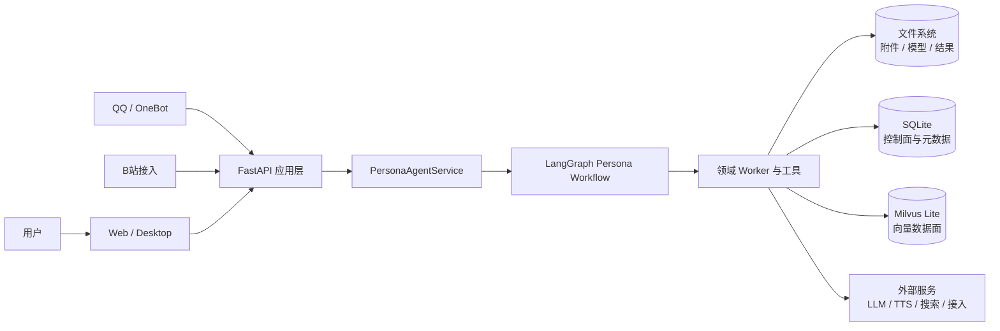
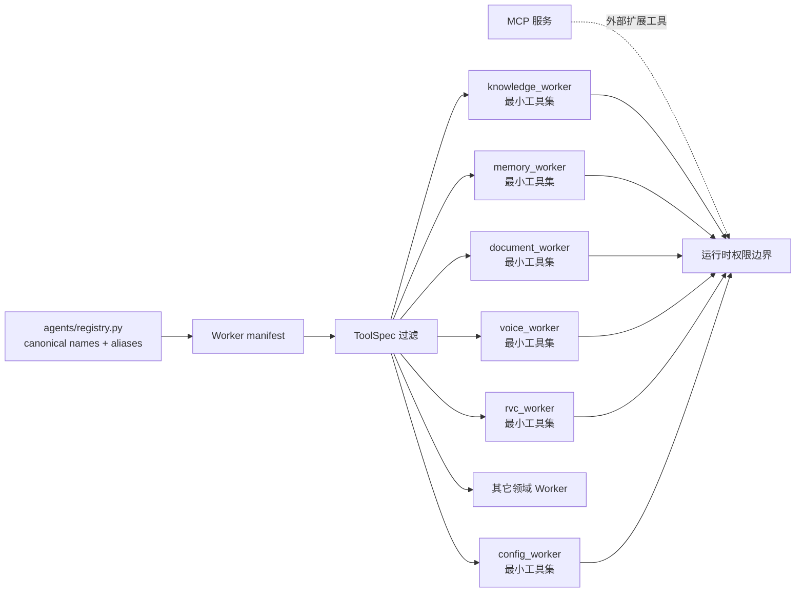
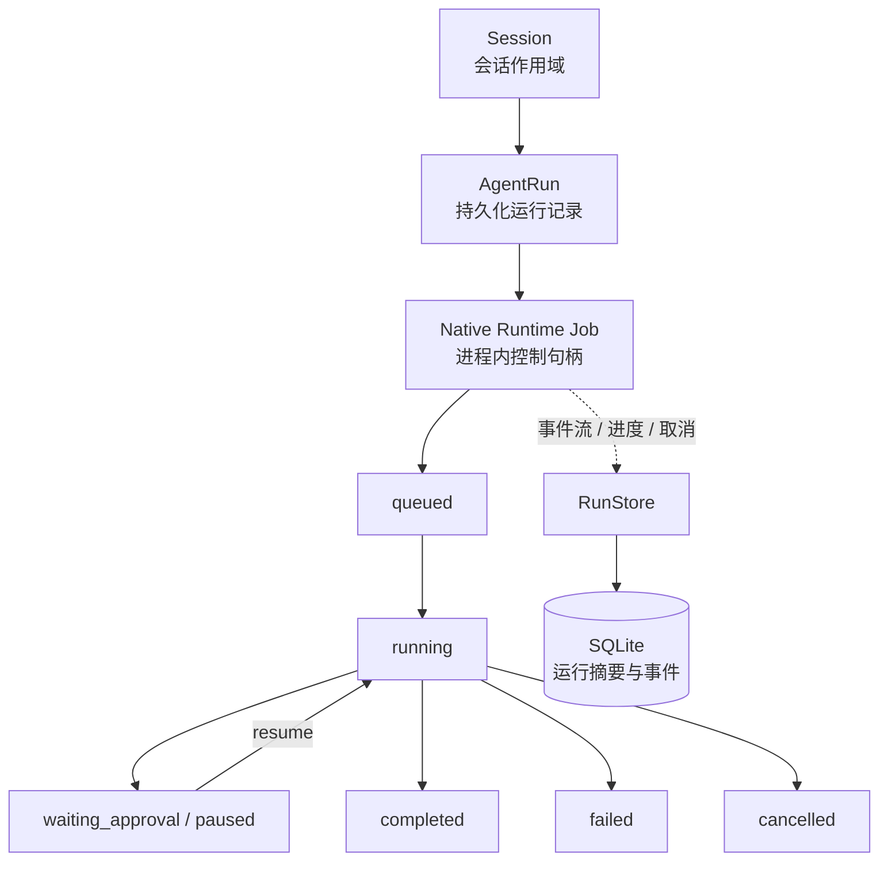
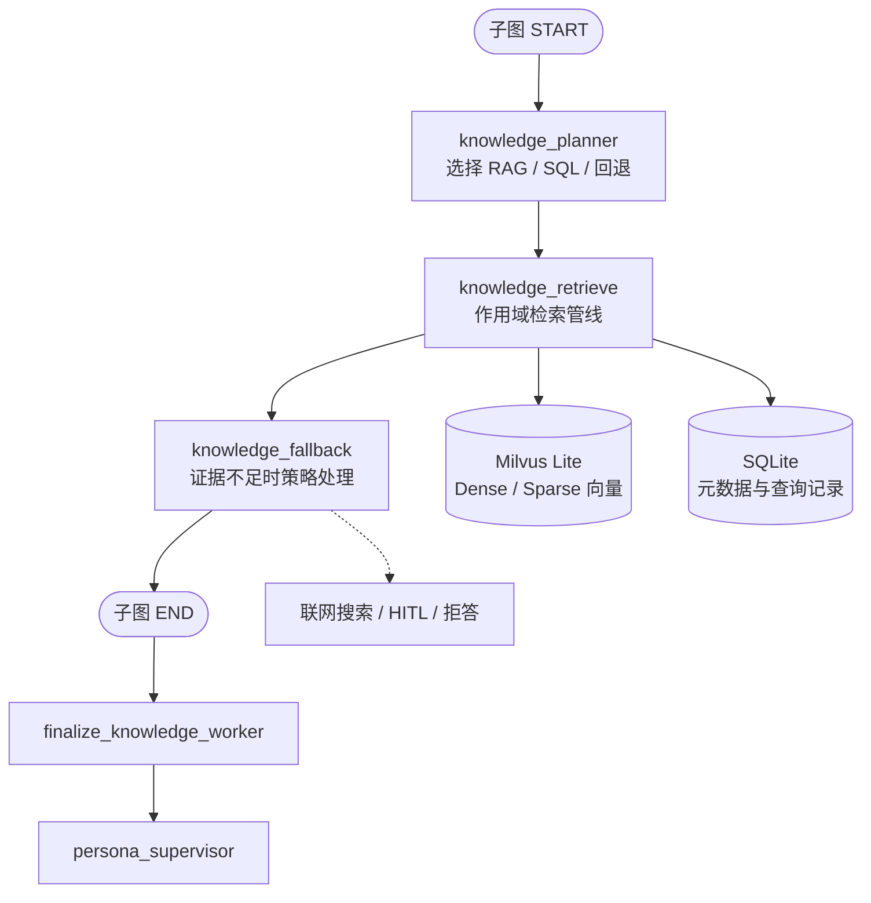

<div align="center">

# YUMENO

**本地优先的角色化 Agent 运行平台：让角色能够理解意图、编排工具、调用领域 Worker，并在对话中完成可恢复的真实任务。**

[](https://www.python.org/)
[](https://fastapi.tiangolo.com/)
[](https://langchain-ai.github.io/langgraph/)
[](https://milvus.io/)
[](LICENSE)
[](https://github.com/TKGEKKOU/yumeno)

[快速开始](#快速开始) · [核心能力](#核心能力) · [系统架构](#系统架构) · [项目结构](#项目结构) · [测试](#测试与验证)

</div>

YUMENO 以角色对话为入口，将 Agent 编排、知识、记忆、声音、文件处理和外部接入组织为一套统一工作台，而不是简单堆叠多个功能：**创建角色 → 配置角色能力 → 与角色对话 → 由 Agent 按需使用记忆、知识、声音、文件处理和外部接入。**

## 项目简介

YUMENO 定位为一个面向本地部署的角色 Agent 工作台。用户从对话进入后，由 Core Agent 理解请求，Supervisor 负责任务编排和交接，领域 Worker 执行具体业务，Native Runtime 负责运行生命周期、事件、恢复、取消和终态记录。

GPT-SoVITS、RVC、RAG、文档、记忆、Live2D、Skill、MCP、QQ 和 B站都是角色可以按需使用的能力，而不是互相割裂的产品入口。

### 设计目标

- **对话优先**：配置和长任务尽量回到对话内，以结构化卡片展示真实状态。
- **编排清晰**：Core Agent、Supervisor 和 Worker 分工明确，分别负责理解、决策收口和领域执行。
- **状态真实**：明确区分未配置、未安装、未启动、检查中、运行中、等待输入、失败和已完成。
- **本地优先**：默认使用本地文件、SQLite 和 Milvus Lite，不把 Docker 或独立服务作为普通用户的启动前置条件。
- **边界安全**：任务合同只传递引用和结构化选项，不传递本地路径、Shell 或可执行命令。

## 核心能力

| 能力 | 说明 |
| --- | --- |
| 角色 Agent 对话 | 角色资料、记忆、知识和能力策略共同参与对话；流式输出可被中断和停止。 |
| Supervisor 编排 | 统一处理任务识别、Worker 委派、缺失输入、人工确认、恢复和结果收口。 |
| 文件型长任务 | RVC 以 attachment/session/task 引用串联准备、分离、确认、转换和结果回收。 |
| GPT-SoVITS | 支持语音服务、TTS/ASR、音色资产、训练流程和服务按需启动；已安装不等于已启动。 |
| RAG 知识链路 | 文档导入、分块、Embedding、Milvus Lite 向量检索、重排、质量门和评测。 |
| 资源管理 | `config_worker` 管理应用受管运行资源；不会把用户模型、附件和历史结果当成可卸载资源。 |
| 扩展接入 | Skill、MCP、QQ/OneBot、B站等能力通过统一的角色和系统边界接入。 |
| Native Runtime | 进程内管理 Session、Run/Job、事件流、Resume、Cancel 和 Finish，并持久化安全摘要。 |

## 快速开始

### 推荐方式：Windows PowerShell

```powershell
git clone git@github.com:TKGEKKOU/yumeno.git
cd yumeno
.\scripts\start.ps1
```

如果当前 PowerShell 阻止脚本执行：

```powershell
Set-ExecutionPolicy -Scope Process Bypass
.\scripts\start.ps1
```

启动后访问：

```text
http://127.0.0.1:17000/static/index.html
```

### 手动启动

```powershell
py -3.11 -m venv .venv
.\.venv\Scripts\python.exe -m pip install -e . -r requirements.txt
Copy-Item .env.example .env
.\.venv\Scripts\python.exe -B main.py
```

### 第一次使用

1. 在 `.env` 或供应商配置页配置一个可用的 LLM Provider。
2. 创建或选择一个角色。
3. 直接在对话页发送请求。
4. 需要知识、语音、RVC 或其它能力时，再根据对话卡片提示完成资源准备。

Embedding、Reranker、GPT-SoVITS、RVC、FFmpeg 等属于按需能力；未安装或未启动不是系统错误，界面应给出下一步操作。

## 系统架构

当前采用 **Supervisor-centric Agent Architecture** 作为实际控制主线：面向用户的 `persona_supervisor` 统筹多个领域 Worker；Worker 返回结构化事实、状态和结果引用，再由 Supervisor 组织最终的用户可见回复。

### 系统上下文



### Agent 编排主流程


> `intent_route` 在当前实现中是兼容性意图线索节点，不是工作流主入口；真实入口由 `build_persona_workflow()` 构建为 `START → persona_supervisor`。

### Worker 注册与最小权限



### Native Runtime 生命周期



项目内部实现了 Native Runtime 进程内生命周期内核，参考 Harness 风格的 Session、Job、事件和恢复抽象；它不是外部 Harness 源码的直接封装，也不是独立的分布式调度服务。

### RAG 控制面与数据面



详细的 RVC 文件任务和资源管理边界见：

- [完整架构图索引](diagrams/README.md)
- [RVC 文件型任务图](diagrams/yumeno-rvc-workflow.mmd)
- [资源管理边界图](diagrams/yumeno-resource-boundary.mmd)

## Worker 注册表

当前 canonical name 统一使用 `_worker` 后缀：

| Worker | 领域职责 |
| --- | --- |
| `knowledge_worker` | 知识检索、结构化查询和策略化联网补充 |
| `memory_worker` | 角色记忆、用户记忆和工作区记忆 |
| `document_worker` | 文档列表、资料导入、URL 导入、删除和索引相关操作 |
| `profile_worker` | 角色档案、人设和角色相关导出 |
| `voice_worker` | GPT-SoVITS、TTS、ASR、音色和训练相关业务 |
| `rvc_worker` | 音频准备、人声分离、模型选择、转换任务和结果 |
| `live2d_worker` | Live2D 模型、目录和相关连接管理 |
| `config_worker` | 应用受管资源的检测、安装、下载、停止、卸载和状态 |

旧请求仍可兼容解析：

```text
knowledge / memory / document / profile / voice / voice_clone
rvc / live2d / config
```

这些是别名，不会创建重复 Worker。MCP 工具属于外部扩展能力，不冒充内置 Worker。

## 典型任务链路

### 普通对话与领域委派

```text
用户消息
  → persona_supervisor 理解请求
  → 直接回答，或生成结构化 dispatch_request
  → 领域 Worker 执行
  → finalize_worker 校验结果
  → supervisor_collect / persona_supervisor
  → 用户可见回复
```

### RVC 文件任务

```text
对话请求
  → attachment_id
  → rvc_worker 创建并恢复 RVC session
  → 音频标准化 / 视频音轨提取
  → 人声与伴奏分离
  → 用户确认音轨
  → 选择模型、Index 和参数
  → 创建异步转换任务
  → 通过事件流展示进度
  → 成功返回结果引用，失败或取消返回真实状态
```

前端只提交结构化用户操作，不自行创建 RVC session、不执行 `/extract` 或 `/separate`，也不使用浏览器临时路径伪装后端结果。

## 数据与资源边界

### RAG 数据边界

```text
SQLite（控制面）
  角色、会话、知识空间、文档元数据、文档任务、索引状态、查询记录、评测数据和运行摘要

Milvus Lite（向量数据面）
  文档分块、Dense/Sparse Vector 和向量检索索引

文件系统
  原始文档、附件、模型、音频和任务结果
```

SQLite 存在知识空间、文档任务或 RAG 查询记录，并不代表向量存储在 SQLite。三类数据通过 `workspace_id`、`knowledge_space_id`、`document_id` 和 `source_hash` 关联。

### 资源管理边界

`config_worker` 只操作应用受管目录，例如 RVC 运行环境、Separator、ASR、GPT-SoVITS、FFmpeg、Embedding 和 Reranker。以下内容不进入普通资源卸载逻辑：

- 用户 `.pth`、`.index` 音色模型；
- 会话附件、历史音频和历史任务结果；
- 用户知识文档；
- 不属于应用受管路径的文件；
- 远程 API Provider。

## 项目结构

```text
YUMENO/
├─ agents/
│  ├─ graph/              LangGraph 父图、Supervisor、knowledge 子图
│  ├─ runtime/            Native Runtime、Run/Job、事件和生命周期适配
│  ├─ registry.py         Worker canonical name、manifest 和工具权限
│  ├─ tools/              领域工具与 Worker 执行入口
│  └─ contracts/          结构化交接、错误和运行合同
├─ app/
│  ├─ routers/            FastAPI 路由与 API
│  ├─ models/             SQLite 控制面模型
│  └─ run_store.py        运行记录、任务、步骤和事件持久化
├─ persona/               角色、草稿、版本、记忆和知识绑定
├─ rag/                   检索、重写、重排、质量门和评测
├─ ingestion/             文档解析、分块、Embedding 和 Milvus Lite 索引
├─ voice/                 GPT-SoVITS、RVC、Separator、ASR、TTS 和音频任务
├─ realtime/              会话、执行和事件协议
├─ frontend/              Vue 工作台、能力和供应商配置
├─ static/                对话页、兼容入口和共享前端资源
├─ diagrams/              与代码核对过的 Mermaid 架构图
├─ docs/                  技术说明、部署材料和设计记录
└─ tests/                 Python、API、RAG、Runtime、Vue 和 JavaScript 测试
```

## 配置原则

- **LLM**：首次使用的必要配置；负责 Core/Supervisor 的自然语言理解和表达。
- **Embedding / Reranker**：知识检索按需配置，默认配合 Milvus Lite 使用。
- **GPT-SoVITS**：运行环境可以已安装但默认不启动，语音开启时按需启动。
- **RVC / Separator / FFmpeg**：由 `config_worker` 检查和管理，RVC 业务由 `rvc_worker` 执行。
- **外部接入**：QQ、B站、联网搜索和远程 Provider 使用各自语义化配置，不共享误导性的“模型/来源/设备”字段。

## 测试与验证

仓库为后端、Agent、Runtime、RAG、API、Vue 和 JavaScript 保留了对应测试。常用命令：

```powershell
# Python 全量测试
.\.venv\Scripts\python.exe -m pytest -q

# JavaScript 测试
node --test tests/js/*.test.cjs

# Vue 测试、类型检查和前端构建
Push-Location frontend
npm test -- --run
npm run typecheck
npm run build:frontend
Pop-Location

# 编译和静态检查
.\.venv\Scripts\python.exe -m compileall -q agents app ingestion rag persona realtime voice
node --check static/js/app.js
git diff --check
```

对于依赖真实外部服务、大型模型、GPU 或网络的场景，我们以当前环境状态为准；未配置时不会把测试或界面结果伪报为成功。

## 当前边界

目前主要面向本地单用户和 Windows 桌面场景。Native Runtime 采用进程内实现，运行记录通过应用存储适配；暂不把分布式队列、高可用集群、生产级多租户隔离或远程 Milvus 作为默认部署目标。外部模型、GPT-SoVITS、RVC、FFmpeg、Live2D 和用户资产仍受各自许可证与使用条件约束。

## 安全与授权

- 仅处理你拥有或已获得明确授权的声音、视频、文档和其它资料。
- Agent 合同拒绝 `path`、`command`、`shell` 和 `python` 等执行字段。
- 角色、工作区、知识空间和附件作用域由服务端建立，客户端不能扩大权限。
- 高风险写操作、联网行为和资源操作可进入人工确认与 checkpoint 恢复。
- 请勿将 API Key、Token、私有音频、用户文档或原始工具载荷提交到 Issue。

## 联系方式

- GitHub：[@TKGEKKOU](https://github.com/TKGEKKOU)
- QQ：`3198260896`
- 邮箱：`3198260896@qq.com`
- 项目问题：请优先提交 [GitHub Issues](https://github.com/TKGEKKOU/yumeno/issues)

## 许可证与第三方声明

YUMENO 自有代码采用 [MIT License](LICENSE)。第三方依赖、模型、GPT-SoVITS、RVC、FFmpeg、Milvus Lite、Live2D Cubism Core 和用户提供的资产不自动继承 MIT License，请同时阅读 [THIRD_PARTY_NOTICES.md](THIRD_PARTY_NOTICES.md) 及对应上游许可证。

## 贡献

欢迎提交 Issue 或 Pull Request。提交 Agent、Worker、Runtime 或架构图修改时，请同时说明影响的状态、权限、数据边界和测试命令；涉及模型和第三方代码时，请确认许可证与分发边界。
