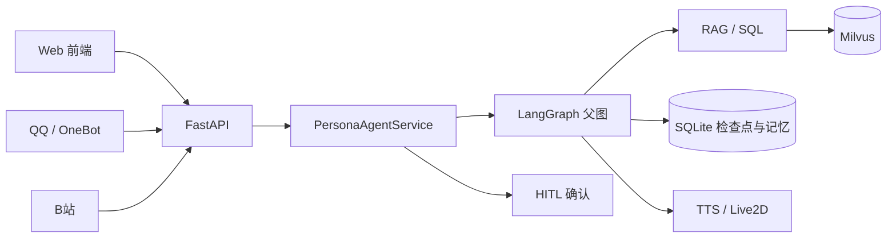
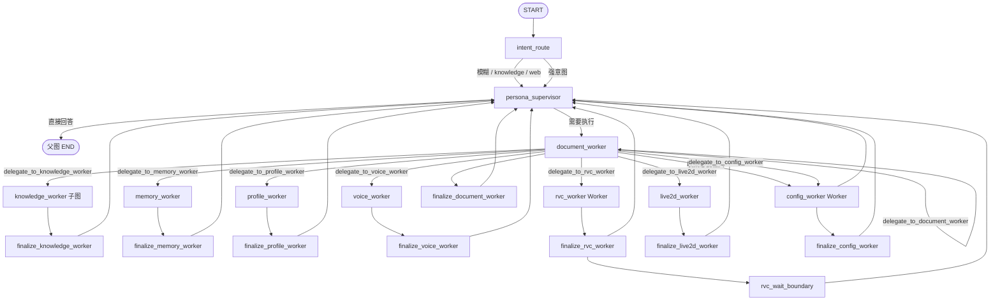
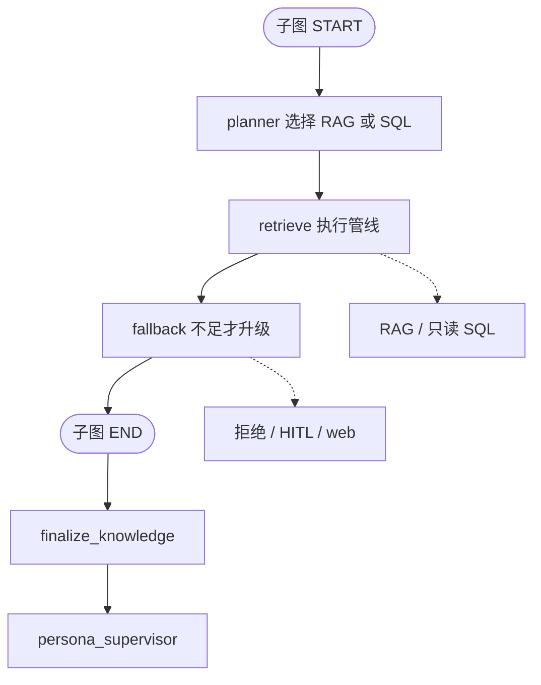
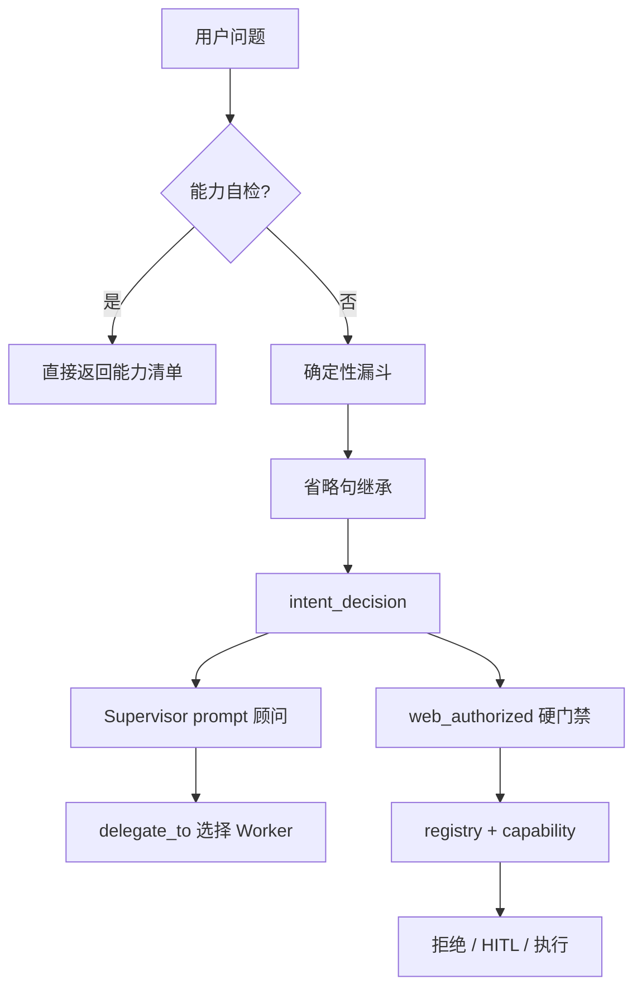
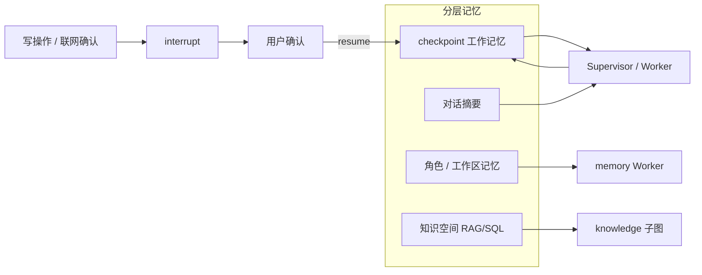
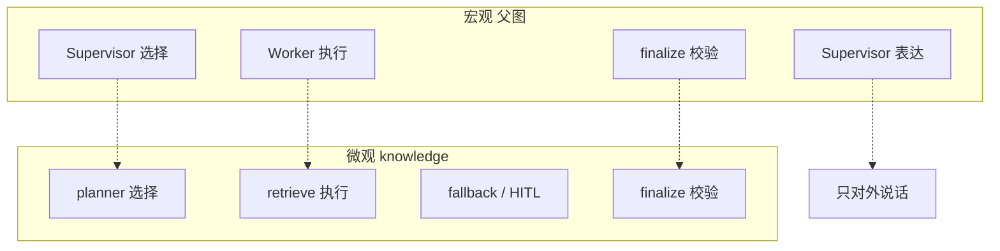
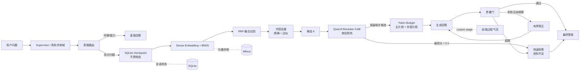

# YUMENO

YUMENO 是一个**本地优先的角色化 Agent 运行平台**。它以角色对话为入口，由 Core Agent 理解用户意图，Supervisor 负责策略编排与 Worker 委派，领域 Worker 执行知识、记忆、文档、语音、RVC、Live2D、资源管理等任务；内置 Native Runtime 统一管理 Session、Job、事件流、人工确认、恢复、取消和任务终态。

> 这不是把多个模型简单拼在一起的聊天机器人，也不是外部 Harness 的直接封装。YUMENO 在项目内部实现了参考 Harness 风格的 Agent Loop 和任务运行时，同时保留业务 Agent 图与领域服务的清晰边界。

## 项目主线

```text
创建角色 → 配置角色能力 → 与角色对话
                         ↓
              Agent 理解意图并编排任务
                         ↓
       记忆 / 知识 / 文档 / 语音 / RVC / 外部接入
                         ↓
              Runtime 跟踪、恢复、取消和收口
```

RVC、GPT-SoVITS、RAG、Skill、MCP、QQ 和 B站不是互相独立的产品，而是角色 Agent 可以按需使用的能力。

## 核心能力

- **Supervisor-centric Agent**：Core Agent 负责意图理解，Supervisor 负责委派、回收和最终表达，Worker 不互相越权，也不直接向用户输出未经校验的结果。
- **结构化任务交接**：Core → Supervisor → Worker 之间传递任务类型、输入引用、用户选项和结果引用；交接合同拒绝路径、命令、Shell 和脚本字段。
- **可恢复任务运行时**：内置 Python Runtime 提供 Session、Job、事件流、Resume、Cancel、Finish 和持久化运行摘要。
- **确定性 RAG**：knowledge_worker 使用 Planner + 确定性检索/SQL/联网管线，结合质量门、作用域过滤和人工确认，避免让模型直接自由操作数据库。
- **文件型长任务**：RVC 任务覆盖附件、Session、音频准备、人声分离、用户确认、模型选择、转换、取消和结果回收。
- **角色化声音链路**：voice_worker 管理 GPT-SoVITS、TTS、ASR、音色训练和按需服务；服务未启动与服务异常分别表达。
- **受管资源管理**：config_worker 统一管理应用受管的运行环境、模型和依赖资源，保护用户模型、附件、历史结果和知识文档不被误删。
- **本地优先数据链路**：SQLite 负责控制面和元数据，Milvus Lite 负责文档向量、稀疏向量和检索索引。
- **统一工作台**：Web 前端围绕角色、声音、知识、接入、能力和系统组织功能，对话页通过任务卡片展示真实状态。

## Agent 架构

以下架构图与仓库中的 `diagrams/*.mmd` 保持一致，便于在 GitHub 中直接查看。

### 系统上下文



### 父图与 Worker 调度



### knowledge 子图



### 意图与权限



### 分层记忆与人工确认



### 宏观到微观同构



### RAG 检索管线



父图遵循 `Supervisor → Worker → finalize → Supervisor` 的闭环；Worker 只返回结构化事实、证据、状态和结果引用。`knowledge_worker` 是 Planner + 确定性检索/回退子图，不是普通的自由工具循环。
## Worker 注册表

正式名称统一使用带 `_worker` 后缀的 canonical name：

| Worker | 职责 |
|---|---|
| `knowledge_worker` | 知识检索、结构化查询和策略化联网补充 |
| `memory_worker` | 角色记忆与工作区记忆 |
| `document_worker` | 文档列表、删除、URL 导入和知识资料管理 |
| `profile_worker` | 角色档案、人设与会话导出 |
| `voice_worker` | GPT-SoVITS、TTS、ASR、音色训练和语音服务 |
| `rvc_worker` | 音频准备、分离、模型选择、转换和结果 |
| `live2d_worker` | Live2D 模型和相关连接管理 |
| `config_worker` | 应用受管资源的检查、下载、停止、卸载和状态 |

历史请求中的 `config`、`rvc`、`voice_clone` 等名称只作为兼容别名解析，不会创建重复 Worker。

## Native Agent Runtime

Runtime 与业务图分层：

- **Session**：绑定角色、工作区和会话线程，承载 checkpoint 与连续上下文。
- **Job**：一次对话、恢复请求或后台长任务的可查询运行单元。
- **Event**：将阶段、进度、等待、错误和结果以脱敏事件流提供给前端。
- **Resume**：用户确认或补充输入后，从检查点继续当前任务。
- **Cancel**：取消运行转发，并由领域 Worker 取消实际任务。
- **Finish**：以 completed、failed 或 cancelled 明确收口，处理完成/取消竞态。

启动方式保持简单，不需要额外 Node Runtime、外部 Harness executable 或单独的 Harness 服务。

## RAG 数据边界

```text
SQLite（控制面）
  角色、知识空间、文档元数据、文档任务、解析/索引状态、查询记录、评测数据

Milvus Lite（数据面）
  文档分块的 dense/sparse 向量与检索索引
```

两者通过 `workspace_id`、`knowledge_space_id`、`document_id` 和 `source_hash` 关联。SQLite 中出现文档任务或知识空间记录，不代表向量被存入 SQLite。

## 快速开始

### 推荐启动

```powershell
git clone git@github.com:TKGEKKOU/yumeno.git
cd yumeno
.\scripts\start.ps1
```

如果 PowerShell 阻止脚本：

```powershell
Set-ExecutionPolicy -Scope Process Bypass
.\scripts\start.ps1
```

浏览器访问：`http://127.0.0.1:17000/static/index.html`

### 手动启动

```powershell
py -3.11 -m venv .venv
.\.venv\Scripts\python.exe -m pip install -e . -r requirements.txt
Copy-Item .env.example .env
.\.venv\Scripts\python.exe -B main.py
```

### 内置 Runtime

```powershell
.\.venv\Scripts\python.exe -m agents.runtime serve
```

### 配置原则

首次使用只需要先配置可用的 LLM Provider。Embedding、Reranker、GPT-SoVITS、RVC、FFmpeg 等属于按需能力，未配置或未启动时，界面应显示真实状态和下一步操作，而不是伪造成功。

## 代码结构

```text
agents/       Agent 图、Supervisor、Worker 注册、Runtime、Tools、Contracts
app/          FastAPI 路由、数据库、Provider、附件、RunStore 和 API schema
persona/      角色、草稿、版本、记忆和知识空间绑定
rag/          检索、改写、重排、质量门、联网和评测
ingestion/    文档解析、分块、Embedding、Milvus 索引
voice/        GPT-SoVITS、RVC、Separator、ASR、TTS 和语音任务
realtime/     会话、执行和事件协议
frontend/     Vue 工作台、能力和供应商配置
static/       对话页、工作台兼容入口和共享样式
docs/         架构、部署、运行时和验收文档
tests/        Python、API、RAG、Runtime 和前端测试
```

## 测试与验证

```powershell
.\.venv\Scripts\python.exe -m pytest -q
node --test tests/js/*.test.cjs
python -m compileall agents app ingestion rag persona realtime voice
node --check static/js/app.js
git diff --check
```

测试结果应以当前环境实际输出为准。依赖外部服务或大型本地模型的能力，不应在未配置时被标记为成功。

## 安全边界

- Agent 之间只传递结构化数据引用，不传播本地路径和可执行命令。
- Worker 按注册表和能力目录获取最小工具集合。
- 角色、工作区、知识空间和附件作用域由服务端构建，客户端不能自行扩大。
- 变更操作、联网升级和高风险工具可以进入人工确认与 checkpoint 恢复。
- 资源卸载只作用于应用受管目录，不清理用户模型、附件、历史结果和知识资料。
- SQLite 查询使用只读边界、AST/authorizer 与结果上限；Milvus 检索强制作用域过滤。

## 当前限制

YUMENO 当前面向本地单用户和 Windows 桌面场景。并发规模、远程分布式 Milvus、高可用部署和生产级多租户隔离不属于当前默认目标；具体外部服务、模型和第三方资产仍遵循各自的安装与许可证要求。

## 许可证

YUMENO 自有代码采用 [MIT License](LICENSE)。第三方依赖、Live2D Cubism Core、模型、GPT-SoVITS、RVC、FFmpeg 及用户提供的资产不自动继承该许可证，请同时阅读 [THIRD_PARTY_NOTICES.md](THIRD_PARTY_NOTICES.md) 及相关上游许可。

## 贡献

欢迎提交 Issue 或 Pull Request。涉及模型、运行资源和第三方代码时，请在提交前确认许可证、体积和分发边界。
