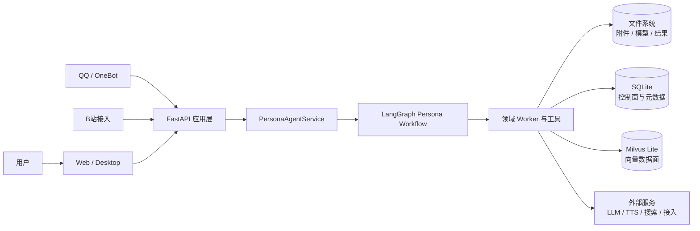
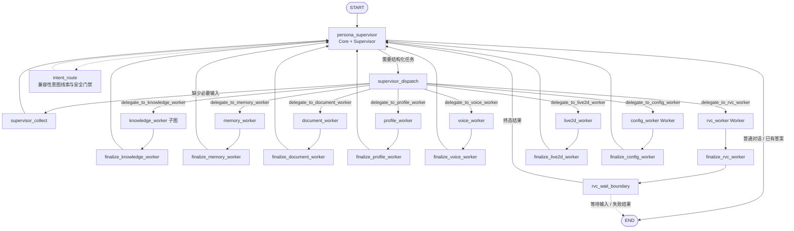
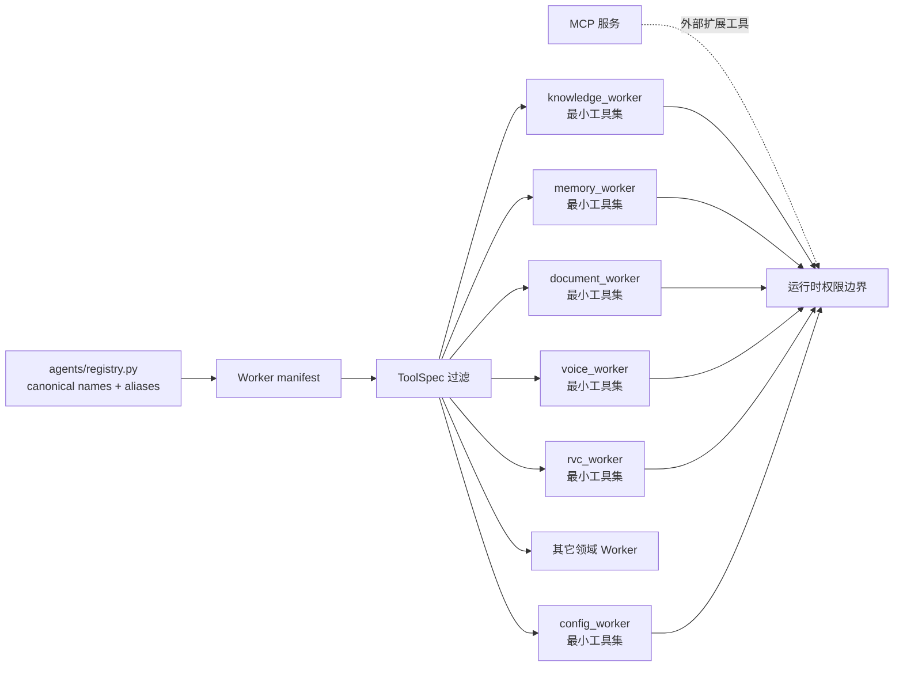
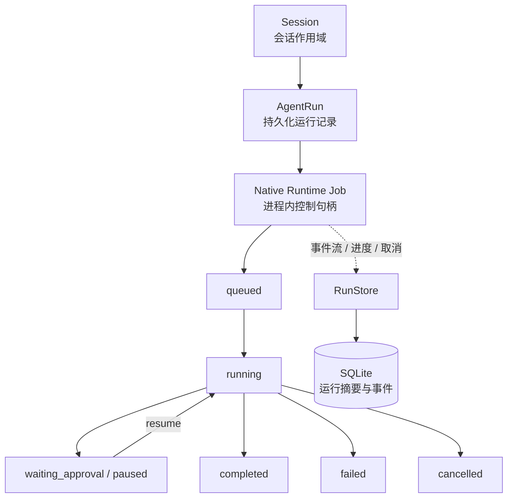
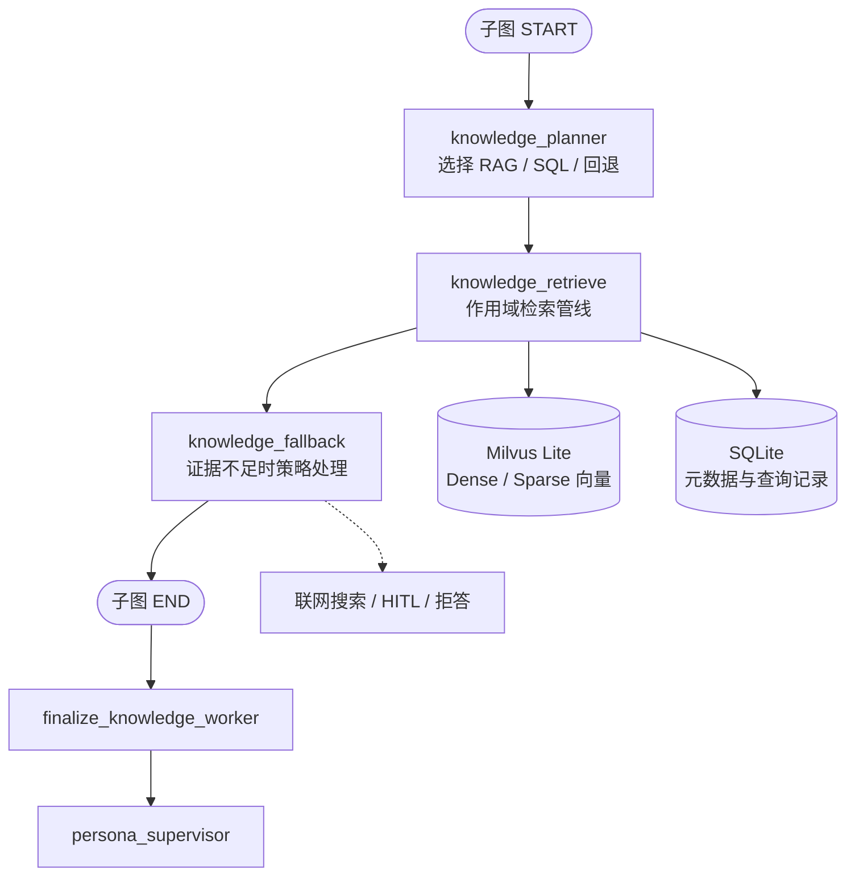
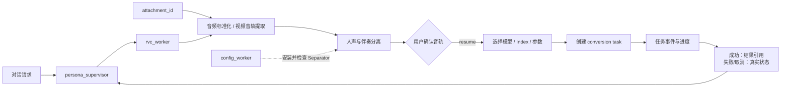
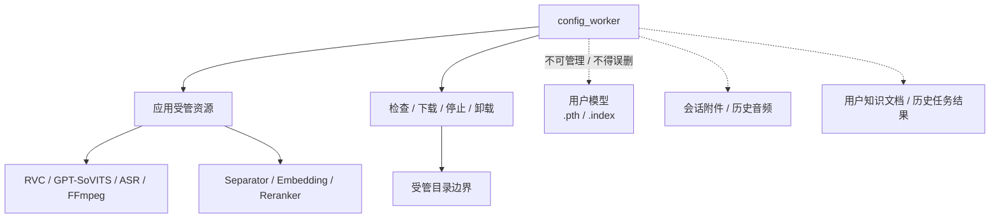

# YUMENO 架构图

这里集中维护与当前代码核对过的 Mermaid 架构图。README 只展示最能说明产品主线的 5 张图；本页补充 RVC 长任务和资源边界等实现细节。

## 阅读口径

- 我们采用 **Supervisor-centric Agent Architecture**：`persona_supervisor` 是唯一面向用户组织最终回复的节点。
- `knowledge_worker` 是 Planner + 确定性检索子图，不是自由的 `create_agent` 工具循环。
- 领域 Worker 不互相调用，也不直接向父图 `END` 输出未经收口的用户答案。
- `config_worker` 负责应用受管资源；业务 Worker 负责使用资源。
- Native Runtime 是进程内生命周期内核；它记录运行状态和事件，但不替代业务 Agent 图，也不是外部调度集群。
- 架构图中的“Milvus”默认指 Milvus Lite；远程 Milvus 是可选部署方式。

## 1. 系统上下文

多个入口最终进入同一个 FastAPI 和 `PersonaAgentService`，不会为 Web、QQ、B站分别复制一套 Agent 业务逻辑。

## 2. Agent 编排主流程

工作流的真实入口是 `START → persona_supervisor`。`intent_route` 目前保留为兼容性意图线索和安全门禁，不应被理解为绕过 Supervisor 的独立主路由。

## 3. Worker 注册与最小权限

注册表统一维护 canonical name、兼容别名、manifest、执行默认值和工具集合。这样 Worker 可以按领域获得最小权限，而不是共享全部工具。

## 4. Native Runtime 生命周期

Session 表示会话作用域，`AgentRun` 是可持久化的运行记录，Native Runtime Job 是进程内控制句柄。确认、补充输入、取消和恢复都通过运行合同和事件反馈给前端。

## 5. knowledge_worker 子图

文档导入由 `document_worker` 负责，检索和回答证据处理由 `knowledge_worker` 负责；两者通过知识空间、文档和来源引用关联，不把所有知识逻辑塞进一个 Worker。

## 6. RVC 文件型长任务

RVC 是 YUMENO 文件型任务和恢复边界的验证场景。各阶段传递 `attachment_id`、session、task 和 result reference，不向前端暴露或依赖浏览器临时路径。

## 7. 受管资源边界

我们只允许 `config_worker` 操作应用受管目录。用户音色模型、附件、知识文档、历史结果和非受管路径不进入资源卸载逻辑。

## 代码对应关系

| 图 | 主要代码 |
| --- | --- |
| Agent 编排 | `agents/graph/build.py`、`agents/graph/supervisor.py` |
| Worker 注册 | `agents/registry.py`、`agents/graph/state.py` |
| Runtime | `agents/runtime/native.py`、`agents/runtime/runner.py`、`agents/runtime/models.py` |
| RAG | `agents/graph/knowledge.py`、`rag/`、`ingestion/` |
| RVC | `agents/tools/rvc.py`、`voice/`、相关 API 路由 |
| 资源管理 | `agents/tools/config.py`、`app/routers/providers.py`、`app/routers/resources.py` |

修改这些代码的拓扑或状态合同时，应同步更新对应 `.mmd` 文件和架构图测试。
