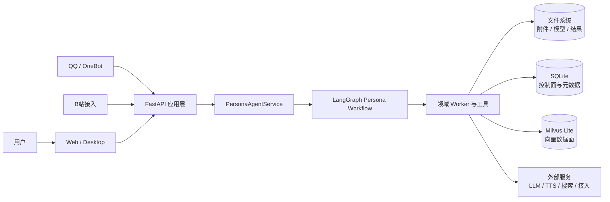
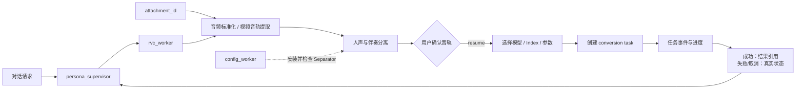

# YUMENO 架构图

README 只保留三张必要图，分别说明系统边界、Agent 主流程，以及以 RVC 为例的真实文件型任务。其它 Worker 复用相同的委派、资源和任务协议，不再为每个功能重复维护二级跳转图。

## 1. 系统边界

## 2. Agent 主流程

## 3. RVC 文件型任务示例

> RVC 图只用于说明一个具体实现样本：GPT-SoVITS、知识导入、资源检查等能力共享同一套 Core Agent → Supervisor → Worker → Runtime 机制。
