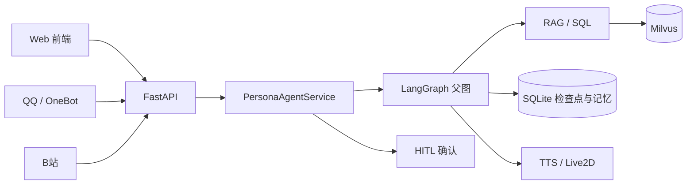
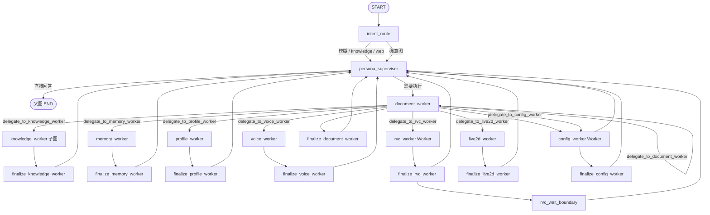
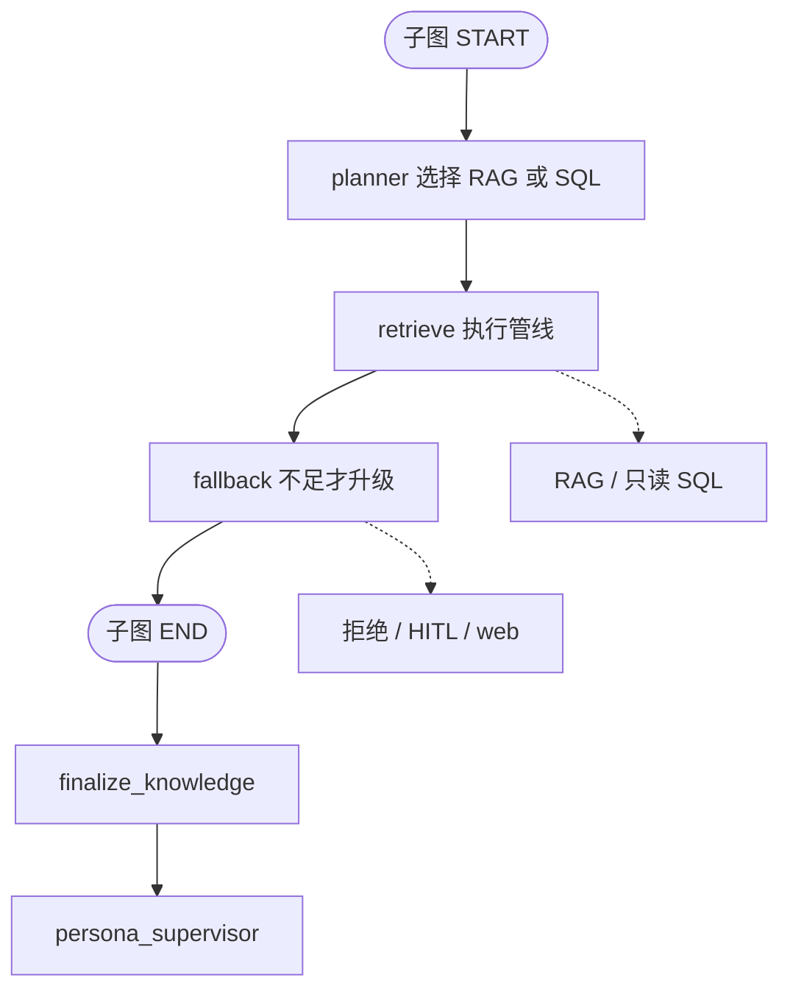
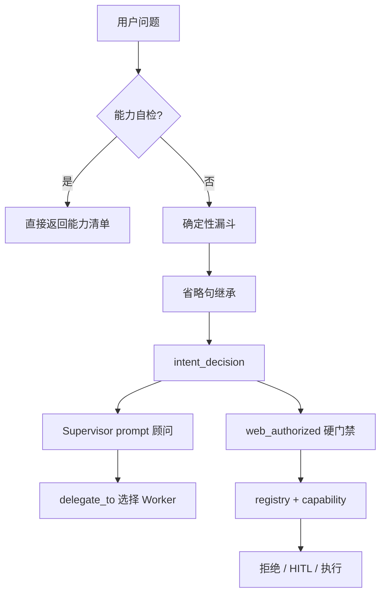
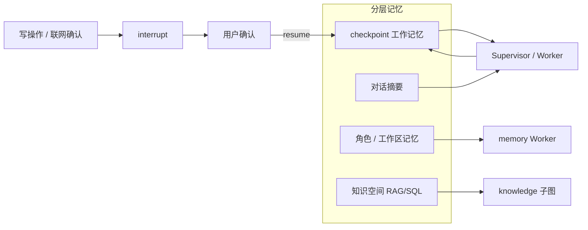
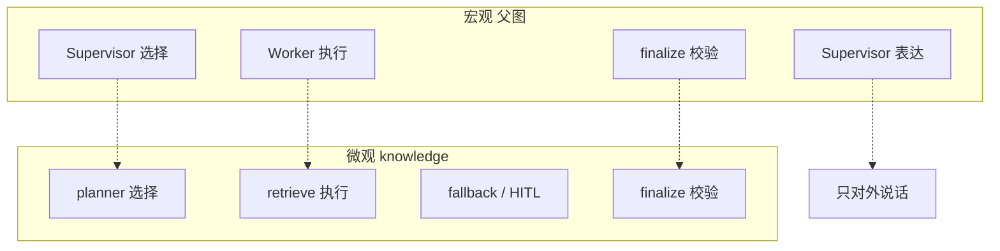
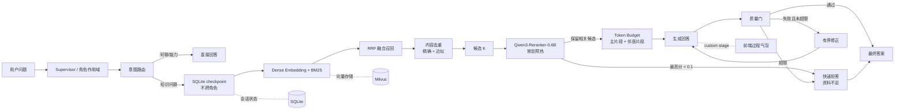

# YUMENO 架构图

全部用 Markdown mermaid 画，可直接在 GitHub / 编辑器预览。不要再导出 PNG。

口径：

- 这是 **hybrid Supervisor-centric**：1 个对外 Supervisor + 1 个 knowledge 子图 + 7 个领域 Worker。
- knowledge **是** LangGraph 子图，**不是** `create_agent` 工具循环。
- Worker 不直达父图 END，也不互相调用。
- 父图拓扑见 `agents.graph.diagram.parent_graph_mermaid()`；LangGraph 原生父图导出缺 handoff 边。

## 系统上下文

## 完整 Multi-Agent 父图

## knowledge 子图

## 意图与权限

## 分层记忆与 HITL

## 宏观到微观同构

## RAG 检索管线

