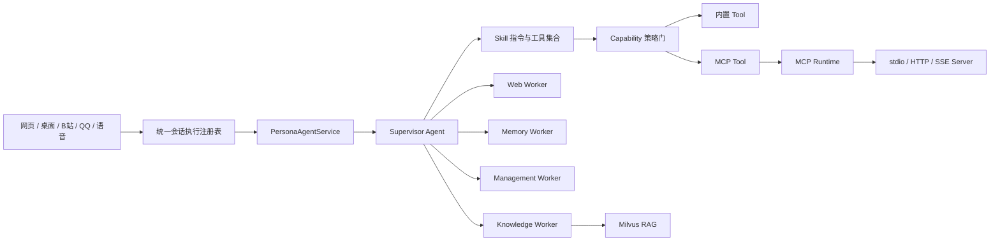
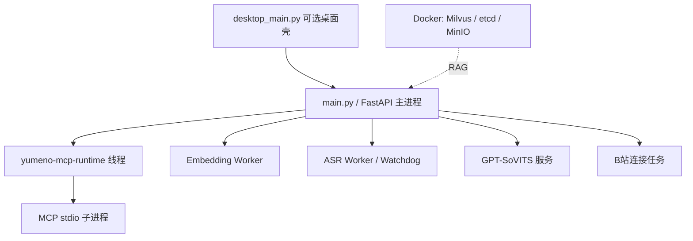

# YUMENO 能力系统长计划成果报告

报告日期：2026-08-10
实施范围：多 Agent、Skill、Tool、MCP、RAG、能力控制台与相关进程生命周期

## 1. 执行结论

本轮改造已经完成能力系统的主体落地。YUMENO 现在以统一 Tool 注册表为执行基础，以 Capability 作为稳定的授权标识，以 Skill 组织提示词和工具集合，以 MCP 接入外部标准工具，并继续由 Milvus 承担 RAG 向量检索。

主要成果如下：

- 建立了统一的 Capability 目录和角色级策略，不再只依赖各模块各自判断权限。
- MCP 客户端改为基于官方 MCP SDK 2.x 的持久运行时，支持 `stdio`、Streamable HTTP 和 SSE。
- Skill 支持标准 `SKILL.md` 与 `allowed-tools`，外部包增加启用、信任、脚本许可三层状态。
- Supervisor、Worker、Skill 和 MCP Tool 的边界得到明确，并增加 handoff 次数上限。
- 同一角色会话的同步、流式和外部入口请求统一串行，降低 LangGraph checkpoint 并发写入风险。
- “扩展”页面升级为能力控制台，可查看 Skill 安全状态、MCP 状态和已注册工具。
- Milvus 保持不变，仍是角色知识 RAG 的向量数据库，没有退化为临时本地索引。
- MCP 启动失败被隔离为局部能力故障，不再阻塞 FastAPI、桌面入口、B站接入或 Live2D。

当前交付状态为：**主体实现和最终回归均已收口**。早期报告中记录的旧测试契约、语音转写 session 生命周期以及 MCP/Embedding 生命周期问题已经修复；2026-08-11 终审后完整回归为 `581 passed, 2 skipped, 31 warnings`。

## 2. 目标与约束

本轮工作的目标不是堆叠更多框架，而是在现有项目上形成一套轻量、标准、可维护的能力系统。

实施时遵循以下约束：

- 保留现有对话、B站直播弹幕、Live2D、语音和桌面启动链路。
- 保留 Milvus 作为 RAG 核心向量数据库。
- Skill 不被实现成另一套 Agent；它只负责提供行为说明和受控工具集合。
- MCP 不直接侵入业务路由；外部工具先进入统一注册表，再由 Agent 和 Skill 使用。
- 外部 Skill 和未明确声明只读的 MCP Tool 默认采用保守策略。
- 单个外部能力故障不能扩大成整个应用启动故障。
- 不引入独立的常驻编排服务，继续以 FastAPI 主进程管理运行时生命周期。

## 3. 改造前的主要问题

### 3.1 Tool、MCP 和角色授权缺少统一事实源

原系统已经能够注册内置 Tool 和 MCP Tool，但授权主要分散在服务器粒度配置、Skill 工具列表和具体执行链中。模型是否可见、角色是否允许以及执行前是否确认，缺少统一的能力标识和判定入口。

这会带来三个风险：

- 相同工具可能在不同入口得到不同权限结果。
- 只在提示词或模型可见性阶段隐藏工具，不能阻止绕过后的实际调用。
- MCP 工具重载或重名时，难以维持稳定的授权关系。

### 3.2 Skill 缺少完整的外部包信任边界

原有 Skill 已具备“提示词 + 工具集”的基本结构，但外部下载或上传的 Skill 如果直接启用，其说明文本和脚本都可能进入 Agent 运行环境。仅有启停状态不足以区分“可以查看”“可以注入提示词”和“可以运行脚本”。

### 3.3 MCP 会话生命周期与主应用耦合不清晰

旧实现依赖适配层创建临时会话。对于 `uvx` 启动的本地 MCP 服务，这种模式可能重复承担冷启动和依赖加载成本，也不利于统一关闭 stdio 子进程与网络会话。

### 3.4 多入口可能并发写入同一会话

网页同步请求、SSE、WebSocket、语音转写以及直播入口最终可能指向同一个 `persona_id:conversation_id`。如果它们同时调用 Agent，就可能并发修改同一 LangGraph checkpoint。

### 3.5 控制台只展示配置，不能清晰表达能力关系

原“插件/扩展”页面能够管理部分 Skill 和 MCP 配置，但没有清楚展示 Agent、Skill、Tool、MCP 与 RAG 的职责边界，也缺少外部 Skill 的信任和脚本许可反馈。

## 4. 落地后的总体架构



架构职责现在明确为：

| 组件 | 职责 | 不负责的内容 |
|---|---|---|
| Agent | 理解目标、规划和整合最终回答 | 不直接定义外部协议 |
| Worker | 在受限领域完成专业子任务 | 不独立面向用户生成最终回答 |
| Skill | 注入领域指令并声明允许使用的工具 | 不启动独立 Agent 进程 |
| Tool | 完成一次结构化操作 | 不决定整个对话流程 |
| Capability | 为 Tool 提供稳定 ID、策略和确认规则 | 不执行工具本身 |
| MCP | 以行业标准协议提供外部 Tool | 不替代 Skill 或 Agent |
| RAG | 检索角色知识证据 | 不作为通用工具协议 |
| Milvus | 保存和检索向量及稀疏索引 | 不保存会话和角色配置 |

## 5. Capability 与权限系统成果

### 5.1 稳定能力标识

新增的能力目录从唯一 `ToolSpec` 注册表生成，避免维护第二套互相漂移的工具清单。

| 来源 | Capability ID | 模型可见名称 |
|---|---|---|
| 内置 Tool | `builtin/<tool>` | `<tool>` |
| MCP Tool | `mcp/<server>/<tool>` | `mcp__<server>__<tool>` |

稳定 ID 使角色策略不再依赖展示名称。MCP Tool 即使需要添加模型侧命名空间，策略仍能准确指向原服务器和原工具。

### 5.2 角色级策略

角色能力覆盖写入 SQLite 表 `persona_capability_policies`，唯一键为 `persona_id + capability_id`。策略支持精确能力和服务器通配符，匹配顺序为：

1. 当前角色的精确能力。
2. 当前角色的服务器或类型通配符。
3. 全局 `*` 角色的精确能力。
4. 全局 `*` 角色的服务器或类型通配符。
5. Capability 默认值。

角色能力接口已经提供：

- `GET /api/personas/{persona_id}/capabilities`
- `PUT /api/personas/{persona_id}/capabilities`

请求示例：

```json
{
  "overrides": {
    "builtin/search_persona_knowledge": true,
    "mcp/free-search/*": true,
    "mcp/example/write_record": false
  }
}
```

### 5.3 双层执行保护

能力策略在两个阶段生效：

- 模型调用前：未授权 Tool 不进入模型可见工具列表。
- Tool 实际执行前：`wrap_tool_call` 再次执行能力判定。

这项设计解决了“只隐藏但不拦截”的根因。对于 MCP Tool，只有服务器明确声明只读时才免确认；元数据缺失或可能写入的工具统一进入人工确认流程。

## 6. Skill 系统成果

### 6.1 标准格式与兼容性

Skill 现在优先采用标准目录结构和 `SKILL.md`：

```yaml
---
name: web-research
description: 联网检索并整理公开信息
allowed-tools: search research
---
```

解析器支持标准 `allowed-tools`，并继续兼容旧 `tool-names` 和旧 JSON Skill，避免已有配置立即失效。

### 6.2 三层生命周期

每个 Skill 具有三个独立状态：

| 状态 | 含义 |
|---|---|
| `enabled` | 是否允许加载 Skill |
| `trusted` | 是否信任其提示词与工具声明 |
| `scripts_enabled` | 是否允许落地并执行其脚本 |

默认策略如下：

| 来源 | enabled | trusted | scripts_enabled |
|---|---:|---:|---:|
| 内置 Skill | 是 | 是 | 按内置定义 |
| 控制台手工创建 | 是 | 是 | 否 |
| URL/GitHub 安装 | 否 | 否 | 否 |
| ZIP 上传 | 否 | 否 | 否 |

未信任 Skill 不会向 system prompt 注入指令，也不会向模型暴露工具。脚本执行还必须同时满足已启用、已信任、已允许脚本、Skill 已加载以及人工确认。

### 6.3 Skill 与 Tool 的关系

Skill 不复制 Tool 实现，只引用注册表中的工具名。动态 MCP Tool 也进入同一 Tool 注册表，因此可以被 Skill 复用。服务器断开导致工具暂时不存在时，Skill 会忽略缺失工具，不再因为陈旧引用抛出 `KeyError` 并中断整个对话。

“免费搜索”在这个模型中被定义为：

- `free-search` MCP Server：负责提供真实的 `search`、`research` Tool。
- `web-research` 一类 Skill：负责告诉 Agent 何时使用搜索、如何选择引擎和如何整理结果。
- Capability 策略：负责决定某个角色能否看到和执行这些 Tool。

因此，搜索能力本身属于 MCP Tool，搜索工作流属于 Skill，两者不需要互相替代。

## 7. MCP 系统成果

### 7.1 官方 SDK 2.x 持久运行时

MCP 已切换到官方 `mcp==2.0.0`，运行时使用 `ClientSessionGroup`。`MCPRuntime` 在 FastAPI 进程内创建独立线程和 asyncio 事件循环，持有：

- stdio MCP 子进程。
- Streamable HTTP 会话。
- SSE 兼容会话。
- MCP 服务器到 Session 的映射。

同步 LangChain Tool 通过线程安全 future 调用该事件循环。这样既保留当前同步 Agent 工作流，又避免每次工具调用重新创建本地 MCP 进程。

### 7.2 标准配置格式

配置已经支持标准 `mcpServers` 根节点，并继续读取旧数组格式：

```json
{
  "mcpServers": {
    "free-search": {
      "transport": "stdio",
      "command": "uvx",
      "args": [
        "--from",
        "free-search-mcp==0.9.2",
        "--with",
        "mcp==2.0.0",
        "free-search-mcp"
      ],
      "enabled": true
    }
  }
}
```

写回配置时使用标准格式。旧 `free-search-mcp==0.4.2` 和 `mcp==1.29.0` 配置可由迁移逻辑识别并升级。

### 7.3 故障隔离和动态管理

FastAPI lifespan 只在后台启动 MCP 连接任务。单个服务器连接失败时：

- FastAPI 继续提供服务。
- 对话、B站、Live2D 和语音入口不被阻塞。
- 失败服务器记录 `error` 状态和可读错误。
- 成功连接的其他服务器仍可注册 Tool。

控制 API 支持新增、删除、启用、停用、重载、测试连接和更新角色授权。应用退出时显式停止 MCP Runtime，并注销动态 Tool。

### 7.4 依赖变化

运行时不再依赖 `langchain-mcp-adapters`。MCP 定义通过官方 SDK 获取，再转换为 LangChain `StructuredTool`。这减少了一层会话生命周期抽象，也让 MCP 版本和传输行为更可控。

## 8. 多 Agent 与会话一致性成果

### 8.1 Supervisor 和 Worker 边界

Supervisor 仍是唯一生成最终用户回复的 Agent。Knowledge、Web、Memory、Management Worker 只接收委派任务，并以结构化结果返回 Supervisor。

本轮增加了最多 4 次 handoff 的业务上限。达到上限后返回 `handoff_limit_reached`，避免模型在 Supervisor 和 Worker 之间无限往返。

`loaded_skills` 和 `worker_results` 的状态更新改为每轮明确初始化和覆盖语义，降低子图把旧状态重复合并的风险。

### 8.2 同会话串行执行

`ConversationExecutionRegistry` 按 `persona_id:conversation_id` 建立异步锁。以下入口复用同一注册表：

- Agent REST 查询与恢复确认。
- SSE/流式查询。
- WebSocket 实时对话。
- 语音转写后提交 Agent。
- 其他通过相同服务层进入的角色会话。

不同会话仍可并行，同一会话严格排队。这针对的是 checkpoint 并发写入的根因，而不是全局串行整个应用。

## 9. RAG 与 Milvus 关系

本轮没有替换 Milvus，也没有把 RAG 降级为嵌入式临时向量存储。

当前职责保持为：

- SQLite：角色、对话、长期记忆、能力策略和应用配置。
- LangGraph checkpoint：短期会话执行状态。
- Milvus：角色知识的 Dense、Sparse/BM25 检索与作用域过滤。
- Knowledge Worker：调用受控 RAG 工具，把证据交给 Supervisor。

这项选择保留了现有混合检索、索引规模扩展、角色知识隔离和后续评测能力。代价是仍需要 Docker 基础设施，但这属于项目已经接受的运行约束，不在本轮通过换库规避。

## 10. 前端能力控制台成果

“扩展”页面增加了 Agent、Skill、Tool/MCP、Milvus RAG 的关系概览，并继续以操作控制台为主，不做营销式说明页。

页面现可展示和操作：

- Skill 启用状态。
- 外部 Skill 信任状态。
- Skill 脚本许可开关。
- MCP 传输方式和启停状态。
- MCP 连接成功、失败、工具数和错误文本。
- MCP 服务器角色授权。
- 已动态注册的 MCP Tool。
- MCP 新增、删除、测试、启用、停用和重载。

安全相关操作具有明确反馈：外部 Skill 必须先信任，才允许打开脚本开关；MCP 连接失败显示在对应服务器卡片，不把整个页面标记为不可用。

## 11. 进程结构与生命周期

### 11.1 目标进程关系



FastAPI 是业务生命周期的中心：启动时后台预热 MCP、Embedding、ASR 和 GPT-SoVITS；退出时断开 B站、关闭 MCP Runtime、停止本地 Worker 并关闭 checkpoint 资源。

桌面壳只是可选启动入口，不是 MCP、Skill 或 Agent 的运行前提。直接运行 `main.py` 仍可提供完整 Web/API 服务；Milvus 相关 RAG 功能仍要求 Docker 基础设施可用。

### 11.2 最近一次进程清理结果

已确认项目相关 FastAPI、Uvicorn、Embedding、ASR、测试服务器和 Live2D QA 进程已停止，端口 `17000`、`18765`、`18766`、`54321` 当前无监听。

Docker Compose 在此前清理检查中没有运行容器。本报告生成时再次查询 Docker API 得到命名管道访问失败，因此当前 Docker 容器状态未被二次确认；这通常表示 Docker Desktop 引擎未运行或当前会话无法访问其命名管道。

## 12. 验证结果

### 12.1 已通过的重点验证

| 范围 | 结果 |
|---|---:|
| Skill parser | 9 passed |
| Skill 相关扩大回归 | 42 passed |
| MCP API、配置与客户端聚焦组 | 29 passed |
| Agent、Skill、Capability 聚焦组 | 53 passed |
| Agent API、角色能力 API、B站相关组 | 26 passed |
| Web 契约与真实 MCP stdio 聚焦验证 | 3 passed |
| 真实官方 MCP Runtime stdio 单测（沙箱外） | 1 passed |

这些结果确认了标准 Skill 解析、外部 Skill 默认隔离、角色能力策略、MCP 配置格式、动态工具注册和真实 stdio 连接等核心路径。

### 12.2 最新全量回归

执行命令：

```powershell
.\.venv\Scripts\python.exe -m pytest tests -q -p no:warnings
```

最终结果（2026-08-11，允许创建真实 MCP stdio 子进程的环境）：

```text
581 passed
2 skipped
31 warnings
```

早期失败项及收口结果：

| 类别 | 根因 | 最终处理 |
|---|---|---|
| MCP 真实 stdio 测试错误 | 沙箱阻止子进程并返回 `WinError 5` | 在正常权限环境运行完整套件，真实 stdio 通过 |
| Keyless Search 与前端测试失败 | 测试仍断言旧版本和页面合同 | 同步测试合同，Node 13/13 通过 |
| Voice Agent Flow 错误 | 测试 session 生命周期不完整 | 修正 session 边界并纳入全量回归 |
| MCP/Embedding 退出竞态 | 跨 Task 清理、迟到子进程和全局闸门污染 | 单 owner task、退出闸门和顺序回归测试共同收口 |

因此当前可以准确描述为“自动化全量回归通过”；两个跳过项仍需要外部 MySQL/Milvus 集成环境，不应表述为已完成真实基础设施联调。

## 13. 已知问题与风险

### 13.1 仍需真实环境验证

1. 使用真实 Milvus 和固定角色知识库运行 Recall@3、MRR@3 与检索 P95 评测。
2. 使用同一外部 LLM 对旧多轮链路和一次决策链路执行 TTFT A/B。
3. 公网或局域网部署前增加身份认证、CORS/CSRF 收紧、限流和审计；当前安全边界是本机 `127.0.0.1`。

### 13.2 建议后续优化

- 在角色管理页增加 Tool 级能力覆盖 UI，使 Capability API 不只可由接口调用。
- 为 MCP Tool 的只读注解增加可视化，帮助用户理解“为何需要确认”。
- 为外部 Skill 增加来源、内容摘要和哈希展示，提升信任决策质量。
- 为 `ConversationExecutionRegistry` 增加等待时间和队列长度指标，便于定位直播高峰期延迟。
- 增加 MCP Runtime 的启动耗时、调用耗时和断线重连观测，但不引入独立监控服务。
- 在 README 中逐步删除已过时的 `MultiServerMCPClient` 和 `langchain-mcp-adapters` 描述，统一指向当前官方 SDK 2.x 架构文档。

## 14. 验收清单

| 验收项 | 状态 | 说明 |
|---|---|---|
| 统一 Tool/Capability 事实源 | 已完成 | Capability 目录由 ToolSpec 注册表生成 |
| Tool 级角色策略 | 已完成 | SQLite 持久化，模型可见性和执行前双重检查 |
| 标准 MCP 配置与官方 SDK | 已完成 | MCP 2.0、`mcpServers`、三种传输 |
| MCP 持久会话与退出清理 | 已完成 | 独立事件循环线程，lifespan 统一关闭 |
| 外部 Skill 安全隔离 | 已完成 | enabled/trusted/scripts_enabled 三层状态 |
| 标准 `allowed-tools` | 已完成 | 同时兼容旧 `tool-names` |
| 多 Agent handoff 有界 | 已完成 | 单轮最多 4 次 |
| 同会话执行串行化 | 已完成 | REST、流式、WebSocket、语音共用注册表 |
| Milvus RAG 保留 | 已完成 | 未替换数据库和检索流程 |
| 能力控制台反馈 | 已完成 | Skill 安全状态、MCP 状态、工具列表 |
| 关键项目进程清理 | 已完成 | 关键端口无监听 |
| 全量自动化零失败 | 已完成 | 581 passed、2 skipped、31 warnings |

## 15. 最终评价

本轮改造已经把 YUMENO 从“能够接入 Skill 和 MCP”推进到“具有统一能力目录、安全边界、角色策略和可控生命周期的标准能力系统”。整体结构保持轻量：没有新增独立网关、权限服务或 Agent 编排进程，仍由现有 FastAPI、LangGraph 和 Tool 注册表完成协调。

当前最重要的后续工作不是继续增加框架，而是用固定真实知识库和同一外部 LLM 完成 Recall@3、MRR@3、检索 P95 与 TTFT A/B，形成可审计的业务质量基线。这套结构已经可以作为后续 Skill、MCP 服务和多 Agent 协作能力的稳定基础。

## 相关文档

- [Agent 能力系统架构与操作说明](agent-capability-system.md)
- [项目总览与运行说明](../README.md)
