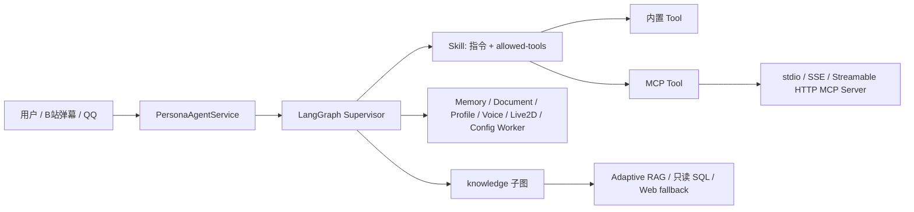

# YUMENO Agent 能力系统

本文说明 YUMENO 中 Agent、Skill、Tool、MCP、RAG 和多 Agent 协作的边界、生命周期与操作接口。

## 1. 总体关系



关键原则：Skill 是行为和工具集合的声明包，不是独立 Agent；Tool 是一次可执行能力；MCP 是外部 Tool 的标准传输协议；knowledge 是由 Planner 驱动的受控子图，负责完整 RAG、只读 SQL 和策略化联网回退；其他 Worker 通过结构化交接把结果交回 Supervisor。

## 2. Agent 与会话

`PersonaAgentService` 是所有网页、桌面、B站和其他 IM 入口的服务层。会话标识为 `persona_id:conversation_id`，LangGraph checkpoint 保存短期对话状态。相同会话由 `ConversationExecutionRegistry` 串行执行，避免查询、流式回复和恢复确认同时写入同一个 checkpoint。

Supervisor 是唯一面向用户生成最终答案的 Agent。Worker 只使用自身 specialist 工具，完成后返回交接结果。handoff 有业务级上限，达到上限时返回结构化失败结果，避免模型在 Supervisor 与 Worker 之间无限循环。

长期记忆存放在 SQLite 的 persona memory。普通文档知识问答通过完整 Adaptive RAG；CSV/XLSX 等结构化资料走 workspace 隔离 SQLite 的只读 SQL，Schema Card 可作为 RAG 的检索入口。

## 3. Capability、Tool 与策略

能力目录由 `agents.registry.capability_catalog()` 从唯一 ToolSpec 注册表生成：

| 来源 | 稳定 ID | 模型别名 |
|---|---|---|
| 内置 Tool | `builtin/<tool>` | `<tool>` |
| MCP Tool | `mcp/<server>/<tool>` | `mcp__<server>__<tool>` |

角色策略存放在 SQLite `persona_capability_policies` 表。匹配优先级为角色精确能力、角色服务器通配符、全局精确能力、全局服务器通配符。未声明只读属性的 MCP Tool 按需确认；拒绝策略在模型可见性和实际执行前都生效。

角色能力 API：

- `GET /api/personas/{persona_id}/capabilities`
- `PUT /api/personas/{persona_id}/capabilities`，请求体为 `{"overrides": {"builtin/search_persona_knowledge": false}}`

旧 MCP 服务器粒度授权 API 仍兼容：`/mcp-grants`。新能力策略是 Tool 级事实源，旧字段用于迁移和兼容旧配置。

## 4. Worker Manifest 与统一结果合同

YUMENO 的 Worker 能力边界由 `WorkerManifest` 描述。Manifest 不是第二套工具注册表，而是从 `ToolSpec` 自动生成的公开声明，确保“能做什么”和“实际挂载了哪些工具”不会漂移。

当前内置 Worker：

- `knowledge`：角色知识空间检索、结构化查询和受策略控制的公开信息补充。
- `memory`：角色记忆与工作区记忆的读取和维护。
- `document`：知识文档、资料上传和 URL 导入。
- `profile`：角色档案和会话导出。
- `voice`：音色素材、分析、训练、进度和绑定。
- `live2d`：Live2D 模型、参数与 VTube Studio 配置。
- `config_worker`：配置读取以及确认后的配置变更。

每个 Manifest 声明：

- `input_schema` / `output_schema`：Worker 输入与共享输出合同。
- `tools` / `capabilities`：当前实际可见的工具和稳定能力 ID。
- `mutating_operations`：可能写入数据的操作。
- `requires_confirmation`：该领域是否可能触发人工确认；不表示每次请求都必然弹窗。
- `timeout_seconds` / `retry_policy`：统一 Runtime 可使用的执行策略边界。

只读查询：

- `GET /api/workers/manifests`
- `GET /api/workers/manifests/{worker}`

Worker 返回统一的 `AgentResult` 合同。新字段使用 `worker` 标识领域，`answer` 是标准回答字段；`specialist` 和旧的 `summary` 仅为旧 API、旧控制台和历史图节点保留的兼容字段。合同还可以携带 `evidence`、`artifacts`、`citations`、`uncertainties`、`trace`、`confidence`、`requires_approval` 和结构化 `error`。

`knowledge_worker` 复用 RAG 的稳定错误合同：`insufficient` 代表资料不足而非系统故障；
`failed_retrieval`、`failed_generation`、`failed_quality_gate`、`dependency_unavailable` 代表失败。
失败时 Worker 只返回错误合同，不返回答案草稿或弱证据；父图仍由 `persona_supervisor` 统一组织最终表达。

Runtime 会把该合同映射为可持久化的运行结果，并在 `result_json` 中保留完整的脱敏结构。不会保存完整 Prompt、思维链或 API Key；事件和错误信息只保留诊断所需的公开摘要。

## 5. Knowledge Worker 与 RAG 错误合同

`knowledge` 不是一个自由总结的 `create_agent`，而是由 Planner、检索、质量门、纠错/回退和 finalize 组成的受控子图：

- 普通文档：Dense + BM25 + RRF 召回、Reranker 精排、上下文组装、答案生成和答案级质量门；
- 结构化资料：Schema Card 辅助定位，真实数据通过隔离 SQLite 的只读 SQL 查询；
- 证据不足：按策略执行有界改写、联网回退或保守拒答；联网结果仍需重新进入完整质量链；
- 结果交接：只把通过合同校验的结果交回 `persona_supervisor`，不直接向用户输出。

RAG 证据合同使用三种状态：`accepted`、`insufficient`、`failed`。`failed` 时丢弃答案草稿和证据，使用以下稳定错误码之一：

| 错误码 | 含义 |
|---|---|
| `insufficient` | 流程正常，但没有足够可靠证据 |
| `failed_retrieval` | 本地或联网检索阶段失败 |
| `failed_generation` | 答案生成阶段失败 |
| `failed_quality_gate` | 质量门执行阶段失败 |
| `dependency_unavailable` | RAG Service 或底层依赖不可用 |

直接 RAG API 使用顶层 `error_code` / `error_message`；Worker 交接使用 `error: { code, message }`。公开消息由固定映射生成，不穿透 Milvus、模型或 Python 异常原文。

## 5. Skill 生命周期

标准 Skill 包是目录中的 `SKILL.md`，frontmatter 至少包含 `name`、`description` 和 `allowed-tools`。旧 `tool-names` 仍可读取。

状态分为三项：

- `enabled`：是否允许加载。
- `trusted`：是否信任外部包中的指令和工具声明。
- `scripts_enabled`：是否允许落地并执行 `scripts/*.py`。

手工创建的本地 Skill 默认启用且可信，但脚本仍需显式允许。GitHub/URL 安装和 ZIP 上传默认停用、不信任、禁止脚本；控制台或 API 必须分别打开这些开关。未可信 Skill 不会注入提示词，也不会暴露工具；脚本执行还需要已加载、可信、允许脚本和现有人工确认。

## 6. MCP Runtime

真实运行时使用官方 MCP SDK 2.x 的 `ClientSessionGroup`。FastAPI lifespan 创建 `MCPManager`，管理器在独立 `yumeno-mcp-runtime` 线程中持有事件循环、stdio 子进程和远程会话。同步 LangChain Tool 通过线程安全 future 调用该事件循环，因此不会为每次搜索重复启动 `uvx`。

支持三种传输：

- `stdio`：本地命令和参数。
- `streamable_http`：MCP 推荐的远程 HTTP 传输。
- `sse`：兼容旧远程服务。

配置文件兼容旧数组，也接受标准根节点格式：

```json
{
  "mcpServers": {
    "example": {
      "transport": "streamable_http",
      "url": "http://127.0.0.1:8008/mcp",
      "enabled": true
    }
  }
}
```

服务器状态包含 `disabled`、`connected`、`error`、工具数、错误文本和最后检查时间。启动连接在后台进行，单个服务器失败不会阻塞 FastAPI、对话、B站或 Live2D。应用退出时统一关闭 MCP Runtime 和动态 Tool 注册。

内置 `free-search` 使用 `free-search-mcp==0.9.2` 与 `mcp==2.0.0`，默认百度引擎且不要求 API key。网络不可用时，状态面板显示错误，其他能力仍可用。

## 7. 前端控制台

“扩展”页面分为 Skill、MCP 服务器和已注册工具三块，并在顶部显示能力链路。Skill 卡片显示启用、信任和脚本开关；MCP 卡片显示传输方式、连接状态、工具数、错误和角色授权。连接、启用、停用、重载、测试和删除动作均使用现有 API，并即时刷新状态。

## 8. 运行与验证

开发环境：

```powershell
.\.venv\Scripts\python.exe -B main.py
```

默认地址：`http://127.0.0.1:17000/static/index.html`。

聚焦回归：

```powershell
.\.venv\Scripts\python.exe -m pytest tests\unit\test_mcp_client.py tests\unit\test_mcp_config.py tests\unit\test_agent_system.py tests\unit\test_agent_skills.py tests\api\test_mcp_api.py tests\api\test_agent_api.py -q -p no:warnings
```

如果 MCP 服务连接失败，先查看扩展页面的服务器状态和错误文本；不要把失败当作整个应用启动失败。
# 在线扩展目录

扩展页的“在线扩展”使用固定 HTTPS JSON 清单，不执行 GitHub 全站搜索，也不把远程脚本直接交给本地 shell。默认清单地址为：

`https://raw.githubusercontent.com/TKGEKKOU/yumeno/main/catalog/extension-catalog.json`

可以通过环境变量 `YUMENO_EXTENSION_CATALOG_URL` 指向组织内部清单。清单格式见 `data/extension-catalog.example.json`，当前支持两类条目：

- Skill：GitHub 目录或 HTTPS zip/文件，安装后写入 `data/skills/`。
- MCP：声明式 `uvx`、`npx`、Docker stdio，或 HTTPS 的 streamable HTTP/SSE 地址。

目录客户端会把最后一次有效响应缓存到 `data/cache/extensions/catalog.json`。刷新失败但缓存有效时，API 返回 `stale=true` 并继续展示缓存；没有缓存时返回 503，不伪装成空目录。

安装是事务操作。用户确认前只返回预览，包括来源、版本、依赖和安全提示；失败会恢复安装前的文件和 MCP 配置。外部 Skill 安装后默认 `enabled=false`、`trusted=false`、`scripts_enabled=false`，MCP 安装后默认 `enabled=false` 且不授予任何角色。用户必须在现有 Skill/MCP 管理视图中显式启用、信任或授权。

主要接口：

- `GET /api/extensions/catalog?kind=all`
- `GET /api/extensions/catalog/{item_id}`
- `POST /api/extensions/catalog/refresh`
- `POST /api/extensions/catalog/{item_id}/install`，请求体 `{ "confirmed": false|true }`
- `GET /api/extensions/catalog/install/{job_id}`
