# YUMENO 项目完整技术解读

> **现行 Agent 图以仓库根目录 ARCHITECTURE.md 为准。** knowledge 已收回父图闭环：Planner + retrieve/fallback，经 finalize 回 Supervisor，不再是快路径直出。Web/Memory/Management 作为独立对外 Worker 的说法已经过时。


> 版本基线：2026-08-11 当前工作区
> 目标读者：项目维护者、简历撰写者、技术面试准备者
> 说明：本文把结论分为“代码事实”“架构推断”“待实测假设”。没有启动真实 Milvus、角色知识库或外部 LLM 时，不把 Recall@3、Milvus 延迟和 TTFT 写成已测结果。

## 阅读导航

这份文档不是只给面试官看的宣传稿，而是一份可以对照源码阅读的项目手册：

- 第 1-6 章：项目边界、进程、配置和数据模型，适合先建立全局地图。
- 第 7-11 章：前端、一次对话、Agent/Workflow/Tool、记忆和 LangGraph。
- 第 12-19 章：RAG、Milvus、评测、结构化查询、能力系统、MCP 和 Embedding 生命周期。
- 第 20-24 章：B站、QQ、语音、Live2D、角色管理等产品能力。
- 第 25-36 章：可观测性、安全、失败处理、测试、微基准、简历和现有功能索引。
- 第 37-50 章：源码目录地图、依赖装配表、API/WebSocket 参考、实体生命周期、状态机、端到端演练、排障、面试深讲、术语表和逐文件阅读清单。

文中路径均相对于项目根目录 `D:\CodePython\YUMENO`；“入口函数”指可以直接沿调用链继续阅读的函数，而不是声称它们都是稳定的公共 SDK。

## 1. 一句话定位

YUMENO 是一个 Windows 本地优先的角色化 Agent/RAG 桌面应用：它把角色人设、分层记忆、Milvus 混合检索、结构化 Text-to-SQL、Skill/MCP/Tool 扩展、GPT-SoVITS 语音、Live2D，以及 B 站和 QQ 消息接入统一到同一个 FastAPI 应用中。

它不是“套壳聊天页”。核心工程价值是把模型的不确定决策限制在策略层，把作用域、权限、数据处理、工具执行、结果校验和生命周期放到可测试的确定性代码中。

## 2. 事实、推断与假设

### 2.1 已由代码和测试确认的事实

- FastAPI 入口是 [`main.py`](../../main.py)，应用工厂是 [`app/main.py`](../../app/main.py) 的 `create_app()`。
- 桌面入口是 [`desktop_main.py`](../../desktop_main.py)，它委托 [`desktop/launcher.py`](../../desktop/launcher.py) 的 `run()` 创建 WebView2 窗口。
- 知识和结构化查询主链路是 Supervisor 委派 knowledge 子图：Planner 选择 RAG/SQL，retrieve/fallback 执行确定性管线，finalize 后回到 Supervisor。
- 写操作与动态 Skill/MCP 仍走 HITL / checkpoint；独立 Web/Memory/Management 对外 Worker 已过时，生产入口是 Supervisor + 领域子图。
- Milvus 负责 Dense/BM25/RRF 检索；CSV/XLSX 数据进入按 workspace/knowledge space 隔离的 SQLite。
- 每轮 Agent 指标只随本轮响应返回，不持久化运行轨迹数据库。
- MCP SDK session 由专用线程中的单一 owner task 创建、使用和关闭。
- 本地 Embedding worker 是独立子进程；LRU 淘汰不再关闭仍可能被 Milvus 持有的旧对象。

### 2.2 合理的架构推断

- 一次策略决策后走确定性 Workflow，通常比多轮 Supervisor/Worker 往返更容易降低延迟并控制权限，但具体 TTFT 降幅必须用真实模型 A/B 测量。
- Dense + BM25 + RRF 对同时包含语义表达和专有名词的中文资料通常比单路向量更稳，但具体召回收益必须用固定题集对照实验验证。
- 本地优先能降低数据外发范围和部署依赖，但本地模型、Docker、显存和磁盘会增加客户端资源门槛。

### 2.3 尚未成立的量化结论

- 尚未测得真实角色知识库的 Recall@3 提升幅度。
- 尚未测得真实外部 LLM 的 TTFT P50/P95 或“响应时间降低百分比”。
- 尚未测得 Milvus 在目标数据规模和真实硬件上的生产 P50/P95。
- 现有 SQL、上下文和本地 SQLite 数据是可复现微基准，不等价于生产容量结论。

## 3. 系统分层

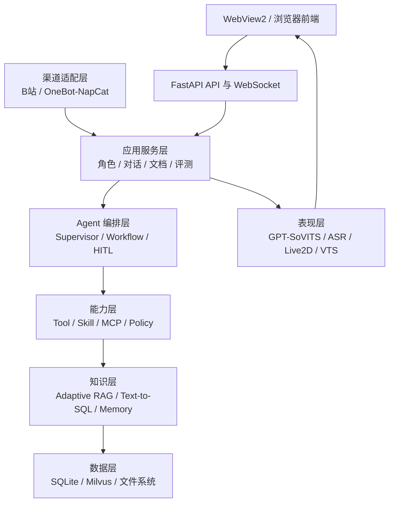

分层的关键不是目录名称，而是责任边界：

| 层 | 应负责 | 不应负责 |
|---|---|---|
| Agent | 一次策略选择、自然语言理解 | 直接相信客户端作用域、自己拼危险 SQL |
| Workflow | 权限、路由、循环上限、后处理 | 把所有步骤再次交给模型决定 |
| Tool | 单个标准化系统动作 | 隐式扩大 workspace 或绕过确认 |
| Skill | 可复用说明、工具组合、使用流程 | 自己持有数据库连接或替代 Tool |
| MCP | 外部工具协议和运行时 | 默认获得全部角色授权 |
| RAG | 检索、证据评分、生成和质量门 | 把检索结果当成无条件真实答案 |
| 渠道适配 | 消息解析、队列、发送 | 复制一套 Agent 业务逻辑 |

## 4. 进程与运行时结构

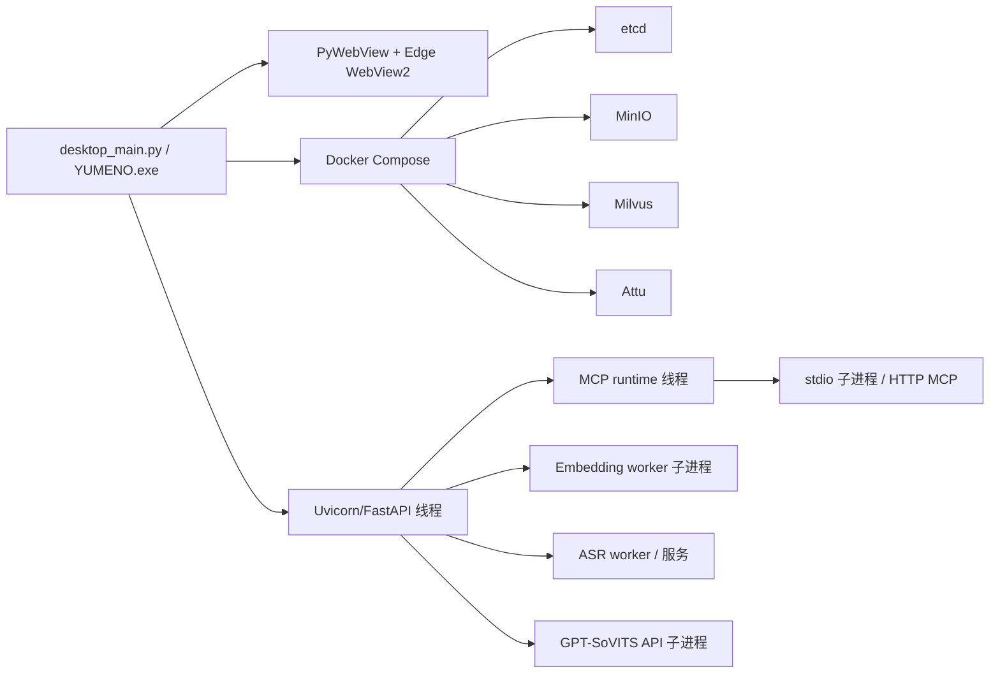

### 4.1 服务端模式

执行 `.\.venv\Scripts\python.exe -B main.py` 时：

1. [`main.py`](../../main.py) 调用 `create_app()`。
2. `uvicorn.run()` 绑定 `Settings.app_host/app_port`，默认 `127.0.0.1:17000`。
3. FastAPI lifespan 创建 MCP 管理器、B站/OneBot 管理器、Agent 服务和媒体资源管理器。
4. 完整启动时后台预热 Embedding、ASR、GPT-SoVITS；测试应用 `initialize_database=False` 不预热重资源。

### 4.2 桌面模式

[`desktop/launcher.py`](../../desktop/launcher.py) 的 `run()` 负责：

- 准备 `.env`。
- 创建 `DockerManager`、`ServerManager`、`LauncherApi`。
- 先显示本地启动页，再由 `LauncherApi._start_worker()` 检查 Docker、Compose、Milvus、Attu、FastAPI 和 GPT-SoVITS。
- 健康检查通过后把同一个窗口切到 `/static/index.html`。
- 用户选择“保持服务”时关闭 WebView2，但保留 FastAPI、GPT-SoVITS 和 Docker；宿主进程通过 `server.wait()` 保持运行。

### 4.3 关闭顺序

正确顺序是“先停止调用者，再停止被调用资源”：

1. 停止 B站/OneBot 接入。
2. 取消并等待 MCP 初始化任务，再关闭 MCP owner runtime。
3. 关闭 Embedding 新建闸门、回收 worker、等待预热线程结束。
4. 取消 ASR/TTS 预热并停止服务。
5. 关闭 LangGraph checkpoint SQLite 资源。
6. 桌面退出策略再决定保留、停止或删除 Docker 容器。

关键实现见 [`app/main.py`](../../app/main.py) 的 `lifespan()`、[`desktop/launcher_api.py`](../../desktop/launcher_api.py) 的 `do_exit()`、[`desktop/server_manager.py`](../../desktop/server_manager.py)。

## 5. 配置来源与 OpenAI 兼容接口

[`settings.py`](../../settings.py) 的 `Settings.load()` 合并两类配置：

- `.env`：监听地址、SQLite、Milvus、RAG 循环上限等基础设施参数。
- `data/local_settings.json`：LLM、Embedding、联网搜索等用户可编辑设置。

LLM 使用 [`rag/llm.py`](../../rag/llm.py) 的 `ChatOpenAI`，核心参数是 API key、base URL 和 model，因此可切换 DeepSeek、Qwen、OpenAI 或其他 OpenAI-compatible Chat Completions 服务。Embedding 同样可走 OpenAI-compatible 接口，或走受管本地模型。

边界：兼容的是 OpenAI 风格协议，不代表每个供应商都支持完全相同的 tool calling、流式字段或错误码。设置页的连接测试用于在保存前验证基本调用。

## 6. 本地数据模型

主要 SQLAlchemy 实体在 [`app/models.py`](../../app/models.py)：

| 实体 | 作用域 | 用途 |
|---|---|---|
| `KnowledgeSpace` | workspace | 知识空间容器 |
| `Persona` | workspace + knowledge space | 角色名称、人设和状态 |
| `PersonaCapabilityPolicy` | persona/capability | 单角色能力覆盖 |
| `PersonaDraft` | workspace | 从资料创建角色的草稿 |
| `PersonaMemory` | persona | 角色长期记忆 |
| `WorkspaceMemory` | workspace | 多角色共享事实 |
| `ConversationMessage` | persona + conversation | 文本、语音、转写和状态 |
| `ConversationSummary` | persona + conversation | 增量会话摘要 |
| `DocumentJob` | knowledge space | 上传、转换、确认、索引状态 |
| `VoiceAsset` | workspace | GPT-SoVITS 音色、权重和参考音频 |

应用关系数据保存在本地 SQLite；向量正文在 Milvus；原始文件、Markdown、音频和模型资产保存在受控目录。复杂表格另存到结构化 SQLite，不混入主业务表。

## 7. 前端应用壳

[`static/index.html`](../../static/index.html) 定义侧边栏；[`static/js/app.js`](../../static/js/app.js) 定义视图路由：

- 对话
- 创建角色
- 管理
- 声音
- 模型目录
- B站直播
- QQ 接入
- 能力扩展
- RAG 评测
- 系统设置

`switchView()` 首次访问时 fetch 对应 `/static/views/*.html`，把节点缓存到 `VIEW_NODES`；后续切页只显隐，不重新创建 DOM。这解决了切页导致表单、评测结果和 Live2D 状态丢失的问题。`viewSwitchEpoch` 防止快速切页时旧 fetch 结果覆盖新页面。

离开对话页时，前端主动停止语音会话并关闭 realtime WebSocket；NapCat 页有 `onHide()` 生命周期。全局音频策略确保同时只播放一个 `<audio>`，避免历史回复和当前 TTS 重叠。

## 8. 一次网页对话的完整调用链

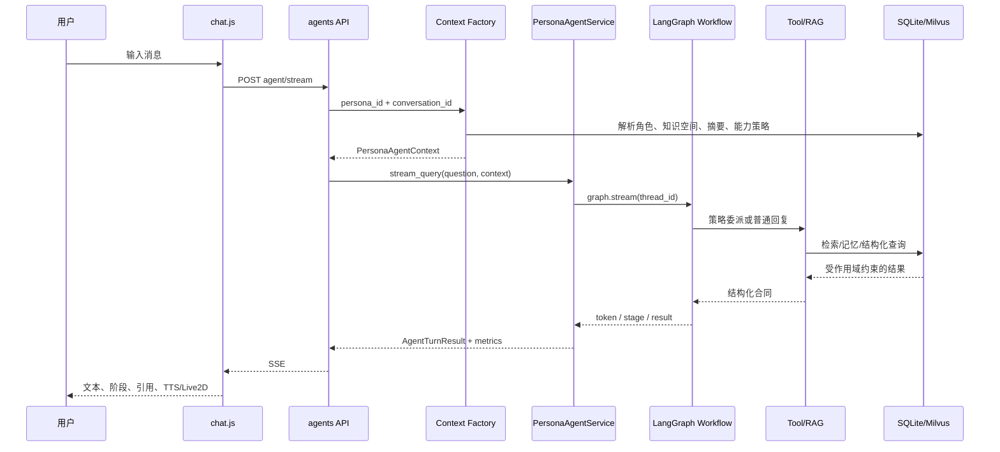

### 8.1 API 入口

[`app/routers/agents.py`](../../app/routers/agents.py) 提供：

- `POST /api/personas/{persona_id}/agent/stream`
- `POST /api/personas/{persona_id}/agent/query`
- `POST /api/personas/{persona_id}/agent/stream-resume`
- `POST /api/personas/{persona_id}/agent/resume`

输入是角色 ID、会话 ID、问题和可选确认结果。输出是 token/stage/result 事件或完整 `AgentTurnResponse`。

### 8.2 服务端权威上下文

[`agents/context_factory.py`](../../agents/context_factory.py) 的 `persona_agent_context_from_session()` 从数据库派生：

- persona_id
- workspace_id
- knowledge_space_ids
- conversation_id
- persona_name/type/profile
- conversation_summary
- PersonaMemory / WorkspaceMemory
- capability policies

客户端不能自己指定 workspace 或 knowledge space，从根源阻止“请求参数改一下就跨角色读取”。

### 8.3 会话线程

[`agents/service.py`](../../agents/service.py) 的 `thread_id()` 固定为 `persona_id:conversation_id`。所有 Worker、HITL 和 resume 共用同一个父图 checkpoint，保证暂停后恢复的是同一轮状态。

### 8.4 快速连续消息

Realtime 层由 [`realtime/execution.py`](../../realtime/execution.py) 和 [`app/routers/realtime.py`](../../app/routers/realtime.py) 管理轮次 ID、确认事件和旧轮停止。前端在发送新轮时维护当前执行，避免多个回复同时修改同一 UI 状态。

## 9. Agent、Workflow 与 Tool 的边界

### 9.1 Supervisor 做策略和最终表达

Supervisor 提示词和节点在 [`agents/graph/supervisor.py`](../../agents/graph/supervisor.py)。父图由 [`agents/graph/build.py`](../../agents/graph/build.py) 编译，`agents/workflow.py` 只是兼容门面。

图内 Worker 是：

- knowledge（Planner + 确定性 retrieve/fallback）
- memory / document / profile / voice / config_worker（受限工具 LLM 子 Agent）

HTTP 仍映射到旧四值 specialist（conversation / web / memory / management），那是 resume 兼容层，不是图内节点。

知识和结构化请求经 `delegate_to_knowledge` 产生受控 `worker_request`。planner 选择 RAG 或消费 SQL 合同，retrieve/fallback 执行确定性管线，finalize 后回到 Supervisor，不再直达父图 END。

### 9.2 Workflow 做硬逻辑

Workflow 负责：

- capability policy 校验
- tool 名称和参数解析
- query / SQL 分流
- 执行标准 Tool
- 把失败归一为 denied/failed/insufficient
- 生成引用和结构化结果
- handoff、rewrite、retry 的硬上限

### 9.3 Tool 是最小系统动作

[`agents/registry.py`](../../agents/registry.py) 的 `ToolSpec` 是单一注册合同：

- `name`
- `specialist`
- `tool`
- `requires_confirmation`
- `mutates_data`
- `server`

内置工具包括知识检索、联网、资料管理、角色/工作区记忆和结构化查询。MCP 工具在运行时追加到 `_EXTRA_TOOL_SPECS`，registry revision 变化后 `PersonaAgentService` 重新构建图，避免旧图继续持有过期工具快照。

### 9.4 HITL

写操作在 middleware 中调用 LangGraph `interrupt()`，前端显示工具名、目标和参数。用户批准后 `Command(resume=...)` 从 checkpoint 恢复；拒绝则返回结构化拒绝结果。未确认的草稿不会先执行再撤销。

## 10. LangGraph 拓扑

主图在 [`agents/graph/build.py`](../../agents/graph/build.py) 的 `build_persona_workflow()`，`agents.workflow` 再导出：

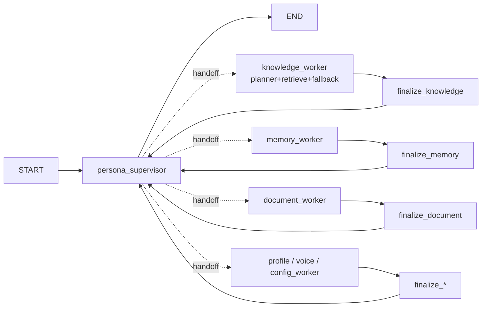

看似 `SUP -> END` 与 handoff 冲突，实际 handoff Tool 返回 `Command(PARENT, goto=...)` 改变父图控制流。所有 Worker 都经 finalize 回 Supervisor；子图 END 只结束子图，不等于父图 END。

## 11. 四层记忆与上下文预算

### 11.1 Checkpoint

[`agents/checkpoint.py`](../../agents/checkpoint.py) 创建 SQLite checkpointer；不可用时应用可回退 `MemorySaver`。它保存 LangGraph 线程状态，用于多轮、interrupt 和 resume。

### 11.2 会话摘要

[`app/conversation_summary.py`](../../app/conversation_summary.py) 每 10 个完成的用户回合在后台增量摘要，只保留关键事实、偏好、未完成事项和约定，目标约 500 字。失败只记录日志，不阻塞正常对话。

### 11.3 角色长期记忆

[`agents/tools/memory.py`](../../agents/tools/memory.py) 对 `PersonaMemory` 做读取、保存、更新和删除，查询同时强制 workspace_id 和 persona_id。

### 11.4 工作区记忆

[`agents/tools/workspace_memory.py`](../../agents/tools/workspace_memory.py) 保存多个角色可共享的低优先级事实。写入和删除默认需要确认。

### 11.5 上下文裁剪

[`agents/context_budget.py`](../../agents/context_budget.py) 默认预算 6000 token。它先把消息切成完整用户回合块，再从最近回合向前保留；AI tool_call 与 ToolMessage 被放在同一块，避免裁剪出残缺 Function Calling 协议。

裁剪只影响当前模型视图，不删除 checkpoint 或数据库消息。

## 12. RAG 文档接入全链路


### 12.1 上传与转换

[`app/routers/documents.py`](../../app/routers/documents.py) 接收上传；[`ingestion/document_jobs.py`](../../ingestion/document_jobs.py) 清理文件名、限制大小、创建 `DocumentJob`，并调用 [`ingestion/converter.py`](../../ingestion/converter.py) 转 Markdown。

输入：文件 + knowledge space。
输出：Markdown 预览和 `awaiting_confirmation` 状态。
失败边界：不支持格式、超限、转换异常只使当前 job 失败。

### 12.2 确认和索引

用户确认后 `prepare_index()` 把状态转为 indexing；后台 `index_document_job()` 调用 [`ingestion/indexer.py`](../../ingestion/indexer.py)。解析器按 `chunk_size=1000`、`chunk_overlap=150` 切分，并写入 workspace、knowledge space、document、chunk、来源和标题元数据。

### 12.3 增量去重

每个 chunk 计算内容哈希；`MilvusRagStore.indexed_hashes()` 查询已有 hash，只写入新块。写入后显式 flush，保证第一次检索同时看到 Dense 和 BM25 路。

### 12.4 失败补偿

结构化导入后如果 Schema Card 写入 Milvus 失败，会删除刚创建的结构化表；删除文档和删除角色也会联动清理向量和结构化文件。

## 13. Milvus 混合检索

[`ingestion/milvus_store.py`](../../ingestion/milvus_store.py) 的集合包含：

- `dense`: FLOAT_VECTOR，HNSW，IP 内积
- `text`: jieba analyzer 输入
- `sparse`: BM25 输出，SPARSE_INVERTED_INDEX
- workspace/knowledge_space/document/category 等标量字段

[`rag/retriever.py`](../../rag/retriever.py) 构建作用域表达式，强制：

```text
workspace_id == 当前工作区
AND knowledge_space_id IN 当前角色空间
AND category == content
```

Dense 和 Sparse 候选通过 RRF 融合。生产检索默认 `k=4`；评测展示 Top3 指标，但候选池可取 10 用于相对相关性判定。

## 14. Adaptive/Corrective RAG

主图在 [`rag/adaptive_graph.py`](../../rag/adaptive_graph.py)：

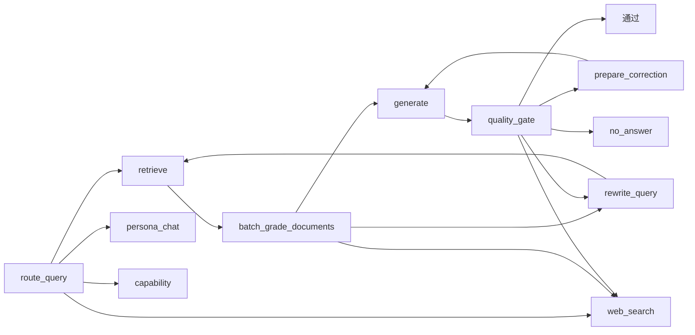

每个节点：

| 节点 | 输入 | 处理 | 输出/边界 |
|---|---|---|---|
| route_query | 原问题 | 知识/闲聊/能力/联网路由 | Agent 已强制 knowledge 时不重复误分 |
| retrieve | query + scope | Dense/BM25/RRF | k=4 文档 |
| batch_grade | 全部候选 | 一次批量相关性评分 | relevant_ids + confidence |
| rewrite_query | 低证据问题 | 生成适检索短查询 | 受 max_rewrite_count 限制 |
| generate | 问题 + 证据 | 角色口吻生成 | answer draft |
| quality_gate | 答案 + 证据 | grounded/useful | 高置信可本地直通 |
| prepare_correction | 缺失点/无证据结论 | 生成可操作反馈 | 受 max_generation_retry 限制 |
| no_answer | 无充分证据 | 保守拒答 | 固定资料不足文案 |

所有回边都有硬计数器，模型不能制造无限循环。trace 只记录节点、片段数、置信度和是否有答案，不保存隐藏推理或完整 prompt。

## 15. RAG 评测

[`app/routers/eval.py`](../../app/routers/eval.py) 用后台线程运行单个内存评测任务；前端轮询 status/results，重启即清空。

[`rag/eval/question_generator.py`](../../rag/eval/question_generator.py) 支持 fast/standard/thorough 档位，基于资料生成题集并按内容指纹缓存。 [`rag/eval/runner.py`](../../rag/eval/runner.py) 对每题分别测：

1. 独立检索阶段。
2. 完整 adaptive RAG 阶段。
3. 可选生成质量判定。

指标由 [`rag/eval/metrics.py`](../../rag/eval/metrics.py) 汇总：

- Recall@3
- Precision@3
- Hit@3
- MRR@3
- retrieval P50/P95
- total P50/P95
- grounded/useful
- 拒答率、通过率
- 改写/纠错率
- scope isolation 探针

重要边界：未人工标注时，expected set 来自 LLM 对候选池的相关性判断，因此是“候选池内相对召回”，不是全库严格召回率。

## 16. CSV/XLSX 与 Text-to-SQL

### 16.1 为什么不把整张表放进向量库

表格的聚合、排序、过滤、分组需要关系运算。把每行转向量会丢失严格数值语义，也会增加存储和召回噪声。因此：

- 表数据进入 SQLite。
- Milvus 只保存 Schema Card，帮助策略层知道有哪些表和列。
- SQL Tool 执行确定性关系查询。

### 16.2 导入

[`structured_data/importer.py`](../../structured_data/importer.py) 读取 CSV/XLSX，标准化列名、推断 INTEGER/REAL/TEXT、创建 ASCII 物理表名并批量写入。数据库路径由 [`structured_data/service.py`](../../structured_data/service.py) 根据 workspace_id 和 knowledge_space_id 派生。

### 16.3 SQL 双层防护

[`structured_data/sql_guard.py`](../../structured_data/sql_guard.py) 先用 sqlglot AST 验证：

- 只允许单条 SELECT 或非递归 CTE。
- 禁止 INSERT/UPDATE/DELETE/DDL。
- 禁止 PRAGMA、ATTACH、系统表和危险函数。
- 只允许当前空间注册的物理表。
- 自动补 LIMIT。

[`StructuredQueryService`](../../structured_data/service.py) 再使用 SQLite：

- URI `mode=ro`
- `PRAGMA query_only=ON`
- authorizer 回调
- progress handler 超时
- 最大行、列、字节限制

输入是已验证 SQL；输出是 columns/rows/truncated/duration 的结构化合同。错误不会返回数据库绝对路径或放大资源上限。

## 17. Capability、Skill、MCP、Tool 的关系

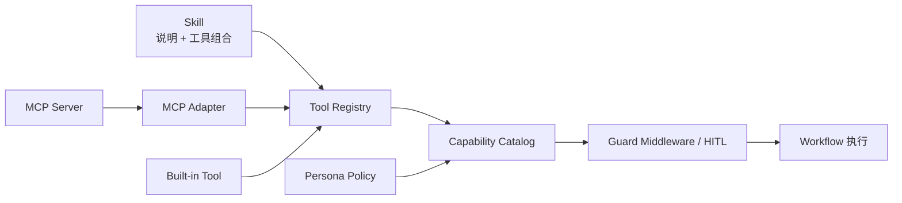

### 17.1 Skill

[`agents/skill_parser.py`](../../agents/skill_parser.py) 解析标准 `SKILL.md` frontmatter，并拒绝路径穿越。 [`agents/skills.py`](../../agents/skills.py) 合并内置和 `data/skills` 自定义技能，管理 enabled/landed 状态，并在 `load_skill` 后把说明和允许工具注入当前上下文。

Skill 解决“什么时候、按什么步骤使用一组工具”，不是远程协议。

### 17.2 MCP

[`integrations/mcp/config.py`](../../integrations/mcp/config.py) 保存 stdio、streamable HTTP、SSE 配置；secret 返回前端时掩码。 [`integrations/mcp/security.py`](../../integrations/mcp/security.py) 对 stdio 命令做白名单、黑名单、内联执行和危险参数检查。

[`integrations/mcp/client.py`](../../integrations/mcp/client.py) 使用官方 MCP SDK：

- owner 线程内只有一个 asyncio owner task。
- owner task 进入 `ClientSessionGroup`，串行执行 connect/list/call/disconnect，并在同一 task 退出。
- 同名服务器 session 以 token 隔离。
- 测试连接使用独立 token，不注册 Tool。
- 工具转换为 LangChain `StructuredTool`。
- 没有明确 read-only 注解的外部工具按不可信写能力处理，要求确认。

### 17.3 单角色授权

[`agents/capabilities.py`](../../agents/capabilities.py) 把内置 Tool、MCP Tool 和 Skill 映射为 capability id。 [`agents/policy.py`](../../agents/policy.py) 保存 persona override。判定优先级支持角色精确项、角色通配项、全局精确项和全局通配项。

用户不需要理解 Tool/MCP/Skill 的依赖图；管理页操作统一能力包，运行时再解析到实际工具。

## 18. MCP 生命周期为何需要 owner task

MCP stdio/HTTP transport 内部使用 AnyIO cancel scope 和 `AsyncExitStack`。这些资源要求在进入它们的 asyncio Task 中退出。简单地“放在同一个 event loop”仍不够，因为 `run_coroutine_threadsafe()` 每次会创建不同 Task。

当前实现的命令队列保证：

1. `ClientSessionGroup.__aenter__()` 在 owner task。
2. load/list/call/disconnect 由同一个 owner task await。
3. 超时使用 `asyncio.timeout` 取消当前 owner 操作，并等待 finally。
4. stop 取消 owner，`async with` 在同一 task 完成 session stack 清理后线程才退出。
5. 未执行的队列协程会显式 close，调用方 Future 会取消。

这不是性能优化，而是资源正确性要求。

## 19. 本地 Embedding 生命周期

[`ingestion/local_embedding/client.py`](../../ingestion/local_embedding/client.py) 通过 stdin/stdout JSON 行协议调用独立 worker：

- `_start()` 创建进程并等待 ready 握手。
- `_request()` 用锁串行一条请求和一条响应。
- worker 崩溃时丢弃旧进程，下次请求自动重启。
- close 与 Popen/握手并发时，通过 lifecycle lock 回收迟到进程。
- 查找缓存最多 4 个 key；淘汰对象进入弱引用 retired 集合，不会因登记本身被永久保活。
- application shutdown 关闭新建闸门，统一关闭 active + retired，再等待预热线程。
- 普通 `shutdown_embedding_workers()` 清理后重新开放按需创建；FastAPI lifespan 使用 `begin_embedding_shutdown()` 保持闸门关闭，避免退出尾声产生迟到 worker。

为什么不能直接在第 5 个配置时 close 第 1 个对象：`MilvusRagStore.vector_store` 可能长期持有其 `embedding_function`，缓存淘汰不等于外部引用已经释放。弱引用登记不夺取生命周期；最后一个 Milvus/调用方引用释放时，适配器析构会幂等关闭 worker。应用退出仍能通过 WeakSet 找到所有尚被外部持有的 retired 对象并主动回收。

## 20. B 站直播接入

[`integrations/bilibili/manager.py`](../../integrations/bilibili/manager.py) 管理状态、队列、暂停、恢复、切房和事件广播。 [`integrations/bilibili/client.py`](../../integrations/bilibili/client.py) 使用轻量 blivedm client，并以 HTTP 最近弹幕作为未开播/长连接不可用时的补充。 [`integrations/bilibili/events.py`](../../integrations/bilibili/events.py) 只标准化普通弹幕和进入直播间事件。

处理链：

1. 用户保存 room_id 和角色。
2. manager 连接并读取事件。
3. normalize 生成统一 `BilibiliLiveEvent`。
4. `LiveEventQueue` FIFO 排队，不合并成一次输入。
5. 每次只把队首事件作为一个用户消息交给角色。
6. 处理完成后再取下一条。
7. 暂停保留连接但停止消费；断开关闭连接；清空队列同时清理当前直播会话记忆和前端事件流。

限制：HTTP 最近弹幕接口不保证提供可靠的“进入房间”事件；进场检测更依赖实时长连接协议。未开播房间可以读取历史弹幕，但状态提示必须区分“房间未开播”和“连接不可用”。

## 21. NapCat / OneBot 11 / QQ

### 21.1 连接方向

YUMENO 提供 [`integrations/onebot11/ws_server.py`](../../integrations/onebot11/ws_server.py) 的正向 WebSocket `/api/onebot/ws`，NapCat 作为客户端连接。Token 可选；用户主动断开后服务端拒绝自动重连，避免控制台不断出现 403 重试。

### 21.2 入站消息

[`integrations/onebot11/parser.py`](../../integrations/onebot11/parser.py) 把私聊/群聊消息、CQ at 和 self_id 转成 `OneBotMessage`。 [`integrations/onebot11/router.py`](../../integrations/onebot11/router.py) 负责：

- 目标窗口授权
- 角色选择
- 群聊 @/触发条件
- 主动回复档位 0%/5%/30%/100%
- 小概率主动回复的内容适合性分类
- 每个私聊或群聊独立 conversation_id
- 调用共用的 Agent context factory

100% 主动回复需要前端二次确认，防止账号在多个群中无意大量发言。

### 21.3 出站文字和语音

YUMENO 通过 OneBot action 发送私聊或群聊。消息模式支持：

- 只文字
- 文字 + 语音
- 只语音
- 中文文字 + 原始日语语音

中文模式只转换显示文字，TTS 仍使用角色原始日语回复。流式 TTS 每生成一段就立即发送一条语音，不等待整段全部合成。临时语音文件发送后清理；最近发送记录只保留文本，不保留重复音频播放器。

### 21.4 会话隔离和清理

私聊按对方 QQ，群聊按群号构造 conversation_id，所以不同窗口不会共享短期对话历史。角色长期记忆仍按 persona 共享；workspace memory 跨角色共享。控制台可清空当前目标窗口的消息和 checkpoint，而不影响其他窗口。

## 22. 语音系统

### 22.1 音色资产

[`voice/studio.py`](../../voice/studio.py) 管理声音工作室会话；[`voice/clone_pipeline.py`](../../voice/clone_pipeline.py) 负责 FFmpeg 提取、采样率转换、VAD 切片、响度归一和参考音频构建。 [`voice/gpt_sovits/training.py`](../../voice/gpt_sovits/training.py) 管理训练任务和产物。

### 22.2 合成

[`voice/gpt_sovits/synthesis.py`](../../voice/gpt_sovits/synthesis.py) 按标点和最大长度切分投递片段，再按中文、日文、英文脚本拆分语言段，逐段调用 GPT-SoVITS 并合并 WAV。

[`app/routers/tts.py`](../../app/routers/tts.py) 提供：

- 单次 synthesize
- NDJSON segment stream
- WebSocket 文本流式合成

输入：persona、conversation、text。
处理：解析角色绑定音色和默认语言，逐段合成。
输出：segment 音频和最终 `ConversationMessage`。
失败边界：未绑定音色返回 409，上游合成失败返回受控错误。

### 22.3 ASR 与 VAD

[`voice/asr`](../../voice/asr) 提供本地 Qwen ASR worker；[`voice/vad`](../../voice/vad) 支持 Silero 和 energy fallback。语音消息先保存，再转写并作为普通用户文本进入同一 Agent 链路。

## 23. Live2D 与 VTube Studio

[`app/routers/live2d.py`](../../app/routers/live2d.py) 扫描模型目录、识别 moc3 版本并返回 VTS 配置。 [`static/live2d/live2d-panel.js`](../../static/live2d/live2d-panel.js) 延迟加载 PIXI/Cubism 重资源，处理：

- 模型选择
- 打开/关闭 dock
- 切页后 canvas 重建
- 拖拽舞台高度
- 专注模式
- idle/listening/thinking/talking 状态
- 内嵌渲染与 VTS 模式切换

[`static/live2d/viseme.js`](../../static/live2d/viseme.js) 把文本/音素和音频能量映射到口型参数；全局 audio play 事件让 Live2D 只跟随当前真正播放的音频。

## 24. 角色创建、管理和删除

创建角色可直接填写，也可通过 [`persona/drafts.py`](../../persona/drafts.py) 从资料识别候选角色。草稿确认后创建 Persona 和独立 KnowledgeSpace。

管理页统一：

- 编辑人设
- 增删资料
- 绑定音色
- 绑定 Live2D 模型
- 配置能力包
- 查看文档索引状态

[`persona/delete_service.py`](../../persona/delete_service.py) 删除角色时协调数据库、文档、Milvus、结构化 SQLite、checkpoint、音频和策略记录。跨系统删除采用 best-effort 补偿，不能依赖单个数据库事务覆盖文件系统和 Milvus。

## 25. 可观测性

[`agents/observability.py`](../../agents/observability.py) 的 `RunRecorder` 为每轮生成：

- run_id
- source
- first token latency
- total duration
- model call count
- input/output/total token
- context before/after/dropped
- tool call/success/failure
- handoff count
- RAG trace
- status

详情先经过 `sanitize_details()`，避免把超长 prompt、密钥或内部对象直接返回前端。Agent REST/SSE 和 QQ/B站入口可使用同一结构。

## 26. 安全边界

### 26.1 已实现

- 服务默认只绑定 `127.0.0.1`。
- settings 写接口要求本地请求和 `X-YUMENO-Request` 保护头。
- persona scope 由服务端数据库派生。
- Milvus 查询下推 workspace/knowledge space 过滤。
- SQL 使用 AST + SQLite authorizer 双层只读校验。
- MCP stdio 命令校验，secret 掩码返回。
- 外部 MCP 未声明 read-only 时默认确认。
- 角色能力 fail-closed。
- 上传文件名清理、大小限制、Skill zip 路径穿越检查。
- 主动 QQ 群聊需窗口授权和频率档位。

### 26.2 明确不等于互联网生产安全

当前产品是本地桌面工具，不是多租户公网 SaaS。`allow_origins=["*"]` 建立在“服务只绑定 localhost”的假设上；如果未来监听局域网或公网，必须增加登录、CSRF/CORS 收紧、TLS、速率限制、审计日志和租户隔离。

## 27. 失败处理策略

| 故障 | 当前行为 |
|---|---|
| LLM 429/5xx | 识别 transient error，返回统一降级文案和 degraded 指标 |
| Milvus 不可用 | 索引/检索失败；结构化导入路径做补偿清理 |
| RAG 无证据 | 有界改写/联网/纠错后保守拒答 |
| SQL 越权/写操作 | AST 或 authorizer 拒绝 |
| MCP 连接失败 | 单服务器 error，不阻塞 FastAPI 启动 |
| MCP 超时 | owner task 内取消并等待清理 |
| Embedding worker 崩溃 | 丢弃进程，下次请求自动拉起 |
| TTS 未安装/未绑定 | 返回状态或 409，不影响文本对话 |
| B站/QQ 断线 | 状态更新、停止消费或等待外部端重连 |
| 会话摘要失败 | 记录日志，不影响主回复 |

## 28. 测试体系

测试目录分为：

- `tests/unit`：函数、策略、生命周期、SQL、RAG 指标、前端静态合同。
- `tests/api`：FastAPI REST/WebSocket、角色、文档、设置、接入。
- `tests/integration`：需要外部 MySQL/Milvus 的集成条件。
- `tests/js`：Node test runner 验证导航、对话、Live2D/viseme 等前端行为。

关键回归合同：

- 知识/结构化快路径每轮 `model_calls == 1`、`tool_calls == 1`。
- MCP group 进入和退出同一个 asyncio owner task。
- MCP session token 精确断开。
- Embedding LRU 淘汰后旧引用仍可用，shutdown 才关闭。
- 关闭应用前等待 MCP 和 Embedding 清理。
- SQL 攻击与跨作用域探针。
- 50 轮上下文预算。

2026-08-11 最终验证：

| 验证 | 结果 | 说明 |
|---|---:|---|
| Python 全量回归 | 581 passed，2 skipped，31 warnings | 102.57 秒；终审修复后在允许创建真实 MCP stdio 子进程的环境运行 |
| Node 前端回归 | 13 passed | 导航、快速连续发送、NapCat 配置同步、Live2D、VTS、viseme |
| Python 编译检查 | 通过 | `agents/app/ingestion/integrations/persona/rag/voice` |
| 差异格式检查 | 通过 | `git diff --check` 无空白错误 |

两个跳过项需要外部 MySQL/Milvus 集成条件。Protobuf、FastAPI `on_event`、Python `audioop` 和第三方 Silero/Torch 的 31 条警告属于依赖升级提示，不是本轮功能失败；其中 `audioop` 也是项目继续固定 Python 3.11 的原因之一。

## 29. 可复现微基准

基准产物：[`docs/benchmarks/enterprise-2026-08-11.json`](../benchmarks/enterprise-2026-08-11.json)。

| 指标 | 实测 | 口径 |
|---|---:|---|
| CSV 导入 | 5,000 行 / 15.869 ms | 本地 SQLite 微基准 |
| 导入吞吐 | 315,075.744 行/s | 由同次运行计算 |
| 聚合查询 P50 | 1.914 ms | 20 次相同只读查询 |
| 聚合查询 P95 | 2.064 ms | 同上 |
| SQL 拦截 | 80/80 | 4 类模式各重复 20 次 |
| 跨空间拦截 | 4/4 | workspace/knowledge space 反向探针 |
| 50 轮 token | 12,057 -> 5,791 | 6000 token 预算，减少 51.97% |

这些数字可以写“本机微基准”，不能写“生产 QPS”。历史上曾出现一次完整回归超过 904 秒未收口，属于诊断过程记录；因为没有保留独立旧基线产物，不把“下降 90%”作为简历量化成果。

## 30. 项目亮点如何写进简历

推荐主描述：

> 设计并实现 Windows 本地优先的角色化 Agent/RAG 平台，基于 FastAPI、LangGraph、Milvus 和 SQLite 将策略决策、权限 Workflow 与标准 Tool 解耦；知识及结构化查询采用一次 Supervisor 决策后的确定性执行，并通过合同测试锁定每轮 1 次模型调用和 1 次 Tool 调用。

可验证的分点：

1. 构建 Dense HNSW + BM25 Sparse + RRF 混合检索和 Adaptive/Corrective RAG，内置 Recall@3、MRR@3、P50/P95、拒答和纠错评测，支持 JSON 导出。
2. 为 CSV/XLSX 设计 workspace 隔离 SQLite + Schema Card + 只读 Text-to-SQL；AST 与 SQLite authorizer 在本机重复探针中拦截 80/80 次恶意 SQL，5,000 行导入约 31.51 万行/s，聚合查询 P95 2.064 ms。
3. 实现 checkpoint、会话摘要、角色记忆、工作区记忆和回合级上下文预算；50 轮测试从 12,057 token 裁剪至 5,791，减少 51.97%，同时保持 ToolMessage 配对。
4. 设计标准 Tool/Skill/MCP 能力系统，支持角色级授权、HITL、stdio/HTTP/SSE 热连接；用单 owner task 解决 AnyIO session 跨 Task 清理和子进程泄漏问题。
5. 将 GPT-SoVITS、Live2D、B站和 OneBot/NapCat 作为适配层接入同一 Agent 服务，保持渠道会话隔离、流式语音和运行状态反馈。

“召回率提升”“响应时间降低”应等固定知识库 A/B 后再补具体比例；当前可写“建立测评闭环”和“合同级减少模型调用”，不要伪造线上数值。

## 31. 面试讲解顺序

建议用 8 分钟主线：

1. 业务背景：角色不只聊天，还要基于私有资料、记忆和多个消息渠道稳定工作。
2. 核心矛盾：纯 Agent 灵活但不可控，纯 Workflow 稳定但缺乏自然语言策略。
3. 架构解法：Agent 决策一次，Workflow 执行硬逻辑，Tool 封装系统动作。
4. 数据安全：服务端权威 scope、Milvus 过滤、Text-to-SQL 双层只读。
5. RAG：文档接入、混合召回、批量评分、质量门、有界纠错。
6. 记忆：checkpoint/摘要/persona/workspace 四层，以及上下文预算。
7. 扩展：Skill 是流程知识，MCP 是外部协议，Tool 是执行单元。
8. 工程结果：微基准、回归合同、真实限制和后续 A/B 计划。

## 32. 常见追问与回答

### 为什么不让 Agent 自己完成所有步骤？

因为权限、SQL、安全过滤、循环次数和资源上限必须确定。Agent 只选择意图，Workflow 才能提供可测试的失败边界。

### 为什么还保留 Legacy Worker？

Web、记忆和管理写操作需要工具选择、HITL 和 checkpoint resume。一次性重写会扩大回归风险，所以先迁移最高频、最适合确定性执行的知识和结构化路径。

### 为什么用 Milvus 而不是本地向量库？

项目目标包含 Dense/BM25/RRF、标量过滤、独立索引和可扩展数据规模；Milvus 更匹配这一目标。代价是 Docker 和额外存储，不适合追求极小安装包的产品。

### 为什么表格还要 SQLite？

向量检索回答“哪段相关”，关系数据库回答“精确过滤、分组和聚合”。两者是互补数据面，不是二选一。

### 如何证明跨角色不串数据？

上下文由 persona 在服务端解析；Milvus filter 和 SQLite 文件路径都带 workspace/knowledge space；评测还有伪造 workspace 的反向隔离探针。

### MCP 为什么不直接 `asyncio.run()`？

stdio/HTTP transport 需要长期 session，且 AnyIO cancel scope 受 task 归属约束。每次 `asyncio.run()` 会创建和销毁 loop，也无法安全复用 transport。

## 33. 当前技术债与后续优先级

### P0：简历前必须完成的真实测量

1. 固定至少 30 个标注问题和真实角色知识库。
2. 记录旧/新检索策略的 Recall@3、MRR@3、P95。
3. 对同一 LLM 做旧多轮链路与新一次决策链路的 TTFT A/B。
4. 保存环境、commit、配置、原始 JSON，保证数据可审计。

### P1：生产化增强

- 把内存 eval job 改为可取消的轻量任务管理器，但不必引入复杂任务数据库。
- 为外部 LLM 和 Milvus 增加更明确的超时、重试和熔断指标。
- 增加 MCP HTTP/stdio 长时间运行压力测试。
- 增加 QQ/B站突发消息的限速和背压指标。

### P2：可选演进

- 独立 reranker A/B。
- 图片理解仅在切换到视觉模型后接入，当前 DeepSeek 文本模型不伪装识图。
- 公网部署前补完整身份认证、多租户和审计。

## 34. 最终理解框架

可以把整个项目记成四句话：

1. **入口统一**：网页、语音、B站和 QQ 最终都变成带 persona/conversation 的用户消息。
2. **上下文权威**：服务端从角色解析 workspace、知识空间、记忆和能力，客户端不能扩大权限。
3. **决策与执行分离**：Agent 决定做什么，Workflow 决定能不能和怎么做，Tool 完成一个动作。
4. **数据按问题选引擎**：文本证据走 Milvus RAG，表格计算走 SQLite Text-to-SQL，关系和记忆走应用 SQLite，媒体走文件系统和专用 worker。

这四条是 YUMENO 从功能集合变成可解释工程系统的核心。

## 35. 页面与微功能实现索引

下面这张表按用户看到的页面追踪实现。前端页面由 `static/views` 提供结构，`static/js` 负责交互；FastAPI router 只处理协议和校验，核心状态尽量下沉到 manager/service。

| 页面 | 用户功能 | 前端实现 | API / 服务端实现 | 状态位置 |
|---|---|---|---|---|
| 对话 | 最近角色自动选中 | `chat.js` 的 `resolveRecentPersonaId()` | `GET /api/personas` | `localStorage: yumeno:recent-persona` |
| 对话 | 每角色独立会话窗口 | `selectPersona()` | messages/agent routers | `localStorage: yumeno:conversation:{persona_id}` + SQLite |
| 对话 | 快速连续发送、防旧轮覆盖 | turn id、busy state、realtime socket | `ConversationExecutionRegistry` | 当前页面内存 + LangGraph checkpoint |
| 对话 | 流式文字、阶段、引用、确认 | SSE 解析与 `resumeAgent()` | agents router + `PersonaAgentService` | 当前轮 `AgentTurnResult` |
| 对话 | 流式 TTS、只播放当前音频 | TTS WebSocket/NDJSON 与全局 audio 仲裁 | tts router + GPT-SoVITS service | 临时音频 + `ConversationMessage` |
| 创建角色 | 上传资料识别候选角色 | `personas.js` 草稿流程 | persona-drafts router | `PersonaDraft` + 草稿文件 |
| 创建角色 | 预览、选候选、确认创建 | candidate/confirm actions | draft service + personas router | Persona + KnowledgeSpace |
| 管理 | 编辑人设 | 管理表单 | `PATCH /api/personas/{id}` | SQLite Persona profile |
| 管理 | 增删资料并立即索引 | 上传、确认、重试、删除 | documents router + indexer | DocumentJob + Milvus/结构化 SQLite |
| 管理 | 绑定音色与 Live2D | 资产/模型选择器 | personas、voice-assets、live2d routers | Persona profile |
| 管理 | 按依赖链配置 Skill/MCP/Tool | 能力包选择器 | persona capabilities/mcp-grants | `PersonaCapabilityPolicy` |
| 声音 | 新建声音工作室会话 | `voice-studio.js` | voice-studio router/manager | `data/voice_studio/sessions` |
| 声音 | 视频/音频转换、分离、VAD 切片 | 步骤状态与轮询 | clone pipeline + separator/VAD | 会话目录和 `meta.json` |
| 声音 | 上传/试听/删除片段、生成参考音 | 片段列表和播放器 | voice-studio segment endpoints | WAV 文件 + session meta |
| 声音 | 音色资产测试与 GPT-SoVITS 训练 | asset actions | voice-assets router + training service | VoiceAsset + 权重/参考音频 |
| 模型目录 | 扫描模型、打开目录、选择 VTS | `live2d-manager.js` | live2d router | Persona profile / 文件目录 |
| B站直播 | 保存房间与角色、连接/暂停/恢复/断开 | `integrations.js` | integrations router + `BilibiliLiveManager` | integrations config + manager 内存 |
| B站直播 | FIFO 弹幕处理、事件流、清空队列/会话 | WebSocket feed | manager + event queue | 内存队列 + 渠道 conversation |
| QQ 接入 | NapCat 连接、测试、刷新、断开 | `napcat.js` | integrations router + OneBot WS manager | integrations config + WS session |
| QQ 接入 | 授权窗口、角色、文字/语音模式 | 消息配置区 | `ImMessageRouter` | OneBot config |
| QQ 接入 | 群聊 0/5/30/100% 主动回复 | 档位选择与 100% 二次确认 | router 内容适合性判定 | 每目标授权配置 |
| QQ 接入 | 清空目标记忆、最近发送正文 | clear actions / record list | conversation/recent clear endpoints | 目标 conversation + 内存记录 |
| 能力扩展 | Skill 创建、上传、信任、脚本许可 | `plugins.js` Skill tab | skills router/parser | 内置目录 + `data/skills` |
| 能力扩展 | MCP 创建、测试、启停、授权、工具查看 | MCP tab/drawer | mcp router + `MCPManager` | `data/mcp_servers.json` + runtime |
| 能力扩展 | 在线目录搜索、预览、确认安装 | catalog tab | extensions router/installer | catalog cache + 安装任务 |
| RAG 评测 | 题集生成、运行、轮询、导出 | `personas.js` eval section | eval router + eval runner | 当前进程内存；JSON 导出 |
| 系统设置 | OpenAI-compatible LLM 配置与连接测试 | `settings.js` | settings router + `rag/llm.py` | `data/local_settings.json` |
| 系统设置 | Embedding/ASR/Separator/GPT-SoVITS 安装与状态 | 各资源控制器 | resource managers | runtime/model 目录 + status 内存 |
| 全局 | 切页保留 DOM、拒绝过期异步页面 | `app.js` view cache + epoch | 静态文件路由 | 浏览器内存 |
| 全局 | 关闭时保持/暂停/删除服务 | `common.js` 退出对话框 | system router + desktop launcher API | 桌面退出策略 |

## 36. 推荐的代码阅读路线

第一次完整读代码时，不建议从上百个路由逐个看。按一次真实请求向下追更容易建立心智模型：

1. 从 [`main.py`](../../main.py) 和 [`app/main.py`](../../app/main.py) 理解进程、依赖装配和 lifespan。
2. 从 [`static/js/chat.js`](../../static/js/chat.js) 的 `submitQuestion()` 追到 [`app/routers/agents.py`](../../app/routers/agents.py)。
3. 继续看 [`agents/context_factory.py`](../../agents/context_factory.py)，确认 persona、workspace、知识空间和能力为什么由服务端派生。
4. 看 [`agents/service.py`](../../agents/service.py) 如何建立 thread、串流事件、恢复 HITL 并组装本轮指标。
5. 看 [`agents/graph/build.py`](../../agents/graph/build.py) 的父图，以及 [`agents/graph/knowledge.py`](../../agents/graph/knowledge.py) / [`agents/graph/supervisor.py`](../../agents/graph/supervisor.py) 的 Worker 边界。
6. 沿知识请求进入 [`rag/adaptive_graph.py`](../../rag/adaptive_graph.py)、[`rag/retriever.py`](../../rag/retriever.py) 和 [`ingestion/milvus_store.py`](../../ingestion/milvus_store.py)。
7. 沿表格请求进入 [`structured_data/sql_guard.py`](../../structured_data/sql_guard.py) 和 [`structured_data/service.py`](../../structured_data/service.py)。
8. 最后按需要阅读 MCP、Embedding、B站、OneBot、TTS 和 Live2D 适配层；它们都应复用前面的上下文和 Agent 服务，而不是各自复制业务逻辑。

调试时使用同一顺序反向定位：先确认前端发出的 persona/conversation，再确认 router 构造的权威 context，然后看 Workflow stage、Tool 结果和数据引擎。这样能区分“页面状态错误”“作用域错误”“策略路由错误”“工具执行错误”和“外部依赖错误”。

## 37. 源码目录地图与职责边界

这一章回答“一个需求应该去哪里改”。事实来源是当前目录结构和导入关系，不是理想化分层图。

| 目录/文件 | 主要职责 | 不应该承担的职责 | 常用入口 |
|---|---|---|---|
| `main.py` | 创建完整 FastAPI 应用并启动 Uvicorn | 业务规则、资源安装逻辑 | `create_app()`、`uvicorn.run()` |
| `desktop_main.py` | 桌面入口委托 | FastAPI 业务实现 | `desktop.launcher.run()` |
| `desktop/` | WebView2 启动页、Docker/FastAPI/GPT-SoVITS 进程编排、退出策略 | Agent 决策、RAG 检索 | `launcher.py`、`launcher_api.py`、`server_manager.py` |
| `app/main.py` | 依赖装配、lifespan、router 挂载、应用级 manager | 具体路由协议细节 | `create_app()` |
| `app/routers/` | HTTP/WebSocket 参数校验、状态码、响应模型 | 长期持有外部连接、复制核心业务 | 各 `router` |
| `app/models.py` | SQLAlchemy 本地实体定义 | 检索和 LLM 调用 | 10 个核心实体 |
| `app/chat_store.py` | 文本消息落库 | Agent 图编排 | `try_persist_text_message()` |
| `app/conversation_summary.py` | 会话摘要读取/更新 | 全局记忆 | 摘要生成与查询函数 |
| `app/conversation_cleanup.py` | 按 persona/conversation 清理消息、摘要、checkpoint、音频 | 清整个项目 | `clear_conversation_data()` |
| `agents/` | Agent 上下文、LangGraph、能力策略、运行指标、标准 Tool | 渠道协议、媒体编解码 | `PersonaAgentService`、`build_persona_workflow()` |
| `agents/tools/` | 最小可执行系统动作 | 自主决定权限 | 知识、记忆、管理、MCP、结构化 Tool |
| `rag/` | 路由、Adaptive/Corrective RAG、检索、LLM、评测 | 角色 CRUD、QQ/B站协议 | `adaptive_rag_query()`、`run_eval()` |
| `ingestion/` | 文件转换、切分、向量化、Milvus、Embedding 资源 | 回答生成 | `create_conversion_job()`、`ingest_markdown_file()` |
| `structured_data/` | CSV/XLSX 导入、Schema Card、SQL 只读验证和执行 | 自由 SQL、向量语义回答 | `import_structured_file()`、`StructuredQueryService.query()` |
| `persona/` | 角色创建、作用域解析、删除补偿 | Agent 流程 | `resolve_knowledge_scope()`、`PersonaDeletionService` |
| `integrations/` | EventBus、渠道配置、B站、OneBot、MCP transport | 复制一套角色逻辑 | 各 manager/router |
| `extensions/` | 在线扩展目录与安装任务 | MCP transport 运行 | `CatalogClient`、installer |
| `skills/` | 内置 Skill 包 | FastAPI 路由 | 每个 Skill 的说明、脚本和元数据 |
| `voice/` | ASR、VAD、分离、克隆工作室、GPT-SoVITS 安装/训练/合成 | 聊天上下文 | 各资源 manager 和 service |
| `static/views/` | 页面结构 | 业务数据真相 | `chat.html` 等 9 个视图 |
| `static/js/` | 页面交互、请求、WebSocket、浏览器状态 | 服务端权限 | `app.js`、`chat.js` 等 |
| `tests/` | 合同、回归、竞态和前端行为 | 生产运行 | api/unit/integration/js |
| `docs/benchmarks/` | 可追踪的基准结果 | 运行时数据 | 企业微基准 JSON |

### 37.1 依赖方向

期望的主依赖方向是：

```text
静态页面 -> API/WebSocket router -> service/manager -> domain/data/external adapter
                                       |
                                       +-> Agent Workflow -> Tool -> RAG/SQL/Memory/MCP
```

例如 QQ 入站消息不是直接调用某个前端 API，而是：OneBot WebSocket 解析消息 -> EventBus -> `ImMessageRouter` -> 权威角色上下文 -> `PersonaAgentService`。这样增加新渠道时只需把事件转成统一消息，不需要复制 Agent、RAG 和记忆。

### 37.2 最小修改点的判断方法

- 改请求字段或状态码：先看 `app/routers/`。
- 改某个页面的布局/交互：看 `static/views`、对应 `static/js` 和 `static/styles.css`。
- 改模型如何选择知识/Web/记忆：看 `agents/graph/supervisor.py`、`agents/graph/knowledge.py` 和 `agents/intent_funnel.py`。
- 改工具权限：看 `agents/capabilities.py`、`agents/policy.py` 和 guard middleware。
- 改检索质量：看 `rag/retriever.py`、`rag/adaptive_graph.py`，不要先改 QQ/B站适配层。
- 改资料接入：看 `ingestion/document_jobs.py` 和 `ingestion/indexer.py`。
- 改 QQ/B站连接状态：看对应 manager；前端只展示服务端状态。
- 改 TTS 分段：看 `voice/gpt_sovits/synthesis.py:split_text_for_delivery()`，不要在每个渠道重新切文本。

## 38. FastAPI 依赖装配与 `app.state` 资源表

[`app/main.py`](../../app/main.py) 是整个后端最关键的装配根。它不是单纯注册路由，还决定哪些对象是应用单例、何时启动、何时关闭。

### 38.1 `create_app()` 的实际顺序

1. `Settings.load()` 读取 `.env` 和本地设置。
2. 创建 FastAPI 并绑定 lifespan。
3. 创建 SQLite engine 和 session factory，启用 WAL。
4. 创建角色删除、实时执行、Embedding/ASR/TTS/分离/工作室等 manager。
5. 完整模式下建表、执行轻量 schema upgrade、迁移旧音色资产。
6. 创建 SQLite LangGraph checkpointer；测试模式使用 `MemorySaver`。
7. 创建 B站、OneBot 和统一 `ImMessageRouter`。
8. 把统一消息事件订阅到 IM router。
9. include 全部 router，挂载静态文件、Live2D 资产和只读 Datasette。
10. lifespan 进入时连接 MCP、启动可选渠道、后台预热重资源；退出时先关闭渠道/MCP，再回收 Embedding；ASR/GPT-SoVITS 预热任务当前发出取消请求后停止服务，仍保留进一步收口的竞态改进空间。

### 38.2 `app.state` 资源

| `app.state` 名称 | 类型/来源 | 生命周期 | 谁使用它 |
|---|---|---|---|
| `settings` | `Settings` | 应用全程 | router、资源 manager |
| `session_factory` | SQLAlchemy sessionmaker | 应用全程 | 所有数据库路由和渠道上下文 |
| `agent_service` | `PersonaAgentService` | 应用全程 | 网页、B站、QQ |
| `checkpoint_resource` | SQLite checkpointer wrapper | 完整应用全程 | LangGraph 会话恢复 |
| `realtime_executions` | `ConversationExecutionRegistry` | 进程内 | 防同会话并发覆盖 |
| `event_bus` | `EventBus` | 进程内 | OneBot 到 IM router |
| `mcp_manager` | `MCPManager` | lifespan | MCP 配置、连接、工具注册 |
| `mcp_connect_task` | asyncio Task | lifespan | 非阻塞启动可选 MCP |
| `embedding_resources` | `LocalEmbeddingResourceManager` | 应用全程 | 安装、删除、状态 API |
| `embedding_warmup_task` | asyncio Task + worker thread | 完整 lifespan；退出时 await | 降低首次检索冷启动 |
| `asr_warmup_task` | asyncio Task | 完整 lifespan；退出时 cancel | 降低首次 ASR 冷启动；当前未单独 await 收口 |
| `asr_provider_factory` | factory | 应用全程 | 音频转文字 |
| `asr_resources` | `ASRResourceManager` | 应用全程 | ASR 安装/状态 |
| `asr_stream_client_factory` | `WorkerStreamClient` | 按连接创建 | 流式语音 WebSocket |
| `vad_factory` | VAD factory | 按会话创建 | 语音端点检测 |
| `gpt_sovits` | `GPTSoVITSAdapter` | 应用全程 | 服务启动、探活、合成 |
| `gpt_sovits_warmup_task` | asyncio Task + worker thread | 完整 lifespan；退出时 cancel | 降低首次 TTS 冷启动；当前未单独 await 收口 |
| `tts_synthesis` | `GPTSoVITSSynthesisService` | 应用全程 | 网页和 QQ 流式分段合成 |
| `gpt_sovits_install` | install manager | 应用全程 | 安装/取消/删除 |
| `gpt_sovits_training` | `TrainingService` | 应用全程 | 音色训练任务 |
| `separator_resources` | separator manager | 应用全程 | 人声分离模型安装 |
| `clone_tasks` | `CloneTaskManager` | 进程内 | 旧视频克隆任务 |
| `voice_studio` | `VoiceStudioManager` | 应用全程 | 声音工作室会话 |
| `bilibili` | `BilibiliLiveManager` | lifespan | 直播连接和 FIFO 处理 |
| `onebot` | `OneBotConnectionManager` | lifespan | NapCat 反向 WS 和动作请求 |
| `im_router` | `ImMessageRouter` | 应用全程 | OneBot 入站消息 |
| `extension_catalog_client` | `CatalogClient` | 应用全程 | 在线扩展目录 |

### 38.3 为什么测试模式不预热重资源

`create_app(initialize_database=False)` 使用内存 checkpoint，而且不启动真实 Embedding、ASR、GPT-SoVITS 预热。这不是削弱测试，而是隔离测试应用与外部进程：API 合同测试不应因为本机模型是否安装而变慢或泄漏子进程。真实资源行为由专门单测和集成测试覆盖。

### 38.4 退出顺序的根因解释

曾经出现全量测试超时和 `free-search-mcp`/Embedding 子进程残留。根因不是“pytest 慢”，而是外部资源所有权不清晰：MCP session 跨 Task 进入/退出，Embedding 预热线程可能在关闭开始后迟到创建 worker。当前修复把 MCP session 固定在 owner task，把 Embedding 分成普通 drain 和永久退出闸门，并在 lifespan 中等待 MCP/Embedding 相关任务收口；ASR/GPT-SoVITS 预热任务目前只发出取消请求后停止服务，尚未拥有同等的逐 task await 收口合同。

## 39. HTTP 与 WebSocket 公共表面

下面按领域列出公共表面。当前应用生成的 OpenAPI 包含 129 个 HTTP path、153 个 HTTP operation，另有 5 个 WebSocket 入口；精确请求/响应字段以 Pydantic 模型和 OpenAPI 为准，运行应用后可在 `/docs` 查看。本节重点解释每组接口解决什么问题。

### 39.1 应用和系统

| 前缀/路径 | 作用 |
|---|---|
| `GET /api/health` | 最小健康检查，返回状态和 workspace |
| `GET /api/status` | 汇总版本、CPU/内存/磁盘、资源和配置状态 |
| `GET /api/launcher/progress` | 桌面启动页轮询启动步骤 |
| `GET /` | 跳转到 `/static/index.html` |
| `/api/system/*` | 无密钥搜索、Docker 设置、暂停/删除容器、应用关闭 |
| `/sqlite/*` | Datasette 只读浏览本地应用 SQLite；挂载失败不阻塞主应用 |

### 39.2 角色、资料、消息与对话

| 路径组 | 核心行为 |
|---|---|
| `/api/personas` CRUD | 创建、列出、读取、编辑、删除角色 |
| `/api/personas/{id}/documents` | 列出角色知识空间的文档任务 |
| `/api/personas/{id}/capabilities` | 读取/更新 Skill、MCP、Tool 的角色能力策略 |
| `/api/personas/{id}/mcp-grants` | 兼容角色 MCP 授权界面 |
| `/api/persona-drafts/*` | 上传资料、生成候选、选择、确认创建角色 |
| `POST /api/knowledge-spaces/{id}/documents/upload` | 上传一份或多份资料并开始转换 |
| `/api/documents/{job_id}` | 查看、确认索引、失败重试、删除资料 |
| `GET /api/personas/{id}/conversations/{cid}/messages` | 列出对话消息 |
| `DELETE /api/personas/{id}/conversations/{cid}` | 清空消息、摘要、checkpoint 和关联音频 |
| `POST /api/personas/{id}/conversations/{cid}/voice-messages` | 创建用户语音消息 |
| `/api/voice-messages/{message_id}/audio` | 读取已保存语音消息 |
| `POST /api/voice-messages/{message_id}/transcribe` | ASR 转写语音，并把转写作为一轮 Agent 输入 |

### 39.3 Agent、RAG 与实时对话

| 路径 | 说明 |
|---|---|
| `POST /api/personas/{id}/agent/query` | 非流式 Agent 一轮 |
| `POST /api/personas/{id}/agent/resume` | 非流式批准/拒绝 HITL |
| `POST /api/personas/{id}/agent/stream` | SSE 流式 token、stage、result |
| `POST /api/personas/{id}/agent/stream-resume` | SSE 流式恢复中断 |
| `POST /api/personas/{id}/rag/query` | 显式 RAG 查询，适合调试或独立调用 |
| `WS /ws/personas/{id}/conversations/{cid}` | 对话页实时执行通道 |

SSE 的重要事件不是只有 token。`stage` 告诉页面当前进入 Supervisor/知识/Web/记忆/管理阶段，最终 `result` 才包含 answer、evidence、trace、events 和 metrics。页面必须以 result 收口当前 turn，不能只依赖最后一个 token。

### 39.4 RAG 评测

| 路径 | 说明 |
|---|---|
| `POST /api/eval/run` | 启动内存评测任务 |
| `GET /api/eval/status` | 当前进度和状态 |
| `GET /api/eval/results` | 指标与逐题结果 |
| `GET /api/eval/export` | 导出 JSON |
| `POST /api/eval/analyze` | 分析资料并生成/补充问题集 |

评测任务按用户要求保持轻量，不新增复杂任务数据库。刷新页面后能否继续看到结果取决于当前进程内状态；可审计的长期证据应使用导出的 JSON。

### 39.5 Skill、MCP 和在线扩展

| 前缀 | 主要接口 |
|---|---|
| `/api/skills` | 列出 Skill/工具、创建、删除、启停/信任/脚本授权、ZIP 上传 |
| `/api/mcp/servers` | 列表、新建、删除、启停、重载、测试、角色 grants |
| `/api/mcp/tools` | 当前已注册 MCP 工具 |
| `/api/extensions/catalog` | 在线目录列表、详情、刷新、安装、安装任务状态 |

Skill ZIP 上限是 25 MB。MCP 配置响应对密钥做遮罩；前端回传遮罩值时不能覆盖真实密钥。测试连接与持久连接使用隔离 session token，避免测试按钮误断开正在使用的连接。

### 39.6 模型和语音资源

| 前缀 | 职责 |
|---|---|
| `/api/settings` | OpenAI-compatible LLM/Embedding 等设置、测试、密钥显示/删除 |
| `/api/embedding` | 本地 Embedding 配置、安装、取消、删除、打开目录 |
| `/api/asr` | 本地 ASR 状态、配置、安装、取消、删除、目录 |
| `/api/voice` | 单次音频转写 |
| `/api/voice/stream` | 流式 VAD + ASR WebSocket |
| `/api/tts` | 合成状态、单次/流式/WS 合成、视频克隆和分离资源 |
| `/api/voice-assets` | 音色资产 CRUD、导入、试听、训练 |
| `/api/gpt-sovits` | GPT-SoVITS 探测、安装、服务启停、目录 |
| `/api/voice-studio` | 工作室 session、视频/音频、分离、片段、参考音、完成和声音列表 |

对改变本机文件、安装资源或停止服务的部分接口，router 检查本地来源和 `X-YUMENO-Request` 一类保护头。它是本地桌面防误触，不是公网身份认证。

### 39.7 Live2D 与渠道接入

| 路径组 | 职责 |
|---|---|
| `/api/live2d/models` | 扫描本地 Live2D 模型 |
| `/api/live2d/vts` | VTube Studio 连接状态/模型信息 |
| `/api/live2d/model-directory` | 打开模型目录 |
| `/api/integrations/bilibili/*` | 配置、连接、断开、暂停、恢复、清队列、清会话、事件 WS |
| `/api/integrations/onebot11/*` | 配置、观察、目标、测试、断开、清记忆/记录、删除 token |
| `/api/integrations/napcat/send` | 手动发送文字或语音 |
| `WS /api/onebot/ws` | NapCat 反向 WebSocket 连接入口 |

NapCat 端主动连接 YUMENO，YUMENO 不内嵌 QQ 客户端。关闭 OneBot 配置后，服务端会关闭已有连接并拒绝 NapCat 的自动重连；重新启用后才能接受连接。因此“断开”日志里的 403 是禁用状态的预期拒绝，不是 FastAPI 崩溃。

## 40. 数据实体、关系与生命周期

### 40.1 实体关系

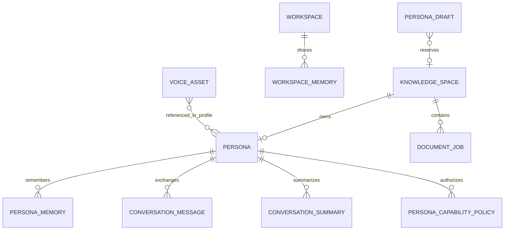

图中的 `o|` 表示可选的一对一：`Persona.knowledge_space_id` 和 `PersonaDraft.knowledge_space_id` 都是 unique FK，但一个知识空间在草稿确认前可以暂时没有 Persona。`PersonaCapabilityPolicy.persona_id` 还允许特殊值 `*` 表示全局默认，它不是外键关系，应理解为“策略作用域”而不是必须属于某个 Persona。SQLAlchemy 当前没有大量 ORM `relationship()` 导航，而是通过外键和 service 显式查询。这减少隐式级联，但删除角色时必须由 `PersonaDeletionService` 明确清理 SQL 行、Milvus、结构化 SQLite、音频和绑定。

### 40.2 `KnowledgeSpace`

- `id`：知识空间 ID。
- `workspace_id`：工作区边界。
- `created_at/updated_at`：审计时间。

每个 Persona 当前持有唯一 `knowledge_space_id`。查询作用域必须从服务端 `resolve_knowledge_scope()` 派生，不能信任浏览器自行提交的知识空间列表。

### 40.3 `Persona`

- `workspace_id` 和唯一 `knowledge_space_id` 定义数据作用域。
- `name`、`persona_type`、`profile_json` 定义角色行为和媒体绑定。
- `status` 表示角色是否可用。

`profile_json` 是灵活扩展区，承载系统提示相关人设、输出语言、音色/Live2D 等配置。灵活性的代价是 schema 约束弱，因此读写入口要做默认值和兼容迁移。

### 40.4 `PersonaDraft`

草稿先保留独立知识空间，再保存候选角色、选择项、建议名称和 profile。确认后才关联真实 Persona。这样上传/识别失败不会制造半完成角色；删除草稿要同时清理 staging 和保留的知识空间。

### 40.5 记忆实体

- `PersonaMemory`：只对单角色生效的长期事实。
- `WorkspaceMemory`：同一 workspace 可复用的全局事实。
- `ConversationSummary`：单 persona + conversation 的压缩历史，唯一约束防止重复摘要行。
- LangGraph checkpoint：完整图状态和 HITL 中断点，不等同于摘要。

四者不能混成一个表：checkpoint 用于恢复执行，summary 用于压缩上下文，persona memory 用于角色长期信息，workspace memory 用于跨角色共享约束。

### 40.6 `ConversationMessage`

关键字段是 `persona_id + conversation_id + role + kind`。`kind` 区分 text/audio，音频通过 `audio_path/audio_content_type` 指向文件，`transcript` 保存识别文本，`status/error_message` 表达处理结果。

消息 ID 使用时间微秒、进程内序号和短 UUID 组合，解决同一秒插入多条消息时仅按数据库时间排序不稳定的问题。它不是分布式全局序列；项目当前是本地单实例，合同足够。

### 40.7 `VoiceAsset`

保存 GPT 和 SoVITS 权重、参考音频、参考语言、训练数据目录、预览音频、训练阶段与错误。`needs_retraining` 会被合成服务明确拒绝，避免旧错误标注资产看似存在但生成质量不可控。

### 40.8 `DocumentJob`

同时是上传任务、预览记录和文档索引登记：

- `source_path`：原文件 staging 路径。
- `markdown_path/preview`：统一转换结果或结构化 Schema Card。
- `document_id`：Milvus 和结构化库清理所用稳定 ID。
- `status/error_message/indexed_at`：状态机和可反馈错误。

文档删除不是只删 SQL 行。正确删除需要 Milvus `document_id` filter、结构化表、staging 文件和任务行一起处理。

### 40.9 数据落点总表

| 数据 | 落点 | 是否随进程重启保留 |
|---|---|---|
| 角色/消息/摘要/音色/文档任务 | 应用 SQLite | 是 |
| LangGraph checkpoint | checkpoint SQLite | 是（完整模式） |
| Dense/Sparse 文档索引 | Milvus | 是，取决于 Docker volume |
| CSV/XLSX 表 | `data/structured/...` SQLite | 是 |
| MCP/渠道/本地设置 | `data/*.json` | 是 |
| Skill 安装 | 内置目录或 `data/skills` | 是 |
| 当前轮 events/metrics | 内存和响应 | 否 |
| B站 FIFO/当前事件 | manager 内存 | 否 |
| QQ 最近发送展示 | deque 内存 | 否 |
| 声音工作室 session | 文件目录 + `meta.json` | 是 |
| QQ 临时回复 WAV | `data/audio/napcat-replies` | 计划 60 秒后删除 |

## 41. 关键状态机

状态机是理解“为什么按钮不能直接随便跳状态”的最快方式。

### 41.1 DocumentJob

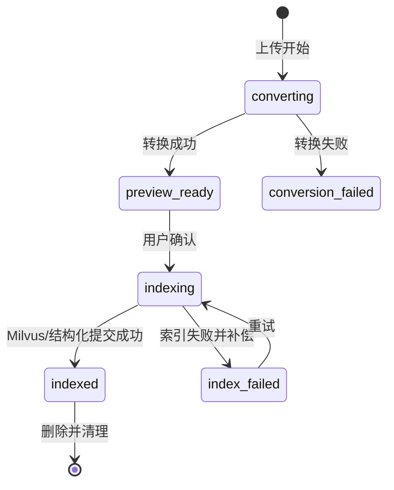

`prepare_index()` 只接受 `preview_ready`，`prepare_retry()` 只接受 `index_failed`。这个服务端检查阻止前端重复点击让两个索引线程同时写同一文档。

### 41.2 B站连接

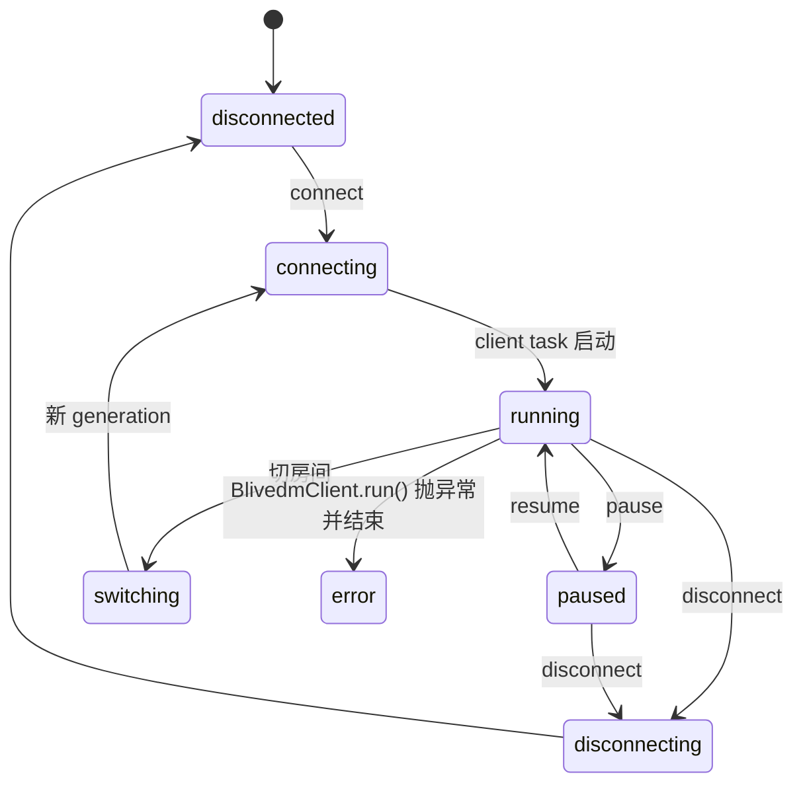

`paused` 只暂停消费队列，不一定关闭数据连接；`disconnect` 才停止客户端、清队列和 worker。清空会话会增加 generation，旧事件即使晚到也不能写进新会话。注意这里是 manager lifecycle；`source_status.mode` 另有 `starting/running/unavailable/idle` 等数据源状态。HTTP 轮询和 WebSocket 都不可用时，数据源会标记 unavailable，但 manager 不一定进入 error；某个通道恢复也只更新 source_status，不自动走 manager 的 error->running。

### 41.3 B站单事件 FIFO

```text
收到事件 -> 规范化/类型开关 -> 3 秒指纹去重 -> queue.put
-> worker 取一条 -> 等待 pause gate -> Agent 回复
-> 推送 reply -> 可选等待前端语音播放确认 -> task_done -> 下一条
```

这解释了“不是一次性把队列拼成一条消息”：worker 每次只取一个 `LiveEvent`，每个事件形成一轮 Agent 对话。启用自动语音时，它还会等待当前事件的 `audio_done`，防止声音重叠。

### 41.4 OneBot 连接

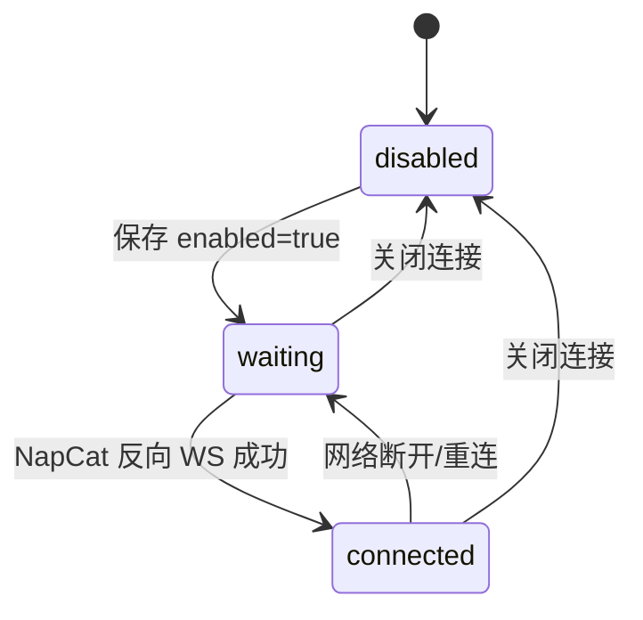

token 为空时本地默认不鉴权；配置 token 后，NapCat 必须在 Authorization Bearer 或 query 参数带同一 token。`enabled=false` 时服务端主动以 policy code 关闭连接并拒绝重连。

### 41.5 Agent 回合

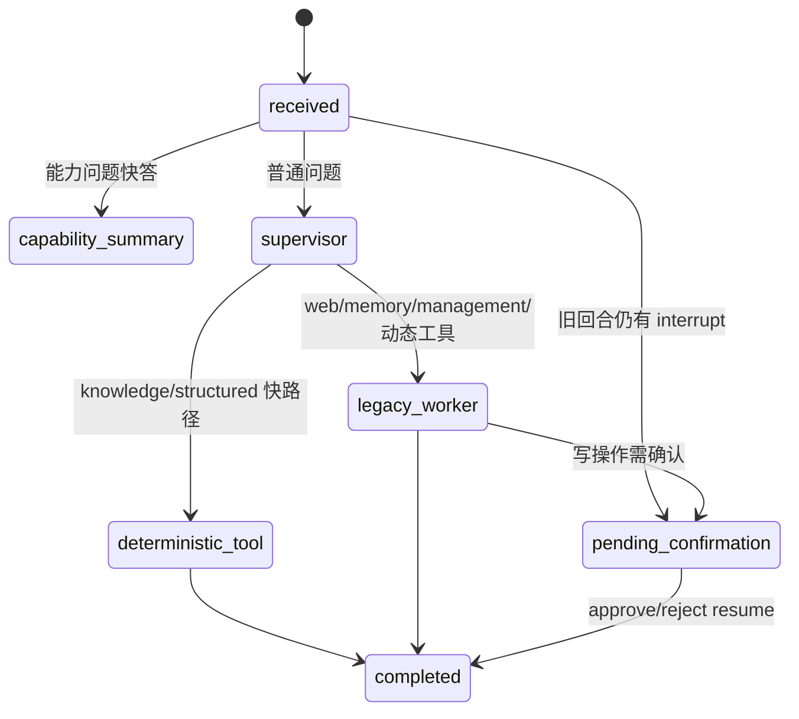

在一个会话有待确认操作时，新问题不会绕过它。`query()` 先 `_find_pending()`，这是 HITL 安全边界的一部分，而不是前端按钮状态。

### 41.6 Voice Studio

Voice Studio 的 `meta.json` 包含 phase、progress、error、输入文件、片段和选择结果。当前代码实际使用的主要阶段为：

```text
idle
  -> queued
  -> convert / extract / separate / slice（按输入和处理路径出现）
  -> audio_ready
  -> segments
  -> reference
  -> done
  -> cancelled / failed（取消或任一后台步骤异常）
```

任务线程通过 `_guard()` 捕获异常并写入失败状态。前端轮询只读 session state，不直接猜测 FFmpeg、分离模型或 VAD 是否完成。

## 42. 核心类和调用关系索引

### 42.1 一轮网页 Agent 的函数链

```text
static/js/chat.js submit
-> POST agent/stream 或 realtime WebSocket
-> app/routers/agents.py context_for()
-> agents/context_factory.py persona_agent_context_from_session()
-> realtime/ConversationExecutionRegistry.run()
-> PersonaAgentService.stream_query()
-> build_persona_workflow()
-> supervisor / deterministic knowledge / worker
-> Tool
-> AgentTurnResult
-> response_for()
-> SSE token/stage/result
-> chat.js 收口、持久化展示、触发可选 TTS
```

### 42.2 `PersonaAgentContext` 为什么是核心合同

它携带 persona、workspace、knowledge spaces、conversation、profile、session factory、摘要、能力策略和本轮 telemetry。所有渠道都必须从数据库构造它。它解决两个问题：

1. Tool 不需要信任前端额外传 scope。
2. 网页、B站、QQ 调用同一 Agent 时得到一致的人设、记忆和权限。

### 42.3 `PersonaAgentService`

- `thread_id()`：固定为 `persona_id:conversation_id`。
- `_graph()`：按 Tool registry revision 懒重建图，MCP/Skill 工具变化后无需重启整个应用。
- `query()/stream_query()`：执行新回合，处理能力快答、HITL 阻塞、LLM 瞬时降级。
- `resume()/stream_resume()`：用 LangGraph `Command(resume=...)` 从 interrupt 恢复。
- `_result()`：只暴露注册 Tool 的结果，过滤内部 handoff ToolMessage，提取 evidence/trace/metrics。

流式实现只转发 `persona_supervisor` 的模型 token，内部 Worker 的推理和交接不会泄漏到用户界面。`_VisibleTextStream` 还会截断 DeepSeek 风格 DSML 工具协议标记，避免把模型内部控制串显示给用户。

### 42.4 `build_persona_workflow()`

实现位于 `agents/graph/`，`agents/workflow.py` 只是兼容门面。父图包含四类机制：

- 动态 prompt：把当前 Persona profile、摘要、记忆和结构化 schema 注入模型。
- Skill middleware：只让模型看见基础工具和已加载/自动加载 Skill 的工具，减少工具过载。
- Capability guard：Tool 执行前再次校验角色授权；MCP 高风险工具还可要求确认。
- Observability/context budget：裁剪模型历史并记录模型调用、首 token、工具和 RAG 阶段。

knowledge 子图的关键是 planner → retrieve → fallback：Supervisor 只生成一次知识/结构化请求；planner 选择 RAG 或消费 SQL 合同，retrieve/fallback 执行确定性管线，finalize 校验合同后回到 Supervisor。

### 42.5 文档索引链

```text
create_conversion_job()
-> 1 MiB 分块读取并限制总大小
-> convert_source() -> preview.md
-> 用户确认
-> prepare_index()
-> 后台 index_document_job()
-> [CSV/XLSX] import_structured_file() + Schema Card
-> ingest_markdown_file()
-> MarkdownParser.parse_file()
-> content_hash 去重
-> MilvusRagStore.add_documents()
-> job.status = indexed
```

如果结构化导入完成后向量索引失败，代码删除刚导入的结构化文档；如果任务行被并发删除导致 `StaleDataError`，代码回滚并按 document scope 删除孤儿向量。这是事务无法跨 SQLite 和 Milvus时的应用层补偿。

### 42.6 RAG 查询链

```text
用户问题
-> route/classify
-> query rewrite（需要时）
-> Milvus dense + BM25 sparse
-> RRF 融合与候选池
-> relevance/quality grading
-> evidence gate
-> corrective loop（有上限）
-> grounded answer 或拒答
```

`trace` 记录候选数、结果数、是否改写、是否纠错和是否拒答。评测页可以把过程指标与最终答案指标分开，避免只看“回答像不像对”。

### 42.7 结构化查询链

```text
Supervisor 选择 structured
-> list allowed tables/schema
-> 生成单条 SELECT
-> sqlglot AST validate
-> 表名必须在 allowed_tables
-> SQLite authorizer 二次阻断写入/危险 opcode
-> progress handler 限时
-> 限制返回行数和单元格大小
-> JSON-safe result
```

AST 校验解决“语句看起来是不是 SELECT”，authorizer 解决“SQLite 实际准备执行什么操作”。两层都需要，因为仅靠字符串前缀或正则不能覆盖 CTE、PRAGMA、附加数据库、注释和嵌套表达式。

### 42.8 MCP 连接链

```text
MCP config
-> MCPManager 每服务器 lock + generation
-> MCPRuntime.run(command)
-> 专用线程 owner task
-> ClientSessionGroup async with
-> load tools
-> 包装成 LangChain StructuredTool
-> registry revision +1
-> Workflow 下次请求懒重建
```

断开时按 `server_name + session_token` 精确关闭。启用、重载、停用和测试串行化，防止“旧连接晚返回覆盖新状态”。

### 42.9 QQ 入站和出站链

```text
NapCat reverse WS
-> OneBotConnectionManager.handle_connection()
-> parse_message_event()
-> EventBus.publish(EVENT_MESSAGE)
-> ImMessageRouter.handle()
-> 命令/显式触发/授权概率判断
-> persona_agent_context()
-> PersonaAgentService.query()
-> text reply
-> 可选 iter_synthesize_segments()
-> 每生成一段 WAV 就 request_action(send_*_msg)
-> 60 秒后删除临时 WAV
```

每个目标有独立发送锁，保证同一好友/群的动作顺序；不同目标不共用 conversation ID，私聊和群聊也不会共享上下文。

## 43. 端到端场景演练

这一章以“操作一步、代码发生一步”的方式串起系统。命令均以 PowerShell 和项目根目录为前提。

### 43.1 启动服务端模式

```powershell
Set-Location D:\CodePython\YUMENO
.\.venv\Scripts\python.exe -B main.py
```

前三步可观察结果：

1. `main.py` 导入 `app.main.create_app()`，在模块级创建 app。
2. Uvicorn 监听默认 `127.0.0.1:17000`。
3. 浏览器访问 `http://127.0.0.1:17000/static/index.html`，`static/app.js` 加载默认“对话”视图。

验证：

```powershell
Invoke-RestMethod http://127.0.0.1:17000/api/health
Get-NetTCPConnection -LocalPort 17000 -State Listen
```

健康接口成功只证明 FastAPI 可达，不证明 Milvus、LLM、Embedding、GPT-SoVITS 或 MCP 全部可用。资源详情看 `/api/status` 和各专用 status API。

### 43.2 启动桌面模式

```powershell
.\.venv\Scripts\python.exe -B desktop_main.py
```

桌面链路：

1. `desktop.launcher.run()` 创建启动页窗口。
2. `LauncherApi` 后台检查 Docker/Compose、Milvus/Attu、FastAPI 和 GPT-SoVITS。
3. 启动进度注入 FastAPI 的 `/api/launcher/progress`，启动页轮询显示步骤。
4. 完成后同一个 WebView2 导航到主应用。

关闭窗口时：

- “保持服务”保留 FastAPI、GPT-SoVITS 和 Docker，窗口关闭但宿主等待服务。
- “暂停服务”停止本轮后台服务，Docker 按策略暂停。
- “删除 Docker”涉及容器资源删除，只能在用户明确选择后执行。

### 43.3 创建一个角色

用户侧：进入创建页，上传资料或直接填写，选择候选并确认。

内部链路：

1. `persona-drafts/upload` 创建 `KnowledgeSpace` 和 `PersonaDraft`。
2. 文件转换为 Markdown 预览，分析内容生成候选角色。
3. `PATCH draft` 保存名称和 profile 修改。
4. 选择 candidate 后，`confirm` 创建 Persona 并绑定预留知识空间。
5. 前端刷新角色列表，并记录最近使用角色。

关键边界：草稿确认前不应出现在正式角色列表。若确认失败，应保留可重试草稿，而不是重复创建 Persona。

### 43.4 给角色上传一份普通文档

1. 管理页选择角色和资料文件。
2. `POST /api/knowledge-spaces/{space_id}/documents/upload` 创建 `DocumentJob(status=converting)`。
3. 文件按 1 MiB 块写入 `data/staging/{job_id}`，超过 `max_upload_mb` 失败。
4. MarkItDown 转成 `preview.md`，job 进入 `preview_ready`。
5. 页面展示预览；用户确认后状态变为 `indexing`。
6. 后台 parser 按约 1000 字符、150 重叠切块，写 scope metadata 和 content hash。
7. Milvus 建立/复用 collection，写 dense、sparse 和元数据。
8. job 进入 `indexed`，此资料对该角色的下一轮查询立即可见。

资料“快速写入记忆”的准确解释：编辑角色 profile 和保存长期记忆会在下一轮上下文构造时读取；上传知识资料则必须完成 `indexed`，因为它不是直接塞进提示词，而是先进入 RAG 索引。

### 43.5 上传 CSV/XLSX

与普通文档前五步相同。索引阶段分叉：

1. `import_structured_file()` 读取工作表，规范列名并推断 INTEGER/REAL/TEXT。
2. 为每个 sheet 建物理表，例如基于 document ID 和 sheet 序号的安全名称。
3. 把 workspace、knowledge space、document、显示名、列映射写入元数据表。
4. 生成 Schema Card，替换 `preview.md` 内容。
5. Schema Card 进入 Milvus，真实行数据只进隔离 SQLite。

因此用户问“这张表讲什么”时可先通过 RAG 找 Schema；问“按月份分组求和”时走 Text-to-SQL。删除文档会同时删其物理表和元数据。

### 43.6 一轮普通对话

假设角色 ID 为 `P`，浏览器 conversation ID 为 `C`：

1. 前端提交文本，立即为本轮生成 turn 标识并进入 busy 状态。
2. router 从数据库读取 P，派生 workspace/knowledge space/capability policy，构造 context。
3. `ConversationExecutionRegistry` 以 `P:C` 串行执行，避免同一窗口两个图同时改 checkpoint。
4. `PersonaAgentService.stream_query()` 检查旧 interrupt 和能力快答。
5. LangGraph Supervisor 看人设、当前消息、受预算限制的历史、摘要和可见工具。
6. 若无需工具，Supervisor 直接流式生成角色回复。
7. 页面只接收 Supervisor token；result 到达后展示完整 answer 和本轮情况。
8. 用户/助手文本写入 `ConversationMessage`，摘要达到阈值后更新。

快速连续发送时，后发消息不会被“几秒一次状态刷新”覆盖：前端使用 turn/epoch 防过期回调，服务端使用执行 registry 串行化同一会话。不同会话仍可并行。

### 43.7 一轮知识问答

1. Supervisor 决定 knowledge。
2. Workflow 解析原问题，调用 `search_persona_knowledge` 标准 Tool。
3. Tool 使用 context 的 workspace/knowledge spaces，客户端不能改 scope。
4. Adaptive RAG 检索、评分、纠错和证据门运行。
5. Tool 返回 answer/evidence/trace/status。
6. Supervisor/Workflow 只在 `accepted` 时使用事实；`insufficient` 时明确缺证据。
7. 前端本轮“情况”展示 tool 调用、候选、引用和耗时。

如果用户直接调用 `/rag/query`，会绕过通用 Agent 对话表面，适合评测和调试，但正式对话推荐 Agent 入口，因为它包含角色、记忆、权限和 HITL。

### 43.8 一轮 Text-to-SQL

用户问：“按月份统计订单金额最高的前三个月。”

1. Supervisor 从注入的结构化 schema 判断 `kind=structured`。
2. 请求合同包含 original query 和单条 SELECT。
3. Workflow 获取此 persona scope 内允许表名。
4. `structured_query` Tool 调用 SQL guard。
5. SQL AST 必须是单条只读查询，所有表必须在 allowed set。
6. SQLite authorizer 再次拒绝写操作、ATTACH、危险 pragma 等。
7. 查询有行数、时间和结果大小限制。
8. 返回列、行、耗时、是否截断；Workflow 组织为可读答案。

如果模型使用显示名而不是物理名，SQL 会失败。系统 prompt 提醒使用 physical identifier + human-readable alias，错误应作为工具失败返回，不能自动扩大权限猜另一个表。

### 43.9 Human-in-the-loop

以“删除一份资料”为例：

1. Supervisor/management Worker 选择删除 Tool。
2. Tool policy 把它分类为写操作/高风险操作。
3. LangGraph `interrupt` 保存 pending action，返回 `pending_confirmation`。
4. 页面显示批准/拒绝，不执行删除。
5. 用户批准时调用 `stream-resume`，`Command(resume={approved:true})` 从原节点继续。
6. 用户拒绝时按拒绝结果继续生成回复。

在 pending 期间发送普通问题只会再次返回等待确认，防止用新消息绕过授权。

### 43.10 B站未开播房间

输入房间号后连接：

1. HTTP `Room/get_info` 解析真实 room ID、标题和 `live_status`。
2. `gethistory` 初次轮询只建立 seen 集合，不把历史全当新消息。
3. 后续每 2.5 秒轮询新增普通弹幕，即使未开播，只要历史接口仍返回新内容就可处理。
4. 同时尝试 blivedm WebSocket；成功时可以获得实时弹幕和 `INTERACT_WORD` 进场事件。
5. WebSocket 不可用但 HTTP 可用时，页面应显示“弹幕可用、进场不可用”，而不是假称全实时。

这是当前轻量方案的稳定性策略：弹幕双通道，进场只有实时 WebSocket 通道。历史 HTTP 本身不提供可靠的进场事件，因此不能承诺未开播时一定捕获进场。

### 43.11 QQ 私聊/群聊

1. NapCat 配置反向 WebSocket：`ws://127.0.0.1:17000/api/onebot/ws`。
2. YUMENO 接入页启用 OneBot，token 留空或双方一致。
3. NapCat 连接后，`OneBotConnectionManager` 更新 bot UIN、连接时间和事件时间。
4. 每个窗口可绑定角色；未单独绑定时使用默认角色。
5. 私聊或显式群触发进入统一 Agent。
6. 群聊非显式消息只有目标群已授权、随机档位命中、LLM 适合性判断为 YES 才主动回复。
7. 回复模式三选一：仅文字、文字+语音、仅语音；“中文文字”只翻译展示文本，TTS 仍用原始日文。
8. TTS 每产出一个 segment 就立即写临时 WAV 并发送，不等待全部生成。

群聊频率 0/5/30/100% 是概率档位，不是严格每 20 条回复 1 条。100% 仍经过适合性判断，但由于外发风险高，前端要求二次确认。

### 43.12 清空某个 QQ 窗口记忆

用户在 NapCat 页选择 private/group 和目标 ID，点击清空：

1. 服务端计算 `im:onebot11:{chat_type}:{chat_id}`。
2. 结合当前绑定/默认 persona，定位 `persona_id:conversation_id` checkpoint。
3. 删除该窗口的 ConversationMessage、ConversationSummary、checkpoint 和关联音频。
4. 其他好友、其他群和网页对话不受影响。

“清最近发送记录”只清页面展示 deque，不等于清 Agent 记忆；两个按钮必须区分。

## 44. 故障定位手册

### 44.1 通用五层定位法

遇到“没有回复”不要直接归因于 LLM。按以下顺序：

1. **页面层**：按钮是否 disabled、浏览器 console 是否报错、请求是否发出。
2. **协议层**：HTTP 状态码、SSE/WS 是否连接、响应 body 的 error。
3. **上下文层**：persona 是否存在，conversation ID 和 scope 是否正确。
4. **Workflow/Tool 层**：stage、tool result、evidence、pending confirmation。
5. **依赖层**：LLM、Milvus、Embedding、MCP、GPT-SoVITS、NapCat/B站网络。

每层都有不同修复点。只反复重启应用可能暂时清状态，却无法解决根因。

### 44.2 服务无法启动

检查端口：

```powershell
Get-NetTCPConnection -LocalPort 17000 -State Listen -ErrorAction SilentlyContinue
```

可能原因：

- 已有旧 YUMENO 占用 17000。
- `.venv` 依赖不完整。
- SQLite 文件或目录权限失败。
- import 阶段第三方库缺失。

若已有监听，先确认 PID 和命令行，不要盲目结束所有 Python：

```powershell
$conn = Get-NetTCPConnection -LocalPort 17000 -State Listen -ErrorAction SilentlyContinue
if ($conn) { Get-CimInstance Win32_Process -Filter "ProcessId = $($conn.OwningProcess)" | Select-Object ProcessId,CommandLine }
```

### 44.3 启动页不见或一直不结束

检查：

- 使用的是 `desktop_main.py` 还是 `main.py`。后者没有桌面启动页。
- `/api/launcher/progress` 是否返回 injected progress；普通浏览器服务模式返回空进度是预期。
- Docker Desktop/Engine、Compose、Milvus 端口和 FastAPI 子线程是否启动。
- WebView2 是否仍加载旧静态缓存；当前静态响应 `no-store`，刷新应重新取资源。

### 44.4 切换页面后 Live2D 消失或对话卡住

发生过的根因类型是页面生命周期不统一：切页销毁/重复绑定 DOM、旧异步回调写入新页面、Live2D canvas/事件监听没有重挂。当前 `app.js` 采用 view cache 和 epoch，Live2D 由共享管理器维护。

定位：

- console 是否出现 duplicate listener/null element。
- view epoch 是否变化后旧 fetch 仍提交。
- Live2D canvas 像素是否非空，模型资源 URL 是否 200。
- 对话 WebSocket 是否仍绑定旧 persona/conversation。

### 44.5 连续消息后不再回复

重点检查：

- 是否存在待确认 HITL；新消息会被有意阻塞。
- 是否同一会话上一轮仍执行；registry 会排队而不是并发。
- SSE 是否收到 result；只有 token 没有 result 说明连接中断。
- 前端 turn id 是否把当前结果误判为过期。
- LLM 是否 429/5xx；瞬时错误会返回统一降级文案，而真实代码异常应保留 500 便于定位。

### 44.6 角色列表突然为空

依次检查：

1. `GET /api/personas` 的 HTTP 状态和 body。
2. 当前 `Settings.sqlite_path` 是否指向原数据库，而不是从不同工作目录启动的新空库。
3. SQLAlchemy 是否成功建表/迁移。
4. 页面是否因一次接口失败把已有 DOM 清空。
5. NapCat 页看到的角色是否来自缓存，而管理页来自 API；不能据此认定数据库仍正确。

不要立即新建同名角色，否则可能在恢复原数据库后产生重复。

### 44.7 文档一直 indexing 或 index_failed

- 看 `DocumentJob.error_message`。
- 检查 Milvus collection 和 embedding dimension 是否一致。
- 检查 Embedding API/local worker 是否可用。
- CSV/XLSX 检查文件锁、表头和 SQLite 路径。
- 删除/重试前确认后台任务是否仍活跃，避免并发清理。

`index_failed` 可以 retry；`conversion_failed` 说明尚未生成可索引 Markdown，通常应重新上传或修转换环境。

### 44.8 RAG 有回答但引用不对

区分四种问题：

- 没召回：检查 chunk、embedding、BM25、scope filter。
- 召回了但排序差：检查 RRF 和 grader。
- 证据正确但答案偏：检查生成 prompt 和 evidence gate。
- 串角色：检查服务端 context 和 Milvus scalar filter，这是安全缺陷而非“调参”。

用评测页查看 Top3 命中和逐题 evidence，比只在聊天框凭感觉判断更可靠。

### 44.9 Text-to-SQL 被拒绝

常见原因：

- 生成了多条语句或非 SELECT。
- 使用显示列名而不是物理列名。
- 引用了不在当前 persona scope 的表。
- CTE/子查询内藏了越权表。
- 超过执行时间或结果行限制。

正确处理是返回可解释错误并让模型在同一作用域修正，不是关闭 guard。

### 44.10 MCP 显示连接失败

- stdio command/path 是否存在，参数是否为数组。
- 默认安全策略是否允许该命令；任意 stdio 需要显式配置许可。
- HTTP/SSE URL 是否可达。
- 工具名是否与其他服务器冲突。
- 测试连接是否成功但 persistent enable 失败。
- 应用关闭后是否仍有 MCP 子进程；若有，检查 owner runtime 收口测试。

不要在 FastAPI event loop 里直接跑阻塞 transport，也不要用多个 `asyncio.run()` 复用同一 session。

### 44.11 NapCat 反向 WS 403

403/1008 的根因通常是：

- YUMENO `enabled=false`，这是点击断开后的预期状态。
- token 不一致。
- NapCat URL 指向错误端口或路径。

操作顺序：YUMENO 保存并启用 -> 确认 URL/token -> NapCat 开启反向 WS -> YUMENO 刷新状态。关闭连接后 NapCat 继续自动重连会被拒绝，日志会重复 403；要停止日志需要同时停用 NapCat 侧该连接或重新启用 YUMENO。

### 44.12 QQ 能手动发送但不自动回复

手动发送只证明 OneBot 动作链可用。自动回复还依赖：

- `auto_reply_enabled`。
- 目标窗口绑定或默认 persona。
- 群触发模式（@/前缀）或主动回复授权。
- LLM/Agent 可用。
- 待确认状态是否阻塞。

查看 `last_event_at` 判断入站事件是否到达，查看 `recent_messages` 只能证明出站文字记录。

### 44.13 QQ 语音不逐段发送

检查 `ImMessageRouter._reply()` 是否使用 `iter_synthesize_segments()` 并在循环内立即 `event.reply_record()`。若改成 `synthesize_segments()` 再遍历，就会等待全部生成。也要确认 OneBot `request_action()` 没被一个全局锁串住所有目标；当前锁粒度是单 target。

### 44.14 B站能收弹幕但没有进场

这是数据通道能力差异：HTTP history 只提供最近弹幕；进场依赖 blivedm WebSocket 的 `INTERACT_WORD`。页面状态里的 `danmaku_available` 和 `enter_available` 应分别解释，不能用“连接成功”一个绿点掩盖差异。

### 44.15 Protobuf 启动警告

警告说明某些依赖生成的 protobuf 代码比 runtime 旧一个大版本。当前测试通过，属于未来兼容风险而非现有启动失败。优先策略是固定 Python 3.11 和当前依赖、等待上游生成代码升级；若只是减少噪声，可按 warning category 精确过滤，但不要全局隐藏所有 `UserWarning`。

### 44.16 关闭时进程残留

检查顺序：

1. 17000 listener。
2. 命令行包含 YUMENO 的 Python。
3. free-search/MCP stdio 子进程。
4. Embedding worker。
5. ASR worker 和 GPT-SoVITS API。

残留是生命周期 bug，不应长期靠“结束所有 Python”处理，因为会误伤其他项目。

## 45. 安全、权限和数据隔离的完整解释

### 45.1 信任边界

当前产品假设是“本机单用户可信桌面环境”。因此：

- FastAPI 默认绑定 loopback。
- CORS 为本地 file/WebView 场景放宽。
- 部分破坏性路由要求本地来源和自定义 header。
- API 没有完整登录、租户鉴权、CSRF 和公网速率限制。

这足以支持本地工具，但不能直接宣称是互联网多租户安全。公网部署必须增加身份层、TLS、密钥托管、审计和配额。

### 45.2 作用域权威

最重要的隔离原则是：用户只提交 persona ID 和 conversation ID，服务端从 Persona 解析 workspace 和 knowledge spaces。后续 Milvus filter、SQLite path、memory query 和 capability policy 都使用这个 context。

客户端提交一个额外 knowledge space ID 即使通过 JSON 校验，也不应扩大查询范围。

### 45.3 Capability Policy

能力策略和连接配置分离：

- MCP server enabled 表示系统连接可用。
- Persona capability enabled 表示某角色能否看见/执行。
- Tool 自身 risk/side effect 描述决定是否需要 HITL。

因此“扩展已安装”不等于“所有角色都能用”。前端用能力包展示依赖关系，后端仍是最终裁决者。

### 45.4 Skill 信任

Skill 可能只有说明，也可能包含脚本和工具依赖。安全层级至少包括：

- installed/enabled：是否存在且启用。
- trusted：是否信任其说明和能力声明。
- scripts_enabled：是否允许执行脚本。
- persona policy：当前角色是否可见。

下载 Skill 的 Skill 本身不能绕开这些状态；安装完成后仍需用户确认信任和脚本许可。

### 45.5 MCP 风险

MCP transport 能连接本地 stdio 或网络服务，工具可能读写文件或调用外部系统。项目通过配置验证、stdio 白名单/显式开关、密钥遮罩、角色授权和工具执行前 guard 降低风险，但第三方服务器代码仍属于外部信任域。

### 45.6 Text-to-SQL

数据库文件按 workspace/knowledge space 隔离，SQL 又必须引用当前 allowed tables。即使模型生成 `SELECT`，SQLite authorizer 仍阻止 ATTACH、写入和其他危险操作。结果还要做 JSON 安全转换和大小限制，防止大结果占满上下文。

### 45.7 渠道外发安全

QQ 风险最高的不是“收到消息”，而是主动外发：

- 默认只在已配置目标、显式触发或授权群生效。
- 主动群聊先概率采样，再做适合性判断。
- 100% 档位前端二次确认。
- OneBot 只支持明确的 private/group target 和数字 ID。
- 同目标发送加锁，避免并发乱序。

系统不会遍历好友/群列表主动群发，除非未来新增这种功能；当前手动发送请求必须携带单一目标。

## 46. 性能、容量和可观测口径

### 46.1 一轮 metrics 能说明什么

`RunRecorder` 在当前响应中提供：

- 模型调用次数和已观测 token。
- 首 token 时间（若流式 provider 提供）。
- Tool 调用和成功/失败。
- handoff 数。
- RAG 各阶段事件。
- 上下文裁剪前后 token 和丢弃消息数。
- 总耗时。

它不替代长期 APM。用户要求轻量，因此页面每轮只展示一次；需要长期分析时导出评测 JSON 或运行基准脚本。

### 46.2 已实测数据

本机微基准已经确认：

- 5,000 行 CSV 导入 15.869 ms，约 315,075.744 行/s。
- 聚合查询 P50 1.914 ms、P95 2.064 ms。
- 4 类 SQL 攻击各 20 次，共 80/80 拦截。
- 4/4 跨 workspace/knowledge space 反向探针拦截。
- 50 轮上下文从 12,057 token 降到 5,791，减少 51.97%。

这些结论的环境、schema 和原始数据见 [`enterprise-2026-08-11.json`](../benchmarks/enterprise-2026-08-11.json)。

### 46.3 不能混写的数据

- 单次本地 SQLite 延迟不能等同于生产数据库 P95。
- 合同测试 `model_calls=1` 不能直接换算 TTFT 降低 66.67%。
- SQL 拦截探针不是形式化安全证明。
- 未运行真实知识库评测时不能写 Recall@3 提升。
- 一次全量测试历史超时不构成可靠旧性能基线。

### 46.4 建立真实 Recall@3 A/B

1. 固定一个真实 Persona 知识空间和 commit。
2. 标注至少 30 个问题，每题列出 expected document/chunk。
3. 用旧策略和新策略分别运行，保存候选池。
4. 计算 Recall@3、MRR@3、Hit@3 和失败类别。
5. 记录 embedding/model、chunk 参数、Milvus collection、硬件和时间。
6. 把 JSON 放入 `docs/benchmarks`，再写“提升 X%”。

### 46.5 建立真实响应时间 A/B

1. 固定同一外部 LLM provider/model 和温度。
2. 准备 knowledge、structured、web、memory 各类请求。
3. 每类预热后重复至少 20 次。
4. 记录 TTFT、总时延、model calls、tool calls、错误率。
5. 分开报告 P50/P95，不只报最快一次。
6. 网络错误和限流单独统计，不静默删除慢样本。

## 47. 从简历到面试的完整讲解稿

### 47.1 30 秒版本

> YUMENO 是我独立设计的 Windows 本地优先角色化 Agent/RAG 平台。后端用 FastAPI 和 LangGraph，把 Agent 的一次策略决策、Workflow 的权限与数据处理、Tool 的最小执行动作分离；文本知识走 Milvus Dense/BM25/RRF 和 Corrective RAG，复杂表格走隔离 SQLite 与双层只读 Text-to-SQL。系统还统一接入了分层记忆、Skill/MCP、GPT-SoVITS、Live2D、B站和 OneBot/NapCat。

### 47.2 两分钟版本

业务背景：用户希望创建一个带人设、私有知识、长期记忆和声音/形象的角色，并让同一角色能在网页、直播和 QQ 中工作。

核心问题：如果让 Agent 自由循环调用所有工具，延迟、权限和失败边界都不可控；如果全写死 Workflow，又不能理解自然语言意图。

我的解法：让 Supervisor 只做一次策略决策，Workflow 负责 scope、权限、SQL 校验、RAG 纠错和结果后处理，Tool 封装检索、记忆、结构化查询和外部 MCP 动作。知识/结构化快路径用测试锁定每轮一次模型调用和一次工具调用，写操作保留 LangGraph checkpoint + HITL。

数据层：普通资料转换切分后进 Milvus 混合检索；CSV/XLSX 的 Schema Card 进向量库，真实行进隔离 SQLite，查询经过 sqlglot AST 和 SQLite authorizer。记忆分 checkpoint、会话摘要、角色长期和工作区四层，再用上下文预算控制长会话。

工程结果：完整 Python 回归 581 passed，前端 13 passed；本机 50 轮上下文 token 减少 51.97%，SQL 攻击探针 80/80 和跨空间 4/4 被拦截。真实 Recall@3 和外部 LLM TTFT 仍保留为下一步 A/B，不把未测结果写进简历。

### 47.3 五到八分钟架构深讲

1. 从 `main.py -> app/main.py` 讲依赖装配和本地进程。
2. 从一次 `agent/stream` 讲服务端权威 context。
3. 画 Agent/Workflow/Tool 三层，说明一次策略决策。
4. 展开普通文档和表格两个数据面。
5. 展开 checkpoint/summary/persona/workspace 四层记忆。
6. 说明 MCP owner task 和 Embedding worker 生命周期是如何通过竞态测试修复的。
7. 说明 B站/QQ只是适配层，统一复用 Agent。
8. 最后报可审计指标和明确局限。

### 47.4 可以写入简历的技术栈

`Python 3.11、FastAPI、Uvicorn、Pydantic v2、SQLAlchemy 2、SQLite WAL、LangChain 1.x、LangGraph、Milvus、BM25、RRF、OpenAI-compatible API、sqlglot、MCP 2.0、WebSocket/SSE、GPT-SoVITS、ONNX Runtime、Silero VAD、WebView2、Docker Compose、pytest、Node test runner`

不要把所有技术栈塞进同一句。简历主体突出 Agent/RAG/数据安全，TTS/Live2D/B站/QQ 放在扩展能力一条。

### 47.5 量化表述模板

已可用：

> 设计回合级上下文预算并保持 ToolMessage 配对，在 50 轮可复现测试中将模型上下文从 12,057 token 降至 5,791，减少 51.97%。

> 为 CSV/XLSX 构建隔离 SQLite 与双层只读 Text-to-SQL，本机 5,000 行导入约 31.51 万行/s、聚合查询 P95 2.064 ms，80/80 SQL 攻击重复探针和 4/4 跨作用域探针全部拦截。

> 重构 MCP 生命周期为专用线程单 owner task，配合 session token、generation 和每服务器锁解决跨 Task 清理、重载竞态与子进程残留；终审后 581 项 Python 回归通过。

待真实测量后补：

> 通过 Dense/BM25/RRF 与 Corrective RAG 将固定题集 Recall@3 从 A 提升到 B（提升 X%），检索 P95 从 C 降至 D。

> 将知识请求从多轮 Agent 循环收敛为一次策略决策和确定性 Tool，外部 LLM TTFT P95 从 A 降至 B（降低 X%）。

其中 A/B/C/D 必须来自保存的基准 JSON。

### 47.6 高频面试追问

**为什么不是纯 LangGraph Agent？** 纯自由循环难以保证权限、循环上限、SQL 只读和稳定延迟。YUMENO 保留模型做意图判断，把硬约束放回 Workflow。

**为什么 Agent 仍有 Legacy Worker？** Web、记忆、管理和动态扩展包含不同工具与 HITL，一次性迁移风险大。先优化高频知识/结构化路径，同时保留兼容面。

**如何防止提示词越权？** 提示词只是一层引导；真正 scope 来自服务端 context，Tool guard、Milvus filter、SQLite allowed tables 和 authorizer 才是执行边界。

**为什么 Milvus 和 SQLite 都要？** 向量库解决语义相关性，关系数据库解决准确过滤、分组和聚合。Schema Card 把两者连接起来。

**记忆和 RAG 的区别？** RAG 是外部资料证据检索；记忆是对用户/角色/工作区事实的持续状态。两者生命周期、权限和更新方式不同。

**如何处理快速连续消息？** 前端 turn/epoch 阻止旧回调覆盖，服务端按 `persona:conversation` 串行执行，LangGraph checkpoint 保存状态。

**为何 MCP 需要专用线程？** SDK transport/session 由 AnyIO cancel scope 管理，必须在同一 owner task 进入、调用和退出；同时不能阻塞 FastAPI 事件循环。

**项目是企业级了吗？** 架构和工程方法达到可解释、可测试、可扩展的企业应用训练目标；当前部署仍是本地单用户，不冒充公网多租户生产系统。

## 48. 技术术语表

| 术语 | 在本项目中的准确含义 |
|---|---|
| Agent | 使用 LLM 做策略/工具选择的执行单元，不等于整个应用 |
| Supervisor | 对用户可见的主 Agent，决定直接回答或分派能力 |
| Worker | 内部知识/Web/记忆/管理专员，结果交回 Supervisor |
| Workflow | 确定性控制层，做权限、路由、循环上限、预后处理 |
| Tool | 一个有 schema 的最小可执行动作 |
| Skill | 可加载的说明、流程知识、依赖工具和可选脚本包 |
| MCP | 模型上下文协议，连接外部工具服务器的标准 transport/session |
| Capability | 对 Tool/Skill/MCP 的统一可授权描述 |
| HITL | Human-in-the-loop，危险动作执行前中断等待用户确认 |
| Checkpoint | LangGraph 图状态快照，用于恢复回合和 interrupt |
| Short-term memory | 当前模型窗口内的近期消息 |
| Conversation summary | 对更早会话的压缩摘要 |
| Persona memory | 单角色长期事实 |
| Workspace memory | 同 workspace 跨角色共享事实 |
| RAG | 检索证据后生成答案 |
| Adaptive RAG | 根据问题/证据决定检索、改写、纠错或拒答 |
| Corrective RAG | 证据质量不足时有界修正查询/重检索 |
| Dense retrieval | 通过 Embedding 向量语义相似度检索 |
| Sparse/BM25 | 基于词项匹配的稀疏检索 |
| RRF | Reciprocal Rank Fusion，融合多路排序名次 |
| Recall@3 | 标注相关项是否出现在前三个候选中的召回比例 |
| MRR@3 | 第一个相关项在前三名中的倒数排名均值 |
| Evidence gate | 证据不足时拒绝生成确定事实的质量门 |
| Schema Card | 表格的表名、列名、类型、行数等文本化概要 |
| Text-to-SQL | 将自然语言意图转成受限 SQL，再执行并解释 |
| SQL AST | SQL 抽象语法树，用于结构验证而非字符串猜测 |
| SQLite authorizer | SQLite 准备语句时的底层操作授权回调 |
| Workspace | 顶层本地数据边界 |
| Knowledge space | 单角色知识库边界 |
| Conversation ID | 一个页面/QQ目标/B站 session 的对话边界 |
| Scope | workspace + knowledge spaces + persona 的权威访问范围 |
| SSE | 服务端单向流式事件，承载 token/stage/result |
| WebSocket | 双向长连接，用于实时对话、OneBot、B站状态、流式语音 |
| TTFT | Time to First Token，首 token 延迟 |
| P50/P95 | 延迟分布中位数/95 分位数 |
| Owner task | 唯一拥有并关闭 MCP session 的 asyncio task |
| Generation | 连接配置代次，防止旧异步结果覆盖新状态 |
| LRU | 最近最少使用缓存；本项目 Embedding 缓存容量为 4 |
| VAD | Voice Activity Detection，检测语音开始/结束 |
| ASR | Automatic Speech Recognition，语音转文字 |
| TTS | Text-to-Speech，文字转语音 |
| GPT-SoVITS | 项目当前音色克隆与合成引擎 |
| VTS | VTube Studio，Live2D 外部控制目标 |
| OneBot 11 | NapCat 与 YUMENO 交换 QQ 事件/动作的协议 |

## 49. 逐文件阅读清单

### 49.1 第一遍：建立主链，约 2 小时

- [ ] `main.py`：只看应用入口。
- [ ] `app/main.py`：画出 `app.state` 和 lifespan。
- [ ] `settings.py`：理解配置覆盖顺序。
- [ ] `app/models.py`：画实体和 scope。
- [ ] `app/routers/agents.py`：理解协议边界。
- [ ] `agents/context_factory.py`：确认服务端权威上下文。
- [ ] `agents/service.py`：理解 thread、stream、resume、result。
- [ ] `agents/graph/`：理解 Supervisor、knowledge 子图、受限 Worker 和 middleware；`agents/workflow.py` 只是门面。

完成标准：能不用看代码画出“一轮网页对话”的序列图。

### 49.2 第二遍：RAG 与结构化数据，约 3 小时

- [ ] `ingestion/document_jobs.py`：上传状态和补偿。
- [ ] `ingestion/converter.py`：统一 Markdown 转换。
- [ ] `ingestion/markdown_parser.py`：chunk 与 metadata。
- [ ] `ingestion/indexer.py`：hash 去重和写入。
- [ ] `ingestion/milvus_store.py`：collection、schema、filter、delete。
- [ ] `rag/retriever.py`：Dense/BM25/RRF。
- [ ] `rag/adaptive_graph.py`：质量门和纠错循环。
- [ ] `rag/eval/runner.py`：Recall@3/MRR/隔离探针。
- [ ] `structured_data/importer.py`：物理表和 Schema Card。
- [ ] `structured_data/sql_guard.py`：AST 规则。
- [ ] `structured_data/service.py`：authorizer、超时、限行。

完成标准：能解释普通 PDF 和 Excel 为什么进入不同数据面，以及失败如何补偿。

### 49.3 第三遍：能力和生命周期，约 3 小时

- [ ] `agents/capabilities.py`：统一 catalog。
- [ ] `agents/policy.py`：角色授权决策。
- [ ] `agents/skills.py`：Skill 发现和加载。
- [ ] `agents/registry.py`：Tool 注册 revision。
- [ ] `integrations/mcp/config.py`：MCP 配置安全。
- [ ] `integrations/mcp/client.py`：owner runtime、session token、generation。
- [ ] `ingestion/local_embedding/client.py`：Popen、LRU、WeakSet、shutdown gate。
- [ ] 对应测试：优先看竞态和关闭顺序用例。

完成标准：能解释“为什么一个普通 await/create_task 不足以安全持有 MCP session”和“为什么 LRU 淘汰不能直接关旧 Embedding”。

### 49.4 第四遍：渠道与媒体，约 3 小时

- [ ] `integrations/bilibili/client.py`：HTTP+WS 双通道。
- [ ] `integrations/bilibili/manager.py`：FIFO、暂停、generation、audio waiter。
- [ ] `integrations/onebot11/ws_server.py`：反向 WS 和动作 echo。
- [ ] `integrations/onebot11/router.py`：窗口隔离、主动回复、文字/语音。
- [ ] `voice/gpt_sovits/synthesis.py`：语言分段和流式 segment。
- [ ] `voice/studio.py`：文件 session 和后台状态。
- [ ] `voice/clone_pipeline.py`：FFmpeg、VAD、参考音。
- [ ] `static/js/chat.js`、`napcat.js`、`integrations.js`：前端消费状态。

完成标准：能解释 B站暂停和断开的差别，QQ 每个窗口如何独立记忆，语音为何能边生成边发送。

### 49.5 阅读测试的顺序

测试往往比实现更清楚地表达合同。优先找：

- `test_context_factory.py`：scope 和上下文。
- `test_agent_observability.py`：本轮 metrics。
- `test_context_budget.py`：长对话裁剪。
- `test_structured_data.py`、`test_sql_guard.py`：SQL 安全。
- `test_onebot_connection.py`、`test_onebot_router_voice.py`：QQ 连接/语音。
- `test_bilibili_live.py`：直播状态和 FIFO。
- MCP/Embedding 生命周期测试：并发、关闭、旧引用。
- `tests/js/chat-rapid-submit.test.cjs`：快速消息。
- `tests/js/navigation-lifecycle.test.cjs`：切页生命周期。

## 50. 项目全景总结

从宏观上，YUMENO 是一个本地优先的“角色运行平台”，不是单一聊天机器人：角色拥有行为、人设、知识、记忆、能力、声音和形象，并能通过网页、B站和 QQ 接收输入。

从架构上，核心不是“用了多少框架”，而是三条边界：

1. **不确定性边界**：LLM/Agent 只决定意图；权限、scope、循环、SQL 和资源限制由确定性 Workflow 控制。
2. **数据边界**：文本语义交给 Milvus，表格计算交给 SQLite，执行状态交给 checkpoint，长期事实按 persona/workspace 分层。
3. **生命周期边界**：FastAPI 只装配和协调；MCP、Embedding、ASR、TTS、渠道 manager 都有明确 owner 和关闭顺序。

从一次实际请求看，所有渠道最终都执行同一套步骤：

```text
外部输入
-> 标准化为 persona + conversation + message
-> 服务端解析权威 scope、记忆和能力
-> 一次策略决策
-> Workflow 权限/预处理
-> 标准 Tool 执行
-> 证据/结果后处理
-> 角色化回复
-> 渠道适配为文字、语音和 Live2D 表现
```

从工程成熟度看，项目已经具备：清晰模块边界、合同测试、竞态测试、全量回归、可追踪微基准、失败补偿、HITL、可观测事件和扩展协议。它仍明确保留三项边界：本地单用户而非公网多租户、真实 Recall@3/TTFT A/B 尚待固定数据集测量、部分 Legacy Worker 尚未全部迁移为一次决策快路径。

这也是最可信的简历叙述：不是把项目包装成已经服务百万用户的生产系统，而是证明你能从业务需求出发，完成 Agent、RAG、结构化数据、安全、进程生命周期、前端交互和测试证据的端到端企业应用构建。
