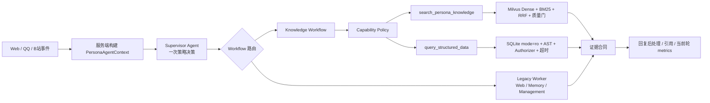

# YUMENO Agent/RAG 平台架构

## 1. 目标与边界

YUMENO 是本地优先的角色对话应用。本文件描述 Agent、Workflow、Tool、Skill、MCP、记忆、Milvus RAG 与结构化数据查询的主链路。TTS、Live2D、B站和 NapCat/QQ 保持为接入适配层，不承担 Agent 核心编排职责。

核心约束：

- Agent 只做一次策略决策，决定普通对话、知识检索、联网、记忆或管理路径。
- Workflow 负责权限校验、输入预处理、确定性执行、结果后处理、循环上限和状态恢复。
- 系统行为统一封装为标准 Tool；Tool 返回结构化合同，不让上层解析自然语言日志。
- Milvus 保留为向量数据库；复杂 CSV/XLSX 不把整张表硬塞进向量库，而是进入工作区隔离的 SQLite。
- 运行详情只在当前轮内存返回，不新增运行轨迹数据库。

## 2. 请求流程

### 2.1 上下文

`PersonaAgentContext` 是服务端权威上下文，包含 `persona_id`、`workspace_id`、`knowledge_space_ids`、`conversation_id`、角色设定、会话摘要、能力策略和 request-local telemetry。网页、OneBot/NapCat 等入口都通过同一个 context factory 构建，客户端不能提交知识空间作用域。

## 3. Agent 与 Workflow

传统路径保留 LangGraph Supervisor/Worker、checkpoint、HITL 和管理类中断，确保 Skill、MCP、写操作兼容。知识和结构化查询迁移到快路径：Supervisor 发出一次 `delegate_to_knowledge`，Workflow 从状态中读取受控 `worker_request`，执行 Tool、校验合同并直接生成可展示结果，不再为同一检索问题再次调用 Worker 和最终 Supervisor。

这里的“一次策略决策”目前严格适用于知识检索和结构化查询主链路。Web、Memory、Management 以及动态 Skill/MCP 写操作仍使用 Legacy Worker 图，以保留工具选择、HITL 和 checkpoint 恢复语义；它们是后续可按同一执行合同逐步迁移的兼容边界，不应在指标中计入快路径收益。

确定性 Workflow 负责：

1. Capability Policy 校验；
2. 识别普通知识请求或结构化请求；
3. 结构化 SQL AST 校验、作用域选择和只读执行；
4. 结果截断、表格化和证据合同；
5. handoff / retry / correction 的上限与失败关闭。

## 4. Tool、Skill 与 MCP

内置 Tool 由 `agents/registry.py` 单一注册表管理，声明 specialist、是否变更数据和是否需要确认。Skill 是可加载的提示词与 Tool 组合，默认不把全部技能工具暴露给模型；MCP 是运行时注册的外部 Tool，默认视为不可信，除非服务端显式声明只读，否则经过确认流程。

内置免 key 搜索使用 `free-search-mcp==0.9.2` 与 `mcp==2.0.0`，迁移自旧的 0.4.2/1.29.0 组合，以匹配当前 MCP SDK 协议。

这三者关系是：Skill 负责可复用能力说明和工具集合，MCP 提供外部能力实现，Tool 是 Workflow 实际执行的最小运行单元。角色策略以 capability id 覆盖启用状态，不让用户在互相依赖的能力之间做孤立开关。

## 5. 四层记忆

| 层级 | 载体 | 作用域 | 生命周期 |
|---|---|---|---|
| Checkpoint | LangGraph SQLite checkpoint | 角色 + 会话线程 | 支持中断恢复和多轮状态 |
| 会话摘要 | `ConversationSummary` | 角色 + conversation_id | 定期压缩旧回合 |
| 角色记忆 | `PersonaMemory` | 角色 | 用户偏好、长期事实 |
| 工作区记忆 | `WorkspaceMemory` | workspace | 多角色共享事实，低优先级 |

上下文预算只裁剪模型视图，不删除 checkpoint；按完整用户回合裁剪，并保留 AI tool_call 与 ToolMessage 配对。

## 6. RAG 全链路

普通文档：转换为 Markdown，按标题/段落结构切分，向量化后写入 Milvus；检索使用 Dense + BM25 + RRF，服务端按 workspace/knowledge space 过滤，生产检索 `k=4`，评测口径固定 `Recall@3`。

CSV/XLSX：受控导入工作区隔离 SQLite，物理表/列使用 ASCII 标识，同时生成 Schema Card 写入 Milvus。模型只需根据 Schema Card 生成 SQL，Workflow 再执行：

- sqlglot 只允许单条 SELECT / 非递归 CTE；
- 禁止写操作、PRAGMA、ATTACH、系统表、危险函数和越权表；
- SQLite `mode=ro`、`query_only`、authorizer、progress timeout；
- 默认最多 100 行、50 列、256 KB、2 秒；
- 文档删除、角色删除和 Milvus 索引失败均清理结构化数据。

## 7. 可观测与评测

每轮返回 request-local `events` 和 `metrics`：run_id、首字延迟、总耗时、模型调用、Token 使用、上下文裁剪、Tool 成功/失败、handoff 和 RAG trace。详情不写入持久化存储。

评测页支持自动题集、Top3 指标、检索/整链路 P50/P95、拒答率、质量门通过率、复杂题改写/纠错率、工作区隔离校验和 JSON 导出。

## 8. 失败边界

- 外部 LLM 429/5xx：返回统一降级文案，并将运行状态标为 `degraded`；
- Tool 权限失败：返回 denied/insufficient，不把未经授权的草稿交给 Supervisor；
- Milvus 不可用：索引任务失败并补偿清理结构化表；
- 复杂 SQL 超时或超限：返回受控错误，不允许继续扩大资源消耗。
- 本地 Embedding worker：创建后立即登记进程，关闭时执行 terminate、限时等待和必要 kill；轻量测试应用不触发真实模型预热。
- Embedding 生命周期：在 `Popen` 前后检查永久关闭状态，关闭与启动竞态时立即回收迟到子进程；崩溃仅丢弃当前 worker，允许下一次请求自动恢复；显式 4 项 LRU 在淘汰时关闭 worker，应用关闭清空全部实例。
- MCP 生命周期：专用 asyncio Runtime 保持 transport/session，FastAPI 的异步连接、发现与断开通过工作线程桥接；每服务器操作锁与 generation 保证最后操作生效，超时/关闭取消在途 Future，工具发现失败清理 Session，应用先等待连接任务取消再关闭 Runtime。
