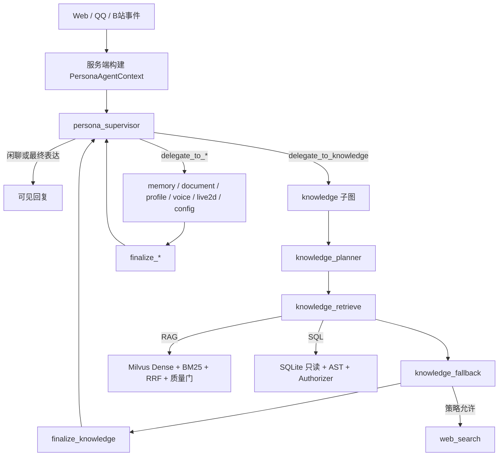

# YUMENO Agent/RAG 平台架构

## 1. 目标与边界

YUMENO 是本地优先的角色对话应用。本文件描述 Agent、Workflow、Tool、Skill、MCP、记忆、Milvus RAG 与结构化数据查询的主链路。TTS、Live2D、B站和 NapCat/QQ 保持为接入适配层，不承担 Agent 核心编排职责。

核心约束：

- 只有外层 Supervisor 对用户说话；Worker 和知识子图不直达父图 END。
- Supervisor / planner 只做策略或工具选择；RAG、SQL、联网是确定性管线。
- 系统行为统一封装为标准 Tool；Tool 返回结构化合同，不让上层解析自然语言日志。
- Milvus 保留为向量数据库；复杂 CSV/XLSX 不把整张表硬塞进向量库，而是进入工作区隔离的 SQLite。
- 运行详情只在当前轮内存返回，不新增运行轨迹数据库。

现行 LangGraph 总图与同构规则见仓库根目录 [ARCHITECTURE.md](../../ARCHITECTURE.md) 和 [架构设计存档](../archive/ARCHITECTURE_DESIGN.md)。

四个层面的选型已经锁死：拓扑是 State Graph（通信约束为 Supervisor 中心辐射），协作是层级验证，记忆是分层记忆且工作记忆落在持久化状态图，训练范式声明无需 CTDE/MARL。

## 2. 请求流程

### 2.1 上下文

`PersonaAgentContext` 是服务端权威上下文，包含 `persona_id`、`workspace_id`、`knowledge_space_ids`、`conversation_id`、角色设定、会话摘要、能力策略和 request-local telemetry。网页、OneBot/NapCat 等入口都通过同一个 context factory 构建，客户端不能提交知识空间作用域。

## 3. Agent 与 Workflow

父图保持 LangGraph Supervisor / Worker、checkpoint 和 HITL。knowledge 不再是“一次决策后直出答案”的快路径，也不再是普通 `create_agent` 工具循环。

知识主链路是：

1. Supervisor 发出 `delegate_to_knowledge`，并把结构化查询写成 `kind=structured` 合同；
2. planner 选择 RAG，或在已有 SQL 合同时跳过二次模型调用；
3. retrieve 执行能力校验、RAG 或只读 SQL，写入 JSON 合同；
4. fallback 仅在本地不足时按策略 HITL / 联网；
5. finalize 做合同校验，回到 Supervisor 生成可见回复。

受限工具 Worker 仍使用自己的 LLM 与工具选择，以保留多步确认、技能/MCP 写操作和 checkpoint 恢复语义。它们与 knowledge 的共同点不是“都是自由 Agent”，而是**都经 finalize 回 Supervisor，都不直达父图 END**。

确定性 Workflow 负责：

1. Capability Policy 校验；
2. 识别普通知识请求或结构化合同；
3. 结构化 SQL 的 AST 校验、作用域选择和只读执行；
4. 结果截断、表格化和证据合同；
5. handoff / 纠错路径的失败关闭，以及 HITL 恢复时不重跑已完成的检索。

## 4. Tool、Skill 与 MCP

内置 Tool 由 `agents/registry.py` 单一注册表管理，声明 specialist、是否变更数据和是否需要确认。Skill 是可加载的提示词与 Tool 组合，默认不把全部技能工具暴露给模型；MCP 是运行时注册的外部 Tool，默认视为不可信，除非服务端显式声明只读，否则经过确认流程。

`mutates_data` 与 `requires_confirmation` 正交：检索类工具不写数据，但联网兜底仍可能需要确认；`request_*_confirmation` 本身不写数据，因为它就是确认步骤。URL 导入属于 document Worker，不属于 knowledge 检索子图。

这三者关系是：Skill 负责可复用能力说明和工具集合，MCP 提供外部能力实现，Tool 是 Workflow 实际执行的最小运行单元。角色策略以 capability id 覆盖启用状态，不让用户在互相依赖的能力之间做孤立开关。

## 5. 四层记忆

| 层级 | 载体 | 作用域 | 生命周期 |
|---|---|---|---|
| Checkpoint | LangGraph SQLite checkpoint | 角色 + 会话线程 | 支持中断恢复和多轮状态 |
| 会话摘要 | `ConversationSummary` | 角色 + conversation_id | 定期压缩旧回合 |
| 角色记忆 | `PersonaMemory` | 角色 | 用户偏好、长期事实 |
| 工作区记忆 | `WorkspaceMemory` | workspace | 多角色共享事实，低优先级 |

上下文预算只裁剪模型视图，不删除 checkpoint；按完整用户回合裁剪，并保留 AI tool_call 与 ToolMessage 配对。

## 6. RAG 全链路

普通文档：转换为 Markdown，按标题/段落结构切分，向量化后写入 Milvus；检索使用 Dense + BM25 + RRF，服务端按 workspace/knowledge space 过滤，质量门决定是 `accepted` 还是 `insufficient`。

CSV/XLSX：受控导入工作区隔离 SQLite，物理表/列使用 ASCII 标识，同时生成 Schema Card 写入 Milvus。Supervisor 根据 Schema Card 生成只读 SQL 合同，knowledge retrieve 再执行：

- sqlglot 只允许单条 SELECT / 非递归 CTE；
- 禁止写操作、PRAGMA、ATTACH、系统表、危险函数和越权表；
- SQLite 只读模式、authorizer 与超时边界；
- 结果按安全上限截断；
- 文档删除、角色删除和 Milvus 索引失败均清理结构化数据。

联网不是独立对外 Worker。它是 knowledge_fallback 的策略化升级：用户明确要求或本地证据不足且经过确认后，才允许用公开来源补证据。

## 7. 可观测与评测

每轮返回 request-local `events` 和 `metrics`：阶段、首字延迟、模型调用、上下文裁剪、Tool 成功/失败、handoff 和 RAG trace。详情不写入持久化存储。

评测页支持自动题集、检索/整链路延迟、拒答率、质量门通过率和隔离校验。具体数字以评测导出为准，不在架构文档里写死。

## 8. 失败边界

- 外部 LLM 瞬时故障：返回统一降级文案，并将运行状态标为 `degraded`；
- Tool 权限失败：返回 denied/insufficient，不把未经授权的草稿交给 Supervisor；
- Milvus 不可用：索引任务失败并补偿清理结构化表；
- 复杂 SQL 超时或超限：返回受控错误，不允许继续扩大资源消耗；
- HITL 拒绝联网或写操作：保持原合同状态，不伪装成功；
- 本地 Embedding worker：创建后立即登记进程，关闭时执行 terminate、限时等待和必要 kill；轻量测试应用不触发真实模型预热；
- Embedding 生命周期：在 `Popen` 前后检查永久关闭状态，关闭与启动竞态时立即回收迟到子进程；崩溃仅丢弃当前 worker，允许下一次请求自动恢复；
- MCP 生命周期：专用 asyncio Runtime 保持 transport/session，FastAPI 的异步连接、发现与断开通过工作线程桥接；每服务器操作锁与 generation 保证最后操作生效，超时/关闭取消在途 Future，工具发现失败清理 Session，应用先等待连接任务取消再关闭 Runtime。

### 8.1 RAG 错误合同

所有 RAG 入口（直接 RAG API、`knowledge_worker` 以及父图委派链路）共享同一组公开错误码：

| 错误码 | 含义 | 行为 |
|---|---|---|
| `insufficient` | 没有足够证据，但管线本身正常 | 保守拒答，状态仍为正常完成 |
| `failed_retrieval` | Dense/BM25、Reranker 或联网检索阶段失败 | 直接 `no_answer`，不再改写或生成 |
| `failed_generation` | 证据已准备但答案生成失败 | 直接 `no_answer` |
| `failed_quality_gate` | 质量门执行或校验阶段失败，不等同于普通证据不足 | 丢弃草稿和证据，直接 `no_answer`
| `dependency_unavailable` | 依赖初始化或运行时不可用 | 收敛为脱敏失败结果 |

`RagEvidenceResult`、`AgentResult`、RAG API 响应和 `RagQueryRecord` 均保留 `error_code` 与
`error_message`。公开消息由代码映射生成，底层异常只进入服务端日志；失败状态不会把未通过质量门的答案草稿交给 Supervisor。
