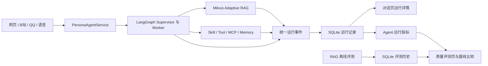

# YUMENO Agent 与 RAG 可观测评测闭环设计

## 背景

YUMENO 已经具备可工作的 Supervisor 多 Agent、角色隔离的短期会话与长期记忆、Milvus 混合检索、自适应纠错 RAG，以及基础离线 RAG 评测。本轮不增加新的 Agent 框架，也不以覆盖技术名词为目标，而是把现有运行数据连接成可观察、可评测、可持续改进的闭环。

当前已有基础：

- `AgentTurnResult` 已返回 `tool_calls`、`evidence`、`trace`、`duration_seconds` 和 `loaded_skills`。
- Adaptive RAG 已记录路由、检索、证据评分、改写、纠错、质量门和拒答等节点摘要。
- 对话历史已持久化到 SQLite，LangGraph checkpoint 保存会话执行状态。
- RAG 评测已有 Recall@K、Precision@K、MRR、Hit@1、接地率、有效率、拒答率、改写率和延迟指标。

目前尚未形成闭环：

- 对话页只展示引用，没有呈现 Agent、Tool、Skill、记忆和 RAG 的统一运行过程。
- 每轮运行摘要没有持久化，刷新页面后无法复盘。
- RAG 评测结果只保存在进程内存，应用重启后丢失，也无法比较修改前后的结果。
- Agent 侧只有原始工具结果，没有统一的成功率、handoff 次数、失败节点等可计算事件。

## 目标

本设计建立一条最小但完整的质量闭环：

1. 每轮 Agent 对话产生统一、可公开、可持久化的运行轨迹。
2. 对话页提供轻量的“运行详情”，按需查看 Agent 与 RAG 的真实执行过程。
3. RAG 评测结果可保存、查看历史并与上一基线比较。
4. 从运行轨迹计算少量可信的 Agent 运行指标，不伪造无法客观判断的准确率。
5. 后续优化必须由失败样本和指标变化驱动。

## 非目标

- 不记录或展示模型隐藏推理、完整 system prompt、API Key、Token 或未经处理的外部工具载荷。
- 不引入 LangSmith、OpenTelemetry Collector、独立追踪服务或新的数据库。
- 不增加更多 Worker，不重写现有 LangGraph 工作流。
- 不把 Text-to-SQL、Kafka、Redis 等与当前角色产品无直接需求的能力纳入本轮。
- 不把 LLM 自动评分包装成绝对真实的业务准确率。
- 不将评测放进正常对话主路径，避免增加日常回复延迟。

## 总体方案



采用“现有结果归一化 + SQLite 持久化”的方案。运行轨迹是应用层稳定合同，LangGraph、RAG、MCP 或具体模型的内部对象不得直接泄漏给前端。

## 统一运行轨迹

### 事件合同

每条可见事件使用相同结构：

```json
{
  "sequence": 1,
  "category": "agent",
  "name": "worker_handoff",
  "label": "委派知识检索",
  "status": "completed",
  "duration_ms": 86,
  "details": {
    "worker": "knowledge"
  }
}
```

字段约束：

- `sequence`：当前运行内的稳定顺序，不使用墙上时钟排序。
- `category`：仅允许 `agent`、`rag`、`tool`、`skill`、`memory`、`system`。
- `name`：稳定机器标识，用于测试和指标汇总。
- `label`：面向用户的中文说明。
- `status`：`started`、`completed`、`failed`、`skipped`、`pending`。
- `duration_ms`：能够准确测量时记录，否则为 `null`。
- `details`：经过白名单过滤的结构化摘要。

第一版采集以下事实事件：

- Agent：Supervisor 开始、Worker 委派与返回、handoff 达到上限、最终完成或失败。
- Skill：本轮实际加载的 Skill 名称。
- Tool/MCP：工具名、来源、执行状态、耗时和安全摘要；不保存完整原始结果。
- RAG：数据源路由、候选数量、证据评分、查询改写、联网回退、质量门、纠错和拒答。
- Memory：读取、保存、更新或删除动作及状态；不在轨迹里复制完整敏感记忆内容。

“为什么选择某个 Worker”只展示可观察的路由结果或规则代码，例如“请求角色资料，委派知识检索”，不生成或保存模型思维链。

### 兼容现有数据

- 现有 RAG `trace` 通过适配器转换为统一事件，不立即重写 Adaptive RAG 图。
- 现有 `ToolMessage` 解析继续由 `PersonaAgentService` 完成，在归一化阶段只保留注册工具。
- `AgentTurnResult` 保留现有字段以兼容 QQ、B站、语音和已有测试，新增 `run_id` 与统一 `events` 字段。
- 无运行轨迹的旧历史消息仍正常显示，不做强制回填。

## 持久化模型

新增 SQLite 表 `agent_runs`，一轮执行一条记录：

| 字段 | 用途 |
|---|---|
| `id` | 运行 ID，UUID |
| `workspace_id` / `persona_id` / `conversation_id` | 与现有角色会话隔离一致 |
| `source` | `web`、`voice`、`bilibili`、`qq` 或 `api` |
| `status` | `running`、`completed`、`pending`、`failed`、`cancelled`、`interrupted` |
| `specialist` | 最终主要 Worker |
| `user_message_id` / `assistant_message_id` | 可为空的历史消息关联 |
| `events_json` | 已脱敏的统一运行事件 |
| `evidence_json` | 截断后的证据摘要与来源 |
| `metrics_json` | 本轮可客观计算的计数和耗时 |
| `error_code` / `error_message` | 经过清理的失败信息 |
| `started_at` / `finished_at` | 生命周期时间 |

索引以 `persona_id + conversation_id + started_at` 为主。运行记录与对话一样本地保存，不进入 Milvus，也不写入 LangGraph checkpoint。

写入采用 best-effort：追踪持久化失败必须记录日志，但不能让角色正常回答变成 500。用户主动清空某个会话时，同时删除该会话运行记录；删除角色时沿用角色级清理规则。

## API

现有 Agent 响应增加：

- `run_id`
- `events`

待确认响应必须携带 `run_id`。恢复请求新增可选 `run_id`；新前端始终回传该值，旧客户端未传时，服务端只允许恢复当前角色会话唯一的 pending 记录。这样确认前后的执行继续写入同一条运行记录。

新增只读接口：

- `GET /api/personas/{persona_id}/conversations/{conversation_id}/runs`
- `GET /api/personas/{persona_id}/conversations/{conversation_id}/runs/{run_id}`

列表接口默认只返回本会话最近运行的摘要；详情接口返回事件和证据。服务端必须再次校验 persona、workspace 与 conversation 作用域，不能仅依赖传入 ID。

评测接口增加：

- `GET /api/eval/runs?persona_id=...`
- `GET /api/eval/runs/{run_id}`
- `GET /api/eval/runs/{run_id}/compare?baseline_id=...`

原 `/api/eval/status` 和 `/api/eval/results` 保留，避免破坏当前轮询页面。

## 对话页运行详情

每条完成的角色回复下方保留现有引用入口，并增加一个默认折叠的“运行详情”。没有 Tool、RAG、Skill 或特殊路由的普通闲聊只显示简短摘要，不制造空面板。

展开后采用纵向、无装饰编号的事件列表：

- 顶部：完成状态、主要能力、总耗时。
- 过程：委派、工具、RAG、记忆等事件，按发生顺序显示。
- 证据：沿用当前引用内容，显示来源和简短片段。
- 异常：失败节点和可执行的错误反馈。

页面不显示装饰性 `//`、步骤数字或内部节点英文名。技术字段只在确实帮助诊断时出现。运行详情不嵌套卡片，不抢占 Live2D 和对话主体空间。

刷新或重新进入对话时，前端从运行记录接口恢复对应详情。运行记录加载失败只隐藏详情并显示轻量错误，不影响历史消息。

## 质量评测页

侧边栏“RAG 评测”可在实施时调整为“质量评测”，页面保留现有一键生成和评测流程，并增加两个视图：

- 知识检索：现有 RAG 指标、逐题结果、运行轨迹和 AI 分析。
- Agent 运行：来自真实运行记录的客观统计和失败样本。

第一版 Agent 指标只采用可以直接观察的数据：

- 工具调用成功率与失败数。
- handoff 平均次数与达到上限次数。
- RAG 接受、拒答、改写、纠错和联网回退次数。
- 平均与 P95 总耗时。
- 按 Worker、Tool 和来源分类的失败样本。

“路由正确率”“任务完成率”“记忆准确率”需要带标准答案或人工反馈的数据集，第一版不自动声称这些指标。后续可在评测用例中增加 `expected_worker`、`expected_tools`、`expected_outcome`，再计算有标签的 Agent 指标。

## 评测历史与基线

新增 SQLite 表 `eval_runs`，保存：

- 角色、档位、问题数量、是否联网及关键配置快照。
- 汇总指标 JSON。
- 逐题结果 JSON。
- 状态、错误、开始与完成时间。

每次完成后可与该角色最近一次成功评测比较，展示绝对值和变化量。比较必须使用相同档位、相同问题集版本、相同关键配置；不满足条件时明确提示“不可直接比较”，不输出误导性的升降结论。

评测题集需要保存内容哈希。自动生成问题仍可用于快速体检；要作为稳定回归基线时，必须冻结题集或使用人工标注的 `expected_chunk_ids`。

## 安全与隐私

- 禁止记录 system prompt、模型隐藏推理、API Key、Token、Cookie 和完整请求头。
- Tool 参数与结果按工具白名单提取；未知 MCP Tool 默认只记录名称、状态、耗时和错误类别。
- 证据片段限制长度，保留 `chunk_id`、来源名和必要引用，不复制整篇资料。
- 错误信息移除本机绝对路径、密钥形态字符串和外部响应中的敏感头。
- 所有查询沿用当前角色与 workspace 隔离，不提供跨角色全局运行记录接口。

## 错误处理

- Agent 或 RAG 失败：只要运行记录存储可用，就在统一 `finally` 收口中标记失败；记录失败节点，不暴露堆栈。
- 客户端取消：标记 `cancelled`，不计入工具成功率分母。
- 待人工确认：标记 `pending`；恢复后继续同一 `run_id`，不创建第二条逻辑运行。
- 服务意外退出：下次启动将长期停留在 `running` 的记录标记为 `interrupted`。
- 轨迹写入失败：回答照常返回，日志记录一次结构化错误。
- 评测失败：保留已完成用例和错误信息，允许重新运行，不覆盖上一条成功基线。

## 实施顺序

1. 定义统一事件合同、脱敏器与纯计算指标，并为现有 Agent/RAG 结果增加适配器。
2. 新增 `agent_runs` 持久化和会话作用域 API，接入 REST、SSE、WebSocket、语音、B站和 QQ 的统一服务边界。
3. 在对话页展示当前轮与历史轮的运行详情。
4. 将现有 RAG 评测结果持久化到 `eval_runs`，增加历史与同条件基线比较。
5. 在质量评测页增加 Agent 客观指标和失败样本入口。
6. 根据第一轮真实数据决定下一项优化，不提前加入重排器、记忆合并算法或更多 Worker。

## 测试策略

- 单元测试：事件归一化、顺序、脱敏、指标计算、评测可比性判断。
- 数据层测试：角色/会话隔离、级联清理、运行状态恢复、JSON 兼容。
- API 测试：同步、SSE、WebSocket、确认恢复和错误路径均产生正确运行记录。
- RAG 测试：现有 trace 转换完整，改写、纠错、拒答和联网回退事件可区分。
- 前端测试：当前结果与历史恢复都能展示详情；无轨迹旧消息不报错。
- 回归测试：现有对话、快速连续发送、QQ、B站、TTS、Live2D 和 RAG 评测流程继续通过。
- 隐私测试：密钥、Token、完整 prompt、本地绝对路径不会进入 API 响应或 SQLite 记录。

## 验收标准

- 每个成功、失败、取消或待确认的 Agent 回合都有唯一 `run_id` 和明确终态。
- 对话页可以查看本轮 Worker、Skill、Tool、RAG、Memory、证据和耗时摘要，刷新后仍存在。
- 普通闲聊不显示冗长空轨迹，不影响回复流式输出和 TTS 首段播放。
- RAG 评测结果重启后仍可查看，相同条件下可与基线比较。
- Agent 运行指标全部由实际事件计算；无标签时不展示伪“准确率”。
- 运行轨迹不包含模型隐藏推理、完整 prompt、密钥或未脱敏的工具结果。
- 追踪或评测存储故障不会阻断正常对话。
- 现有多入口会话串行、角色隔离、Milvus RAG、MCP/Skill/Tool 权限和人工确认行为保持不变。
